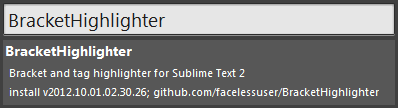

# Превращаем Sublime Text 2 в Notepad++

Решил попробовать настроить Sublime так, чтобы им можно было пользоваться также, как и Notepad++ (с плагинами), имея попутно возможности Sublime Text 2, коих нет в первом редакторе.

Сейчас огромную популярность набирает текстовой редактор Sublime Text 2. Я же в давние времена перешел на Notepad++ и много лет им активно пользовался, радуясь и восхищаясь. И когда стали появляться слухи, что Sublime теснит Notepad++, то решил проверить и попробовать на него перейти. Но, к сожалению, обнаружил, что много фишек, которым мне так нравился Notepad++ (не все идут в исходных настройках) я не вижу, несмотря на обилие новых других интересных возможностей. И было решено попробовать настроить Sublime так, чтобы им можно было пользоваться также, как и Notepad++ (с плагинами), имея попутно возможности Sublime Text 2, коих нет в первом редакторе. При этом некоторые моменты будут копировать настройки Sublime, которые пользователи и без Notepad++ обычно настраивают. И да, Sublime Text 2 настраивался в Windows 7.

## Введение

Данная статья показывает, какие особенности можно повторить, а какие еще ищут своего решения. Предполагается, что базовые настройки Sublime вы уже провели:

- русский язык корректно отображается;
- менеджер пакетов установлен.

Посмотреть базовые настройки можно в статье [Первоначальная настройка Sublime Text 2](/blog/2013/initial-setup-sublime-text-2/).

Итак, пойдем по порядку тех возможностей и деталей, которые мы можем переделать и настроить в Sublime Text 2.

**Внимание.** Посмотрите в конец документа на список нерешенных проблем. В тексте статьи есть моменты, которые названы нерешенными, но они решились в дальнейшем, что и описано в списке проблем.

## Внешний вид

Цветовая схема Sublime Text 2 по умолчанию непривычна для пользователей Notepad++, да и сам шрифт «не такой» после многолетней работы:


[Danny Connell](http://www.dconnell.co.uk/blog/index.php/2012/08/02/notepad-color-scheme-for-sublime-text-2/) предложил решение (далее почти дословно его слова): [Notepad++.zip](files/Notepad++.zip)

- Переходим в папку цветовых схем. В Windows 7 она находится по адресу, на который можно попасть любым из способов:
  - `C:\Users\[your username]\AppData\Roaming\Sublime Text 2\Packages\Color Scheme - Default`;
  - `%appdata%/Sublime Text 2/Packages/Color Scheme - Default`;
  - `Preferences` → `Browse Packages`, а оттуда в папку `Color Scheme - Default`.
- Копируем содержимое архива в эту папку.
- В программе идем по меню `Preferences` → `Color Scheme` → `Notepad++`.
- Изменим шрифт и другие настройки. Для этого идем `Preferences` → `Settings - User`.
- Добавляем нижеприведенный текст и сохраняем `Ctrl` + `S`.

Добавляемый текст:

```json
"font_face": "Courier New",
"highlight_line": true,
"line_padding_bottom": 1,
"line_padding_top": 1
```

При этом не забываем, что в файле настроек последняя строчка была без запятой, и ее надо поставить. В итоге у меня получился следующий текст настроек:

```json
{
  "color_scheme": "Packages/Color Scheme - Default/Notepad++.tmTheme",
  "font_face": "Courier New",
  "highlight_line": true,
  "line_padding_bottom": 1,
  "line_padding_top": 1
}
```

В итоге, Sublime выглядит гораздо привычнее:


И можно включить постоянный перенос строки строк (но это по желанию). Идем `Preferences` → `Settings - Default`, находим строчку:

```json
"word_wrap": "auto",
```

И слово `auto` заменяем на `true`.

И можно поменять внешний вид самой программы: сделать квадратными вкладки и др. Например, с помощью темы <https://github.com/buymeasoda/soda-theme/>. Итак, открываем панель команд `CTRL` + `Shift` + `P`, пишем `Install package`, пишем название плагина `Theme - Soda` и устанавливаем его:


Активируем. Для этого идем `Preferences` → `Settings - User`, и там пишем строчки:

```json
"soda_classic_tabs": true,
"theme": "Soda Light.sublime-theme"
```

При этом получим следующее:


Аналогично устанавливается тема `Theme - Phoenix`:


## Контекстное меню

Разочаровало отсутствие в Windows контекстного меню открытия любого файла, как в Notepad++:


Как оказалось, при установке Sublime Text 2 нужно отметить галочку:


Либо я не заметил этого в прошлые разы, либо функция появилась недавно:


## Сортировка строк

`F9` и `Ctrl` + `F9` (по чувствительности к регистру отличаются) — позволяет отсортировать выделенные строки в алфавитном порядке (в Notepad++ этим занимается плагин `TextFX`). Но не позволяет отсортировать корректно числа в строках, так как строки воспринимаются как строки, а не как числа. Например, даны следующие строки:

```text
5
1
10
```

Они будут отсортированы так:

```text
1
10
5
```

В Notepad++ есть для этого плагин `NppColumnSort`. Как быть тут? Нашел способ, как поменять основную функцию сортировки. Но в Notepad++ плагины `TextFX` и `NppColumnSort` реализуют две разные функции, а в Sublime нам нужно либо одной, либо другой пользоваться. Что делаем? Пишем дополнительный плагин, заодно и потренируемся.

`Tools` → `New Plugin…` и создается заготовка для нашего плагина. Плагин я переделывал из плагина обычной сортировки `%appdata%/Sublime Text 2/Packages/Default/sort.py`. Заменяем код заготовки на такой:

```py
import sublime, sublime_plugin
import re

def sr_cmp(a, b):
    aa = a.begin();
    ba = b.begin();

    if aa < ba:
        return -1;
    elif aa == ba:
        return cmp(a.end(), b.end())
    else:
        return 1;

def case_insensitive_sort(txt):
#   txt.sort(lambda a, b: cmp(a.lower(), b.lower()))
#   return txt
    convert = lambda text: int(text) if text.isdigit() else text.lower()
    alpha_num_key = lambda key: [ convert(c) for c in re.split(''([0-9.,]+)'', key) ]
    return sorted(txt, key=alpha_num_key)

def case_sensitive_sort(txt):
#   txt.sort(lambda a, b: cmp(a, b))
#   return txt
    convert = lambda text: int(text) if text.isdigit() else text
    alpha_num_key = lambda key: [ convert(c) for c in re.split(''([0-9.,]+)'', key) ]
    return sorted(txt, key=alpha_num_key)

def shrink_wrap_region( view, region ):
    a, b = region.begin(), region.end()

    for a in xrange(a, b):
        if not view.substr(a).isspace():
            break

    for b in xrange(b-1, a, -1):
        if not view.substr(b).isspace():
            b += 1
            break

    return sublime.Region(a, b)

def shrink_wrap_and_expand_non_empty_selections_to_entire_line(v):
    sw = shrink_wrap_region
    regions = []

    for sel in v.sel():
        if not sel.empty():
            regions.append(v.line(sw(v, v.line(sel))))
            v.sel().subtract(sel)

    for r in regions:
        v.sel().add(r)

def permute_lines(f, v, e):
    shrink_wrap_and_expand_non_empty_selections_to_entire_line(v)

    regions = [s for s in v.sel() if not s.empty()]
    if not regions:
        regions = [sublime.Region(0, v.size())]

    regions.sort(sr_cmp, reverse=True)

    for r in regions:
        txt = v.substr(r)
        lines = txt.splitlines()
        lines = f(lines)

        v.replace(e, r, u"n".join(lines))

class SortLinesNumericCommand(sublime_plugin.TextCommand):
    def run(self, edit, case_sensitive=False,
                        reverse=False,
                        remove_duplicates=False):
        view = self.view

        if case_sensitive:
            permute_lines(case_sensitive_sort, view, edit)
        else:
            permute_lines(case_insensitive_sort, view, edit)

        if reverse:
            permute_lines(reverse_list, view, edit)

        if remove_duplicates:
            permute_lines(uniquealise_list, view, edit)
```

Здесь убраны все ненужные функции, а изменение претерпели функции `case_insensitive_sort` и `case_sensitive_sort` (в закомментированном виде оригинальный текст функций). Сама непосредственно команда, которая реализовывается в классе:

```py
class SortLinesNumericCommand(sublime_plugin.TextCommand):
```

Поэтому название класса должно быть отличным от названий других команд Sublime. Было `SortLinesCommand` стало `SortLinesNumericCommand` (в конце должно быть часть `Command`). А как будет называться команда в настройках Sublime? Может для Питона это обычно, но я в нем почти не работал, и для меня это было малость неочевидно. Итак, берем название класса `SortLinesNumericCommand`, откидываем часть `Command`, а в полученной части всё приводим к малому регистру, но перед буквами, что были заглавными, кроме первой, ставим нижнее подчеркивание. То есть команда теперь в Sublime будет называться `sort_lines_numeric`.

Сохраняем данный файл в папке `%appdata%/Sublime Text 2/Packages/`, например, под именем `SortLinesNumeric.py`. Теперь у нас данный плагин уже загружен в Sublime, и, по сути, мы можем вызывать его функции.

Небольшое отступление. Если вы разрабатываете свой плагин, сохранили его, и у вас плагин без ошибок и что-то выполняет, то если в дальнейшей разработке вы плагин привели к виду, где есть ошибки критические, сохранили его и проверяете, то ошибок не увидите: так как Sublime будет использовать загруженный в память рабочий вариант плагина. Мне помогал перезапуск Sublime.

Итак, плагин с функцией сортировку у нас написан. Теперь назначим функции `sort_lines_numeric` горячие клавиши и затащим ее в контекстное меню. Открываем файл `%appdata%/Sublime Text 2/Packages/Default/Default (Windows).sublime-keymap` (в соответствии с Вашей операционной системой). Найдите там строчку:

```json
{ "keys": ["ctrl+f9"], "command": "sort_lines", "args": {"case_sensitive": true} },
```

По аналогии с ней добавим строчку нашей команды:

```json
{ "keys": ["ctrl+shift+f9"], "command": "sort_lines_numeric", "args": {"case_sensitive": true} },
```

Теперь выделенный текст при нажатии `ctrl` + `shift` + `f9` сортируется с учетом того, что там могут быть числа.

Открываем файл `%appdata%/Sublime Text 2/Packages/Default/Context.sublime-menu`. Здесь собраны команды для контекстного меню. Добавляем нашу команду и получаем такой файл (я еще добавил пустую строчку, чтобы отделить пользовательские команды):

```json
[
  { "command": "copy" },
  { "command": "cut" },
  { "command": "paste" },
  { "caption": "-", "id": "selection" },
  { "command": "select_all" },
  { "caption": "-", "id": "file" },
  { "command": "open_in_browser", "caption": "Open in Browser" },
  {
    "command": "open_dir",
    "args": { "dir": "$file_path", "file": "$file_name" },
    "caption": "Open Containing Folder…"
  },
  { "command": "copy_path", "caption": "Copy File Path" },
  { "command": "reveal_in_side_bar", "caption": "Reveal in Side Bar" },
  { "caption": "-", "id": "user-command" },
  { "command": "sort_lines_numeric", "caption": "Сортировка с учетом чисел" },
  { "caption": "-", "id": "end" }
]
```

Теперь у нас появилась в контекстном меню нужная нам функция. Аналогично можно добавить любые другие команды:


Первоначальный текст:

```text
Текст
Кот
5
50
Вот так
1
10
10005
7
```

Вышеприведенный текст сортируется так:

```text
1
5
7
10
50
10005
Вот так
Кот
Текст
```

## Проверка орфографии

В Notepad++ проверка осуществляется через Aspell, правда подчеркивание слов с ошибками там нет. Был один плагин, но он не работает с последними версиями программы. В Sublime проверка орфографии встроена, но нет русского словаря. Используется чуть отредактированный способ <http://comphobby.ru/2012/05/26/proverka-orfografii-spell-check-v-sublime-text-2/>.

Идем на сайт <http://extensions.services.openoffice.org/en/dictionaries>. Так скачиваем какой-нибудь русский словарь. Я выбрал `Русский орфографический словарь (АОТ е+ё). Russian spellcheck dict (ieyo). Based on works of AOT.ru.`

Если файл имеет расширение не zip, то переименовываем и меняем на `zip`.

Из архива вытягиваем два файла с расширениями `.aff` и `.dic`. Например, это файлы `russian-aot-ieyo.aff` и `russian-aot-ieyo.dic`. И кидаем файлы в папку с плагинами `%appdata%/Sublime Text 2/Packages/`.

Теперь открываем эти файлы в Sublime. Проверьте, чтобы там были нормальные русские слова, а не русские произвольные наборы букв, что означает неверную кодировку. Например, в файле с расширением `.aff` первой строчкой идет:

```text
SET KOI8-R
```

Это значит, что используется кодировка KOI8-R. А нам нужно сохранить в UTF-8.

Для обоих файлов идем `File` → `Reopen with Encoding` → `Cyrillic (KOI8-R)`. Теперь в файлах должны появиться осмысленные слова маленькими буквами. И далее идем `File` → `Save with Encoding` → `UTF-8` и сохраняем `Ctrl` + `S`.

И в файле с расширением `.aff` первую строчку меняем на:

```text
SET UTF-8
```

Теперь выбираем наш словарь `View` → `Dictionary` → `[наш словарь]` и включаем режим проверки орфографии `F6`:


Теперь все наши ошибки подсвечены:


Также с помощью утилиты <https://habr.com/post/158441/> собрал из словаря [Firefox](http://forum.mozilla-russia.org/viewtopic.php?id=15316) более объемный словарь: [russian_english](files/russian_english.zip).

Это уже готовые `.aff` и `.dic` файлы. Просто копируем их в папку с плагинами и в меню выбираем словарь. В этом словаре нет проблем с заглавными буквами. Плюс это русско-английский словарь:


Если кто сможет подсказать более совершенный англо-русский словарь — буду рад.

Но есть проблема: словарь не предлагает вариантов для замены (в отличие от Notepad++). Кто сможет — предложите варианты решения. Так что получается, что Notepad++ предлагает варианты исправления ошибок, но их не подчеркивает, а Sublime Text 2 подчеркивает, но варианты исправления не дает.

## Открытие новых вкладок

Sublime Text 2 всегда открывает документ в новой вкладке, как следующую после текущей. Данная его особенность просто бесит после нормальной реализации в Notepad++: файл открывается в новой вкладке в самом конце вкладок. Хотя думаю, что приверженцев идеологии Sublime тоже найдется не мало. Но если не нравится, то вот способ.

Скачиваем плагин <https://github.com/stylishmedia/SublimeText-Tabright>.

Файл `Tabright.py` копируем в папку плагинов `%appdata%/Sublime Text 2/Packages`. Теперь файлы будут открываться в нужной вкладке:


Но есть серьезная проблема: при закрытии вкладок до последней вкладки Sublime вылетает. Так что пользоваться плагином можно с большим трудом. В общем, пришлось удалить плагин.

Говорят также, что в последней `dev` версии плагин не работает.

## История буфера обмена

В Notepad++ для этого есть функция `Clipboard History`: `Правка` → `Панель истории файлов`:


Для Sublime Text 2 нужно установить плагин с аналогичным названием `Clipboard History`. Качаем его с <https://github.com/kemayo/sublime-text-2-clipboard-history>.

Копируем папку с распакованным плагином в папку с плагинами `%appdata%/Sublime Text 2/Packages`. Теперь при нажатии `Ctrl` + `Alt` + `V` откроется окно буфера обмена:


В отличие от Notepad++ есть поиск по буферу обмена. Но есть и серьезный недостаток: в историю буфера обмена копируется только текст, который копировался внутри Sublime. В Notepad++ в истории буфера сохраняется текст из всех программ, что часто бывает очень удобным. И панель в Sublime не может быть постоянной как в Notepad++, что также не гуд, когда нужно постоянно вставлять некоторые варианты небольших кусков кода. Или работа со сниппетами может решить эту проблему?

## Помеченные строки (Bookmarks)

В Notepad++ строки помечаются кликом слева около строки:


В Sublime Text 2 для этого приходится использовать комбинацию клавиш `Ctrl` + `F2` (по ней же и снимается). А хотелось бы всё-таки делать это визуально мышью:


Чтобы немного облегчить жизнь в файл `%appdata%/Sublime Text 2/Packages/Default/Context.sublime-menu` добавляем строчку:

```json
{ "command": "toggle_bookmark", "caption": "Отметить строку" },
```

И в контекстном меню появится соответствующая команда.

Переход же от отметки к отметке производится аналогично, как и в Notepad++, через клавишу `F2` (`Shift` + `F2` в обратную сторону).

Сделаем отметки более заметными. Пойдем в тему, что у вас стоит. У меня стоит по умолчанию. Поэтому идем в тему в папке `%appdata%/Sublime Text 2/Packages/Theme - Default` и там меняем файл `bookmark.png` на другой с более заметной отметкой: [bookmark.zip](files/bookmark.zip).

Теперь отметки будут выглядеть так:


## Поиск и замена

В Sublime имеется «умный» поиск по `Ctrl` + `P`, но хоть он удобен, но всё равно не выполняет полные функции поиска (или выполняет?) — задачи у «умного поиска несколько другие». Рассмотрим решение стандартных задач поиска и замены в двух редакторах (мне вначале в Sublime всё не было интуитивно понятно).

В обоих редакторах панель поиска, как и положено во всех программах, вызывается через `Ctrl` + `F`.

Маленькое отступление. А как закрыть-то панель поиска у Sublime? Обратно по `Ctrl` + `F` не закрывается, крестика нет. Оказалось, что `Esc` выполняет эту функцию. С одной стороны очень понятно и просто, с другой — сообразить без гугла у меня не получилось.

На рисунке показаны соответствия команд панели поиска:


Как видим, полного соответствия нет. Что и не странно — разные программы, разные программисты, разные «хотелки». Но мы хотим получить аналоги того, с чем мы привыкли работать.

### Функция «Найти всё во всех открытых документах»

В Notepad++ эта замечательная функция выглядит так:


В Sublime нажимаете `Ctrl` + `Shift` + `F`. Вам выйдет следующее окошко:


В поле `Find` пишите требуемый текст и нажимаете `Find`. По умолчанию поиск производится по всем отрытым папкам и файлам, но в разделе `Where` вы можете указать некоторые фильтры. В результате в новой вкладке откроются результаты поиска:


При двойном щелчке по выделенным фрагментам вы переместитесь на нужный вам файл и место. Но постоянно переключаться между вкладкой результатов поиска и вкладками документов неудобно. В Notepad++ же панель результатов поиска расположена внизу. Нажимаем `Shift` + `Alt` + `8` (разбиваем экран на верхнюю и нижнюю половину) и перетаскиваем туда нашу вкладку с результатами поиска. Панель вкладок только слишком большая для второго окна. Уменьшить бы ее:


Единственно, что если вы работает и так с разделением окна на две или более частей, то будет не очень удобно.

Также в этой панели реализована `функция замены по всем открытым файлам`.

Отщелкните кнопку `use buffer` и теперь не надо мучиться со вкладками:


### Функция «Заменить»

При нажатии на `Ctrl` + `H` — откроется панель замены в текущем документе:


Тут всё понятно, но маленькая ремарка. Уже три комбинации горячих клавиш на три разные панели поиска! А если добавить и «умный» поиск, то и все четыре! В Notepad++ же всё реализовано в одной панели — ничего искать и запоминать не нужно.

### Функция «Найти всё в текущем документе»

В Notepad++ эта замечательная функция выглядит так:


В Sublime в панели обычного поиска есть кнопка `Find All`, но он только выделяет все найденные результаты. Поэтому, чтобы хоть как-то повторить реализацию в Notepad++, приходится использовать функцию поиска по всем открытым файлам, и в разделе `Where` вводить имя файла, в котором производится поиск. А если название длинное? Неудобно. Также, если открыто несколько файлов с одинаковым именем (по разным папкам раскиданы), то поиск будет проведен по всем таким одноименным файлам.

### Функция «Подсчитать»

В Notepad++ всё просто:


Почти в финальной редакции этой статьи было написано, что не смог найти решение в Sublime. Оказывается, всё банально просто:


### Функция «Найти в файлах»

В Notepad++ есть соответствующая вкладка:


В Sublime при расширенном поиске `Ctrl` + `Shift` + `F` при нажатии кнопки `…` есть возможность добавление папки:


Просто в поле ввода запроса нажимайте клавишу `Вверх` или `Вниз`, для того, чтобы производить переход по поисковым запросам. Конечно, в Notepad++ это сделано лучше.

## Подсвечивание скобок

Notepad++ при попадании курсора на скобку подсвечивает их ярким цветом:


В Sublime же есть лишь небольшое малозаметное подчеркивание:


Можно исправить ситуацию плагином `BracketHighlighter`. Установим его через `Package Control`. Идем `Preferences` → `Package Control`, начинаем набирать `Install Packages`:


И в появившемся окне вводим имя плагина и по нему щелкаем:



Плагин установился. Перезапускаем Sublime и видим, что стало получше:


И как подсвечивать не только скобки, но и теги? В файле Sublime Text 2PackagesBracketHighlighterBracketHighlighter.sublime-settings нужно, чтобы была строчка:

```json
"tag_enable" : true,
```

Кто-нибудь знает, как сделать при работе плагина `BracketHighlighter` с белым фоном, но красным цветом текста при выделении скобок? И как подсвечивать не только скобки, но и теги?

## Копирование имени файла

В Notepad++ я постоянно пользуюсь удобной функцией копирования имени файла, пути к нему и полное имя файла по клику правой кнопкой по вкладке файла:


А что предлагает Sublime? У него есть только одна функция copy_path не в контекстном меню вкладки, а в контекстном меню самого тела файла. Что не есть удобно. Итак, открываем файл `%appdata%/Sublime Text 2/Packages/Default/copy_path.py` и меняем его содержимое на следующее (не бойтесь, основная функция будет нетронута):

```py
import sublime, sublime_plugin
import os.path

class CopyPathCommand(sublime_plugin.TextCommand):
    def run(self, edit):
        if len(self.view.file_name()) > 0:
            sublime.set_clipboard(self.view.file_name())
            sublime.status_message("Copied full file path")

    def is_enabled(self):
        return self.view.file_name() and len(self.view.file_name()) > 0

class CopyFileNameCommand(sublime_plugin.TextCommand):
    def run(self, edit):
      full_name = self.view.file_name()
      folder_name, file_name = os.path.split(full_name)
        if len(self.view.file_name()) > 0:
            sublime.set_clipboard(file_name)

            sublime.status_message("Copied file name")

class CopyPathOfFileCommand(sublime_plugin.TextCommand):
    def run(self, edit):
      full_name = self.view.file_name()
      folder_name, file_name = os.path.split(full_name)
        if len(self.view.file_name()) > 0:
            sublime.set_clipboard(folder_name)

            sublime.status_message("Copied path of file")
```

Тем самым мы ввели две команды `copy_file_name` и `copy_path_of_file`. Открываем файл `%appdata%/Sublime Text 2/Packages/Default/Tab Context.sublime-menu` и добавляем строчки (не забывайте о правильной расстановке запятых), сохраняем:

```json
({ "command": "copy_path", "caption": "Полный путь к файлу" },
{ "command": "copy_file_name", "caption": "Имя файла" },
{ "command": "copy_path_of_file", "caption": "Путь к директории файла" })
```

Теперь при нажатии на правую кнопку по вкладке у нас в меню будут три наших функции, которые в буфер обмена копируют нужные нам тексты:


## Печать

Notepad++ умеет печатать (причем с подсветкой кода). И это даже не его преимущество — это свойство почти всех нормальных программ. И было удивительно не увидеть этой функции у Sublime. Что делать? По сути адекватного решения пока нет. Можно скопировать код в другой редактор и распечатать, но тогда теряется вся прелесть, и исчезает вся подсветка кода. В общем нехорошо. Можно воспользоваться одним костылем в виде одного плагина. Итак, открываем панель команд `CTRL` + `Shift` + `P`, пишем `Install package`, пишем название плагина `Print to HTML` и устанавливаем его:


В итоге в меню File появляются два пункта:


При выборе первого у вас откроется в браузере по умолчанию Web страница с подсвеченным кодом и номерами строк, и диалоговым меню печати. По сути, число кликов мыши не увеличивается, так что костыль удобен:


При выборе второго пункта меню откроется текст этой самой HTML страницы. Может кому и пригодится.

## Сравнение файлов

Часто требуется сравнить два файла. Например, найти измененную строчку в двух почти одинаковых файлах. В Notepad++ за это отвечает плагин `Compare`:


В Sublime для этого нужен плагин `FileDiffs`. Итак, открываем панель команд `CTRL` + `Shift` + `P`, пишем `Install package`, пишем название плагина `FileDiffs` и устанавливаем его.

Открываем два наших файла в двух подряд вкладках. Жмем правой кнопкой по первой вкладке:


И там выбираем `Diff with Tab`. В результате чего нам показывают результат работы сравнения:


Знаками `+` и `-` показываются строки сравниваемых файлов. Конечно, с точки зрения юзабилити такой подход гораздо проигрывает более стандартному варианту из NotePad++, но это хоть что-то.

## Синхронизация вертикальной прокрутки

Еще одна важная для меня функция. Когда имеется два файла одного типа часто требуется просмотреть их синхронно. В Notepad++ все реализовано:


Раньше я бы предложил плагин `SublimeSynchroScroll` в Sublime Text 2, но сейчас его нигде не найти.

А ниже несколько проблем, решение которых я вообще не нашел. Заменить даже не чем, что сильно меня печалит.

## Выделение определенного текста

В Notepad++ можно выделить конкретный текст (как будто маркером провели):


Как быть в Sublime? Я пока не нашел решения.

## Фолдинг

Это одна из главных претензий к Sublime Text 2. Я даже в отдельный блок выделил, а не в конечный список нерешенных проблем выделил. Он сворачивает блоки кода только, когда они правильно оформлены отступами. Но не всегда же это так! К тому же разные программисты по-разному оформляют табуляцию. В общем очень некрасиво получается, когда половина div или функций не сворачивается. В Notepad++ всё сворачивается вне зависимости от отступов. Решений я пока не нашел. Вот как это выглядит:


## Соответствие команд

Ниже приводится соответствие некоторых команд, которыми часто пользуюсь, в Notepad++ и Sublime Text 2, если они вызываются разными методами:

### Дублирование участка кода

- Notepad++: `CTRL` + `D`.
- Sublime Text 2: `Ctrl` + `Shift` + `D`.

### Перекодирование файла

- Notepad++: `Кодировки` → `Преобразовать в …`.
- Sublime Text 2: `File` → `Save with Encoding` → `…`.

### Открыть файл в другой кодировке

- Notepad++: `Кодировки` → `Кодировать в …`.
- Sublime Text 2: `File` → `Reopen with Encoding` → `…`.

### Комментирование кода

- Notepad++ I вариант: `Клик правой кнопки мыши` → `Вкл./Выкл. Комментарий строки` (раскомментировать аналогично).
- Notepad++ II вариант: `Клик правой кнопки мыши` → `Закомментировать выделенное` (раскомментировать автоматически нельзя).
- Sublime Text 2 I вариант: `Ctrl` → `/` (раскомментировать аналогично).
- Sublime Text 2 II вариант: В файл `%appdata%/Sublime Text 2/Packages/Default/Context.sublime-menu` добавляем строчку:

```json
{ "command": "toggle_comment", "caption": "Закомментировать" },
```

### Поменять регистр букв на большие буквы

- Notepad++: `Клик правой кнопки мыши` → `ПРОПИСНЫЕ`.
- Sublime Text 2 I вариант: `Ctrl` → `K`, а потом `Ctrl` → `U` (я не понимаю, зачем это было делать на два клавиатурных сочетания).
- Sublime Text 2 II вариант: В файл `%appdata%/Sublime Text 2/Packages/Default/Context.sublime-menu` добавляем строчку:

```json
{ "command": "upper_case", "caption": "ПРОПИСНЫМИ" },
```

### Поменять регистр букв на маленькие буквы

- Notepad++: `Клик правой кнопки мыши` → `строчные`.
- Sublime Text 2 I вариант: `Ctrl` → `K`, а потом `Ctrl` → `l`.
- Sublime Text 2 II вариант: В файл `%appdata%/Sublime Text 2/Packages/Default/Context.sublime-menu` добавляем строчку:

```json
{ "command": "lower_case", "caption": "строчными" },
```

### Разделить окно на две части

- Notepad++: `Вид` → `Операции с документом` → `Переместить в другое окно`.
- Sublime Text 2 I вариант: `View` → `Layout` → `Columns: 2`.
- Sublime Text 2 II вариант: В файл `%appdata%/Sublime Text 2/Packages/Default/Tab Context.sublime-menu` добавляем строчку (не забывайте о правильной расстановке запятых):

```json
{
  "command": "set_layout",
  "args": { "cols": [0.0, 0.5, 1.0], "rows": [0.0, 1.0], "cells": [[0, 0, 1, 1], [1, 0, 2, 1]] },
  "caption": "Создать второе окно"
}
```

### Выбор подсветки синтаксиса

- Notepad++: `Синтаксис` → `…`.
- Sublime Text 2: `View` → `Syntax` → `…`.

### Перейти к соответствующей скобке (закрывающейся или открывающейся)

- Notepad++: `Ctrl` + `B`.
- Sublime Text 2 I вариант: `Goto` → `Jump to Matching Bracket`.
- Sublime Text 2 II вариант: `Ctrl` + `M`.

## Некоторые числовые опыты

Провел пару опытов (именно опытов, а не экспериментов). Это единичные проверки, без какой-либо нормальной выборки, так что делать из них какие-то выводы нельзя, но увидеть для себя тенденцию можно. Иногда приходится работать либо с очень большими текстовыми файлами, либо с очень большим количеством файлов, поэтому и посмотрим, как поведут себя программы.

В одном опыте я открывал текстовой файл размером 177 Мб (в обеих программах был включен перенос, а потом отключен). Notepad++ открывал его 3 секунды, а Sublime Text 2 за 90 секунд. При этом Notepad++ даже не собирался показывать признаки медленной работы, а вот Sublime начал заметно притормаживать. После этого решил провести поиск фрагмента, который встречался тексте где-то 42000 раз. Notepad++ потратил 10 секунд, а Sublime — 22, и при этом не отвечал ни на что.

В другом опыте я решил открыть 1136 файлов общим объемом 20Мб. Sublime открыл за 50 секунд, а Notepad++ за 45 секунд. Так что здесь оба показали одинаково себя. После нужно было найти в открытых файлах количество слова `table`. Notepad++ справился за 3 секунды, а вот Sublime справился почти мгновенно.

Выводы делайте сами по этим опытам.

## Нерешенные проблемы и вопросы

Некоторые вопросы благополучно решись в процессе написания статьи. Здесь же находится тот список, с коим справиться не удалось.

- Есть более полный англо-русский словарь в виде `.dic` и `.aff` файлов?
- При проверке орфографии не предлагаются варианты исправления русских слов.
- Нет возможности добавлять в словарь новые слова.
- При закрытии вкладки до последней при использовании плагина `Tabright` программа вылетает.
- Как по нормальному открывать вкладки, чтобы при открытии файла вкладка появлялась в конце вкладок?
- Плагин `Clipboard History` не сохраняет буфер обмена других программ.
- Панель `Clipboard History` нельзя зафиксировать на постоянной основе.
- Можно ли ставить пометки `Bookmarks` без горячих клавиш?
- Нельзя все поиски свести в одну панель.
- Как найти текст и вывести список найденных мест не во всех файлах, а только в одном (без ввода имени файла, без одноименных файлов)?
- Сворачивает код (фолдинг) только с правильными отступами (одна из главных проблем).
- Кто-нибудь знает, как сделать при работе этого плагина `BracketHighlighter` с белым фоном, но красным цветом текста при выделении скобок?
- Как можно выделять конкретный текст как маркером на бумаге?
- Есть нормальный способ сравнения файлов, как это обычно делают в соответствующих программах?

На данный момент полный переход на Sublime Text 2 для меня довольно болезненный, так как я не нашел всего того, чем привык пользоваться. Пользователи Sublime, подскажите, пожалуйста, способы решения вышеперечисленных проблем и напишите список тех возможностей, которые есть у Sublime, но нет у Notepad++.

И выскажу немного «кощунственную» мысль (возможно, что она не верна). Sublime Text 2 набирает обороты и становится популярным, потому что вариант «из коробки» малопригоден для работы (как минимум надо настроить кодировку для русского языка, изучить горячие клавиши). И этот факт заставляет людей настраивать редактор, а, следовательно, изучать его возможности. Notepad++ «из коробки» гораздо более работоспособный, и пользователь может вообще ничего не изменять, не настраивать и прекрасно работать. У него нет необходимости лезть в дебри и изучать возможные дополнительные настройки.

Пара моментов о использовании этих программ. Каждый использует эти редакторы по-разному, поэтому важно вначале сказать о некоторых особых моментах. Я не любитель горячих клавиш. Запоминать десятки комбинаций в десятках программ для меня тяжело. Особенно когда голова забита проектом, а нужно вспоминать, а какие клавиши тут надо нажать. Использую редакторы не только для написания кода. Не являюсь чистым кодировщиком, поэтому мыслю над проектом много больше, чем кодирую. Поэтому ускорители написания кода мне не нужны. И у меня мало повторяющегося кода.

Некоторые возможности Sublime Text 2 считаются фишками данного редактора. Однако многие из них находятся и в Notepad++: множественное выделение, вертикальное выделение, миникарта (правда она реализована менее удобно), работа с проектами и др.
