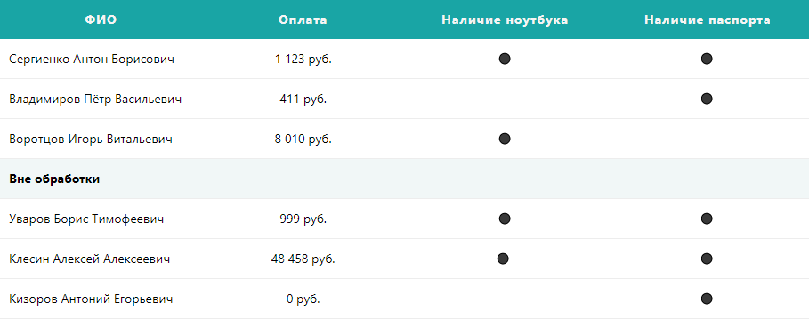
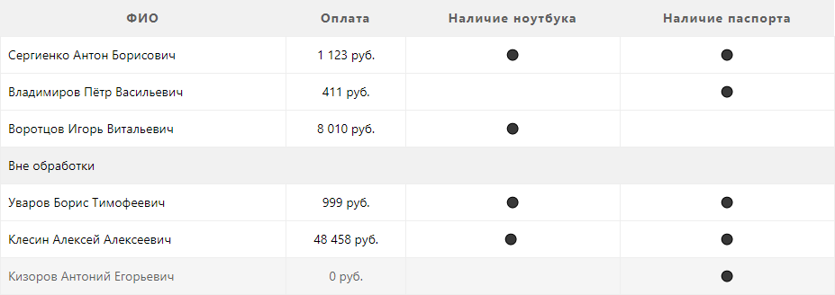

# Красивые таблицы CSS в HTML

Примеры оформления таблиц с помощью CSS стилей.

## Адаптивная таблица



Итак, добавьте в ваш CSS файл следующий код:

```css
table.table_adaptive {
  display: table;
  width: 100% !important;
  table-layout: fixed !important;
  margin: 0;
  padding: 0;
  border-collapse: collapse;
  border-spacing: 0 !important;
  margin-bottom: 30px;
  line-height: 24px;
}

table.table_adaptive caption {
  caption-side: top;
  color: #5f5f5f;
  text-align: center;
  font-weight: bold;
}

table.table_adaptive tr {
  padding: 5px;
}

table.table_adaptive tr:hover {
  background: #71c2c2;
  color: #fff;
}

table.table_adaptive tr:hover a {
  color: #fff;
  border-bottom: 1px dashed #fff;
}

table.table_adaptive th,
table.table_adaptive td {
  padding: 10px;
  text-align: center;
}

table.table_adaptive th {
  font-size: 14px;
  letter-spacing: 1px;
  color: whitesmoke;
  background-color: #19a5a5;
  font-weight: bold;
  border: 0px !important;
}

table.table_adaptive td {
  border-bottom: 1px solid #ededed !important;
  border-top: 0px !important;
  border-left: 0px !important;
  border-right: 0px !important;
  font-size: 14px;
  -ms-word-break: break-all;
  word-break: break-all;
  word-break: break-word;
  -webkit-hyphens: auto;
  -moz-hyphens: auto;
  hyphens: auto;
}

table.table_adaptive td:first-child {
  text-align: left;
}

table.table_adaptive td.justify_text {
  text-align: justify;
}

table.table_adaptive td.left_text {
  text-align: left;
}

table.table_adaptive td.right_text {
  text-align: right;
}

table.table_adaptive tr.subhead {
  background: #f1f7f7;
  font-weight: bold;
}

table.table_adaptive tr.subhead:hover {
  background: #24c5c5;
  color: #fff;
}

@media screen and (max-width: 800px) {
  table.table_adaptive {
    border: 0 !important;
  }
  table.table_adaptive thead {
    display: none;
  }
  table.table_adaptive tr {
    margin-bottom: 10px;
    display: block;
    border: 1px solid #ededed !important;
  }
  table.table_adaptive td {
    display: block;
    text-align: right;
    font-size: 13px;
    border-bottom: 1px dotted #ededed !important;
  }
  table.table_adaptive td.justify_text {
    text-align: right;
  }
  table.table_adaptive td.left_text {
    text-align: right;
  }
  table.table_adaptive td:first-child {
    text-align: right;
  }
  table.table_adaptive td.right_text {
    text-align: right;
  }
  table.table_adaptive td:last-child {
    border-bottom: 0 !important;
  }
  table.table_adaptive td:before {
    content: attr(data-label);
    float: left;
    font-weight: bold;
  }
}
```

Теперь в тексте вашей статьи можете добавить:

```html
<table class="table_adaptive">
  <thead>
    <tr>
      <th>ФИО</th>
      <th>Оплата</th>
      <th>Наличие ноутбука</th>
      <th>Наличие паспорта</th>
    </tr>
  </thead>
  <tbody>
    <tr>
      <td data-label="ФИО">Сергиенко Антон Борисович</td>
      <td data-label="Наличие ноутбука">1 123 руб.</td>
      <td data-label="Оплата">⬤</td>
      <td data-label="Наличие паспорта">⬤</td>
    </tr>
    <tr>
      <td data-label="ФИО">Владимиров Пётр Васильевич</td>
      <td data-label="Оплата">411 руб.</td>
      <td data-label="Наличие ноутбука">&nbsp;</td>
      <td data-label="Наличие паспорта">⬤</td>
    </tr>
    <tr>
      <td data-label="ФИО">Воротцов Игорь Витальевич</td>
      <td data-label="Оплата">8 010 руб.</td>
      <td data-label="Наличие ноутбука">⬤</td>
      <td data-label="Наличие паспорта">&nbsp;</td>
    </tr>
    <tr class="subhead">
      <td colspan="4">Вне обработки</td>
    </tr>
    <tr>
      <td data-label="ФИО">Уваров Борис Тимофеевич</td>
      <td data-label="Наличие ноутбука">999 руб.</td>
      <td data-label="Оплата">⬤</div>
      </td>
      <td data-label="Наличие паспорта">⬤</td>
    </tr>
    <tr>
      <td data-label="ФИО">Клесин Алексей Алексеевич</td>
      <td data-label="Оплата">48 458 руб.</td>
      <td data-label="Наличие ноутбука">⬤</td>
      <td data-label="Наличие паспорта">⬤</td>
    </tr>
    <tr>
      <td data-label="ФИО">Кизоров Антоний Егорьевич</td>
      <td data-label="Оплата">0 руб.</td>
      <td data-label="Наличие ноутбука">&nbsp;</td>
      <td data-label="Наличие паспорта">⬤</td>
    </tr>
  </tbody>
</table>
```

<https://codepen.io/Harrix/pen/GBwrwy>

## Адаптивная серая таблица


Итак, добавьте в ваш CSS файл следующий код:

```css
table.table_adaptive_gray {
  display: table;
  width: 100%;
  margin: 0;
  padding: 0;
  border-collapse: collapse;
  border-spacing: 0 !important;
  margin-bottom: 30px;
  line-height: 24px;
}

table.table_adaptive_gray caption {
  caption-side: top;
  color: #5f5f5f;
  text-align: center;
  font-weight: bold;
}

table.table_adaptive_gray tr {
  padding: 8px;
}

table.table_adaptive_gray tr:hover {
  background: #f5f5f5;
  color: #5f5f5f;
}

table.table_adaptive_gray th,
table.table_adaptive_gray td {
  padding: 8px;
  text-align: center;
}

table.table_adaptive_gray th {
  font-size: 14px;
  letter-spacing: 1px;
  color: #5f5f5f;
  background-color: #f1f1f1;
  border: 0px !important;
}

table.table_adaptive_gray td {
  border-bottom: 1px solid #eee !important;
  border-top: 0px !important;
  border-left: 0px !important;
  border-right: 0px !important;
  font-size: 14px;
  -ms-word-break: break-all;
  word-break: break-all;
  word-break: break-word;
  -webkit-hyphens: auto;
  -moz-hyphens: auto;
  hyphens: auto;
}

table.table_adaptive_gray td:first-child {
  text-align: left;
}

table.table_adaptive_gray td.justify_text {
  text-align: justify;
}

table.table_adaptive_gray td.left_text {
  text-align: left;
}

table.table_adaptive_gray td.right_text {
  text-align: right;
}

table.table_adaptive_gray tr.subhead {
  background: #f1f1f1;
}

table.table_adaptive_gray tr.subhead:hover {
  background: #f1f1f1;
}

@media screen and (max-width: 800px) {
  table.table_adaptive_gray {
    border: 0 !important;
  }
  table.table_adaptive_gray thead {
    display: none;
  }
  table.table_adaptive_gray tr {
    margin-bottom: 10px;
    display: block;
    border: 1px solid #ededed !important;
  }
  table.table_adaptive_gray td {
    display: block;
    text-align: right;
    font-size: 13px;
    border-bottom: 1px dotted #ededed !important;
  }
  table.table_adaptive_gray td.left_text {
    text-align: right;
  }
  table.table_adaptive_gray td.justify_text {
    text-align: right;
  }
  table.table_adaptive_gray td:first-child {
    text-align: right;
  }
  table.table_adaptive_gray td.right_text {
    text-align: right;
  }
  table.table_adaptive_gray td:last-child {
    border-bottom: 0 !important;
  }
  table.table_adaptive_gray td:before {
    content: attr(data-label);
    float: left;
  }
}
```

Теперь в тексте вашей статьи можете добавить:

```html
<table class="table_adaptive_gray">
  <thead>
    <tr>
      <th>ФИО</th>
      <th>Оплата</th>
      <th>Наличие ноутбука</th>
      <th>Наличие паспорта</th>
    </tr>
  </thead>
  <tbody>
    <tr>
      <td data-label="ФИО">Сергиенко Антон Борисович</td>
      <td data-label="Наличие ноутбука">1 123 руб.</td>
      <td data-label="Оплата">⬤</td>
      <td data-label="Наличие паспорта">⬤</td>
    </tr>
    <tr>
      <td data-label="ФИО">Владимиров Пётр Васильевич</td>
      <td data-label="Оплата">411 руб.</td>
      <td data-label="Наличие ноутбука">&nbsp;</td>
      <td data-label="Наличие паспорта">⬤</td>
    </tr>
    <tr>
      <td data-label="ФИО">Воротцов Игорь Витальевич</td>
      <td data-label="Оплата">8 010 руб.</td>
      <td data-label="Наличие ноутбука">⬤</td>
      <td data-label="Наличие паспорта">&nbsp;</td>
    </tr>
    <tr class="subhead">
      <td colspan="4">Вне обработки</td>
    </tr>
    <tr>
      <td data-label="ФИО">Уваров Борис Тимофеевич</td>
      <td data-label="Наличие ноутбука">999 руб.</td>
      <td data-label="Оплата">⬤</div>
      </td>
      <td data-label="Наличие паспорта">⬤</td>
    </tr>
    <tr>
      <td data-label="ФИО">Клесин Алексей Алексеевич</td>
      <td data-label="Оплата">48 458 руб.</td>
      <td data-label="Наличие ноутбука">⬤</td>
      <td data-label="Наличие паспорта">⬤</td>
    </tr>
    <tr>
      <td data-label="ФИО">Кизоров Антоний Егорьевич</td>
      <td data-label="Оплата">0 руб.</td>
      <td data-label="Наличие ноутбука">&nbsp;</td>
      <td data-label="Наличие паспорта">⬤</td>
    </tr>
  </tbody>
</table>
```

<https://codepen.io/Harrix/pen/KBraLY>

## Адаптивная классическая таблица



Итак, добавьте в ваш CSS файл следующий код:

```css
table.table_adaptive_classic {
  display: table;
  width: 100%;
  margin: 0;
  padding: 0;
  border-collapse: collapse;
  border-spacing: 0 !important;
  margin-bottom: 30px;
  line-height: 24px;
}

table.table_adaptive_classic caption {
  caption-side: top;
  color: #5f5f5f;
  text-align: center;
  font-weight: bold;
}

table.table_adaptive_classic tr {
  padding: 8px;
}

table.table_adaptive_classic tr:hover {
  background: #f5f5f5;
  color: #5f5f5f;
}

table.table_adaptive_classic th,
table.table_adaptive_classic td {
  padding: 8px;
  text-align: center;
}

table.table_adaptive_classic th {
  font-size: 14px;
  letter-spacing: 1px;
  color: #5f5f5f;
  background-color: #f1f1f1;
  border: 0px !important;
}

table.table_adaptive_classic td {
  border: 1px solid #eee !important;
  font-size: 14px;
  -ms-word-break: break-all;
  word-break: break-all;
  word-break: break-word;
  -webkit-hyphens: auto;
  -moz-hyphens: auto;
  hyphens: auto;
}

table.table_adaptive_classic td:first-child {
  text-align: left;
}

table.table_adaptive_classic td.left_text {
  text-align: justify;
}

table.table_adaptive_classic td.right_text {
  text-align: right;
}

table.table_adaptive_gray td.justify_text {
  text-align: justify;
}

table.table_adaptive_classic tr.subhead {
  background: #f1f1f1;
}

table.table_adaptive_classic tr.subhead:hover {
  background: #f1f1f1;
}

@media screen and (max-width: 800px) {
  table.table_adaptive_classic {
    border: 0 !important;
  }
  table.table_adaptive_classic thead {
    display: none;
  }
  table.table_adaptive_classic tr {
    margin-bottom: 10px;
    display: block;
    border: 1px solid #ededed !important;
  }
  table.table_adaptive_classic td {
    display: block;
    text-align: right;
    font-size: 13px;
    border-bottom: 1px dotted #ededed !important;
    border-top: 0px !important;
    border-left: 0px !important;
    border-right: 0px !important;
  }
  table.table_adaptive_classic td.left_text {
    text-align: right;
  }
  table.table_adaptive_gray td.justify_text {
    text-align: right;
  }
  table.table_adaptive_classic td:first-child {
    text-align: right;
  }
  table.table_adaptive_classic td.right_text {
    text-align: right;
  }
  table.table_adaptive_classic td:last-child {
    border-bottom: 0 !important;
  }
  table.table_adaptive_classic td:before {
    content: attr(data-label);
    float: left;
  }
}
```

Теперь в тексте вашей статьи можете добавить:

```html
<table class="table_adaptive_classic">
  <thead>
    <tr>
      <th>ФИО</th>
      <th>Оплата</th>
      <th>Наличие ноутбука</th>
      <th>Наличие паспорта</th>
    </tr>
  </thead>
  <tbody>
    <tr>
      <td data-label="ФИО">Сергиенко Антон Борисович</td>
      <td data-label="Наличие ноутбука">1 123 руб.</td>
      <td data-label="Оплата">⬤</td>
      <td data-label="Наличие паспорта">⬤</td>
    </tr>
    <tr>
      <td data-label="ФИО">Владимиров Пётр Васильевич</td>
      <td data-label="Оплата">411 руб.</td>
      <td data-label="Наличие ноутбука">&nbsp;</td>
      <td data-label="Наличие паспорта">⬤</td>
    </tr>
    <tr>
      <td data-label="ФИО">Воротцов Игорь Витальевич</td>
      <td data-label="Оплата">8 010 руб.</td>
      <td data-label="Наличие ноутбука">⬤</td>
      <td data-label="Наличие паспорта">&nbsp;</td>
    </tr>
    <tr class="subhead">
      <td colspan="4">Вне обработки</td>
    </tr>
    <tr>
      <td data-label="ФИО">Уваров Борис Тимофеевич</td>
      <td data-label="Наличие ноутбука">999 руб.</td>
      <td data-label="Оплата">⬤</div>
      </td>
      <td data-label="Наличие паспорта">⬤</td>
    </tr>
    <tr>
      <td data-label="ФИО">Клесин Алексей Алексеевич</td>
      <td data-label="Оплата">48 458 руб.</td>
      <td data-label="Наличие ноутбука">⬤</td>
      <td data-label="Наличие паспорта">⬤</td>
    </tr>
    <tr>
      <td data-label="ФИО">Кизоров Антоний Егорьевич</td>
      <td data-label="Оплата">0 руб.</td>
      <td data-label="Наличие ноутбука">&nbsp;</td>
      <td data-label="Наличие паспорта">⬤</td>
    </tr>
  </tbody>
</table>
```

<https://codepen.io/Harrix/pen/zLMZOr>

## С градиентом


Итак, добавьте в ваш CSS файл следующий код:

```css
.features-table {
  width: 100%;
  border-collapse: separate;
  border-spacing: 0;
  border: 0;
  text-shadow: 0 1px 0 #fff;
  color: #2a2a2a;
  background: #fafafa;
  background-image: -moz-linear-gradient(top, #fff, #eaeaea, #fff);
  background-image: -webkit-gradient(linear, center bottom, center top, from(#fff), color-stop(0.5, #eaeaea), to(#fff));
  margin: 20px auto;
}

.features-table td {
  height: 50px;
  padding: 0 20px;
  border-bottom: 1px solid #cdcdcd;
  box-shadow: 0 1px 0 #fff;
  -moz-box-shadow: 0 1px 0 #fff;
  -webkit-box-shadow: 0 1px 0 #fff;
  text-align: center;
  vertical-align: middle;
  display: table-cell;
}

.features-table tbody td {
  text-align: center;
  width: 150px;
}

.features-table td.grey {
  background: #efefef;
  background: rgba(144, 144, 144, 0.15);
  border-right: 1px solid #fff;
}

.features-table td.green {
  background: #e7f3d4;
  background: rgba(184, 243, 85, 0.3);
}

.features-table td:nowrap {
  white-space: nowrap;
}

.features-table thead td {
  font-size: 120%;
  font-weight: 700;
  border-top-right-radius: 10px;
  border-top-left-radius: 10px;
  border-top: 1px solid #eaeaea;
}

.features-table tfoot td {
  font-size: 120%;
  font-weight: 700;
  border-bottom-right-radius: 10px;
  border-bottom-left-radius: 10px;
  border-bottom: 1px solid #dadada;
}
```

Теперь в тексте вашей статьи можете добавить:

```html
<table class="features-table">
  <thead>
    <tr>
      <td>Признаки</td>
      <td class="grey">Сычи</td>
      <td class="grey" nowrap>Ушастые совы</td>
      <td class="green">Филин</td>
    </tr>
  </thead>

  <tfoot>
    <tr>
      <td nowrap>Итого по размерам</td>
      <td class="grey">Мелкие</td>
      <td class="grey">Средние</td>
      <td class="green">Крупные</td>
    </tr>
  </tfoot>

  <tbody>
    <tr>
      <td nowrap>Количество видов</td>
      <td class="grey">3</td>
      <td class="grey">6</td>
      <td class="green">16</td>
    </tr>

    <tr>
      <td nowrap>Большие уши</td>
      <td class="grey">Да</td>
      <td class="grey">Да</td>
      <td class="green">Да</td>
    </tr>

    <tr>
      <td nowrap>Латинское наименование</td>
      <td class="grey">Athene</td>
      <td class="grey">Asio</td>
      <td class="green">Bubo</td>
    </tr>
  </tbody>
</table>
```

Селектор `nowrap` не позволяет переносить строки. Полезный селектор, но не увлекайтесь, а то таблица «улетит».

<https://codepen.io/Harrix/pen/wxxZVJ>

## Простая таблица


Итак, добавьте в ваш CSS файл следующий код:

```css
.simple-little-table {
  font-family: Arial, Helvetica, sans-serif;
  color: #666;
  font-size: 12px;
  text-shadow: 1px 1px 0 #fff;
  background: #eaebec;
  margin: 20px;
  border: #ccc 1px solid;
  border-collapse: separate;
  -moz-border-radius: 3px;
  -webkit-border-radius: 3px;
  border-radius: 3px;
  -moz-box-shadow: 0 1px 2px #d1d1d1;
  -webkit-box-shadow: 0 1px 2px #d1d1d1;
  box-shadow: 0 1px 2px #d1d1d1;
}

.simple-little-table th {
  font-weight: 700;
  padding: 21px 25px 22px;
  border-top: 1px solid #fafafa;
  border-bottom: 1px solid #e0e0e0;
  background: #ededed;
  background: -webkit-gradient(linear, left top, left bottom, from(#ededed), to(#ebebeb));
  background: -moz-linear-gradient(top, #ededed, #ebebeb);
}

.simple-little-table th:first-child {
  text-align: left;
  padding-left: 20px;
}

.simple-little-table tr:first-child th:first-child {
  border-top-left-radius: 3px;
}

.simple-little-table tr:first-child th:last-child {
  border-top-right-radius: 3px;
}

.simple-little-table tr {
  text-align: center;
  padding-left: 20px;
}

.simple-little-table tr td:first-child {
  text-align: left;
  padding-left: 20px;
  border-left: 0;
}

.simple-little-table tr td {
  padding: 18px;
  border-top: 1px solid #fff;
  border-bottom: 1px solid #e0e0e0;
  border-left: 1px solid #e0e0e0;
  background: #fafafa;
  background: -webkit-gradient(linear, left top, left bottom, from(#fbfbfb), to(#fafafa));
  background: -moz-linear-gradient(top, #fbfbfb, #fafafa);
}

.simple-little-table tr:nth-child(even) td {
  background: #f6f6f6;
  background: -webkit-gradient(linear, left top, left bottom, from(#f8f8f8), to(#f6f6f6));
  background: -moz-linear-gradient(top, #f8f8f8, #f6f6f6);
}

.simple-little-table tr:last-child td {
  border-bottom: 0;
}

.simple-little-table tr:last-child td:first-child {
  border-bottom-left-radius: 3px;
}

.simple-little-table tr:last-child td:last-child {
  border-bottom-right-radius: 3px;
}

.simple-little-table tr:hover td {
  background: #f2f2f2;
  background: -webkit-gradient(linear, left top, left bottom, from(#f2f2f2), to(#f0f0f0));
  background: -moz-linear-gradient(top, #f2f2f2, #f0f0f0);
}

.simple-little-table a:link,
.simple-little-table a:visited {
  color: #666;
  font-weight: 700;
  text-decoration: none;
}

.simple-little-table a:visited {
  color: #999;
}

.simple-little-table a:active,
.simple-little-table a:hover {
  color: #bd5a35;
  text-decoration: underline;
}
```

Теперь в тексте вашей статьи можете добавить:

```html
<table class="simple-little-table" cellspacing="0">
  <tr>
    <th>Алгоритмы</th>
    <th>Выполненность</th>
    <th>Наличие прогонов</th>
  </tr>

  <tr>
    <td>Генетический алгоритм</td>
    <td>100%</td>
    <td>Да</td>
  </tr>

  <tr>
    <td>Муравьиный алгоритм</td>
    <td>100%</td>
    <td>Да</td>
  </tr>

  <tr>
    <td>Метод Ньютона</td>
    <td>20%</td>
    <td>Нет</td>
  </tr>

  <tr>
    <td>Дифференциальный алгоритм</td>
    <td>80%</td>
    <td>Нет</td>
  </tr>

  <tr>
    <td>Метод наискорейшего пуска</td>
    <td>100%</td>
    <td>Да</td>
  </tr>

  <tr>
    <td>Случайный поиск</td>
    <td>23%</td>
    <td>Да</td>
  </tr>

  <tr>
    <td><a href="blog.harrix.org">Гиперссылка</a></td>
    <td>80%</td>
    <td><a href="blog.harrix.org">Да</a></td>
  </tr>
</table>
```

<https://codepen.io/Harrix/pen/zLLQYy> 600
