# Koken — CMS для фотогалерей — Изменяем тему

В предыдущей [статье](https://github.com/Harrix/harrix.dev-blog-2013/blob/main/2013-03-11-koken-first-review/2013-03-11-koken-first-review.md) был рассмотрен первый обзор этой CMS. Хотя админка этой CMS, на мой взгляд, бесподобна, то сами шаблоны тем, которые по умолчанию вызываются на сайт, не очень привлекательны. К тому же хочется внедрить свой фирменный стиль и так далее. В общем, будет дальше смотреть данную CMS и подстраивать свою фотогалерею под свои нужды.

---

**Внимание!** <!-- !important -->

Кроме данного обзора, я этой CMS больше не занимался. Поэтому знаний больше, чем в статьях на этом блоге, у меня нет. Поэтому ответить на все ваши вопросы я не могу. Но [на официальном сайте](http://help.koken.me/customer/portal/questions/new) создатели активно и оперативно отвечают на вопросы (по крайней мере, когда писалась эта статья). Мне за сутки обычно отвечали. Спрашивайте, пожалуйста, у них. Они гораздо больше меня знают о своей системе.

---

На данный момент галерея выглядит с прошлой статьи вот так:

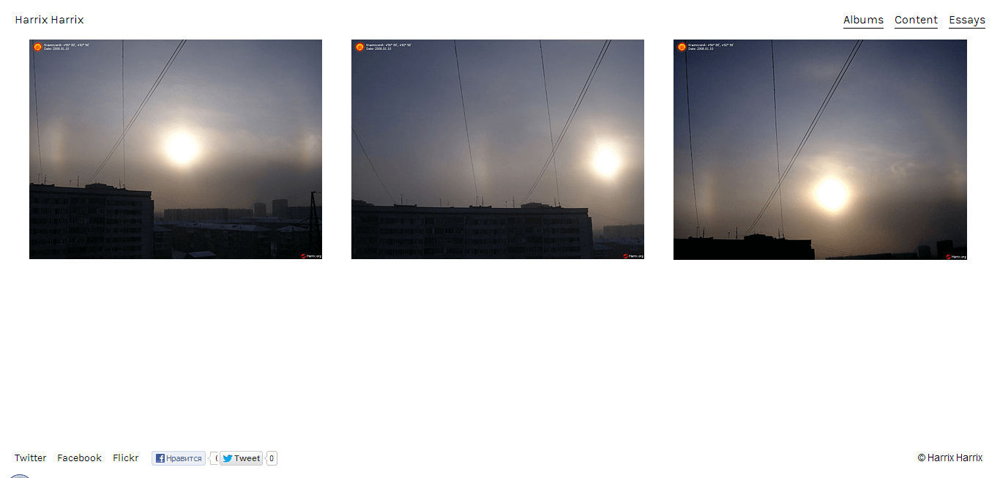

## Постановка задачи

**Задача.** Надо создать свою фотогалерею, чтобы на главной странице были отображены все фотографии, а при клике на какую-нибудь фотографию открывался lightbox, который бы в режиме AJAX подгружал другие фотографии. Также нужно внедрить фирменную символику.

Непосредственно первую часть не решает ни одна из тем данной CMS (даже уточнил у разработчиков). Скорее всего это связано с тем, что в первую очередь CMS рассчитана на сложные фотогалерея с несколькими альбомами. Но хороший lightbox там есть. Только он отрывается странно в темах, где он есть. Вначале надо щелкнуть по фотографии, потом она откроется в отдельном режиме просмотра одной фотографии, а потом только запускает lightbox, то есть на одну операцию больше. Исправим это, создав свою тему.

## Создание своей темы

Идем в папку `/storage/themes/`

Копируем папку той темы, которая вам больше приглянулась, и которая ближе всего к тому, что вы хотите по структуре фотогалереи. И обзываем папку как-то по-своему (без пробелов). Например, я буду изменять ту же тему `regale`, за которую взялся в прошлой статье:

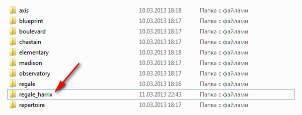

Открываем файл `info.json` в папке темы и меняем там данные нашей темы. В первую очередь меняйте имя темы на своё уникальное. Было:

```json
{
  "name": "Regale",
  "version": "1.1.2",
  "description": "Regale is a bold, assured theme that fluidly scales content across the entire browser window for larger than life photos. Includes a basic header and footer navigation, social media links, plus a configurable grid layout that allows you to control spacing and column count. Single photos presented on the content page are scaled as large as they can go for maximum impact. Theme preview photos by Daniele Zedda.",
  "demo": "http://koken.me",
  "author": {
    "name": "Koken",
    "link": "http://koken.me"
  },
  "koken_version_required": "0.5.0",
```

Стало:

```json
{
  "name": "Regale - Harrix version",
  "version": "1.0",
  "description": "Модифицированная тема Regale движка Koken для фотогалерей. Модификация сделана http://harrix.org",
  "demo": "http://halo.harrix.org",
  "author": {
    "name": "Harrix",
    "link": "halo.harrix.org"
  },
  "koken_version_required": "0.5.0",
```

Удаляем файл `koken.guid` из папки с темой новой. Это обязательно.

Потом, когда настроите тему (или сразу), поменяйте файл `preview.jpg` на свою превью темы. Но это необязательный шаг. Я пока это делать не буду.

Если вы копировали на комп себе, то теперь обратно залейте папку новой темы в папку `/storage/themes/` на вашем домене.

## Активация новой темы

Зайдите в админку вашей фотогалереи `[домен или папка]/admin` и перейдите в раздел `Site`:

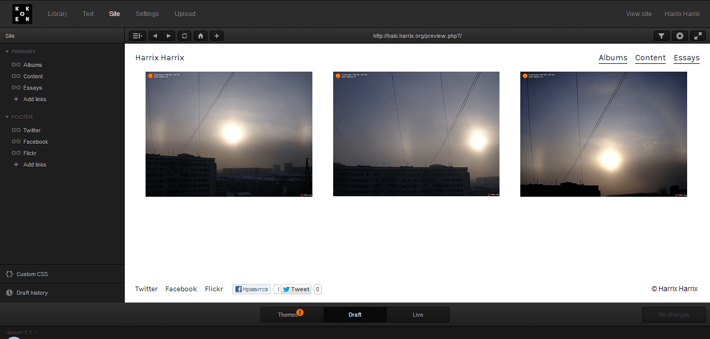

А там подраздел `Themes` (внизу):


О! Пока я писал статью, вышли обновления стандартных тем. Обновите и вы, если видите такую надпись.

А теперь спуститесь вниз и найдите свою тему:

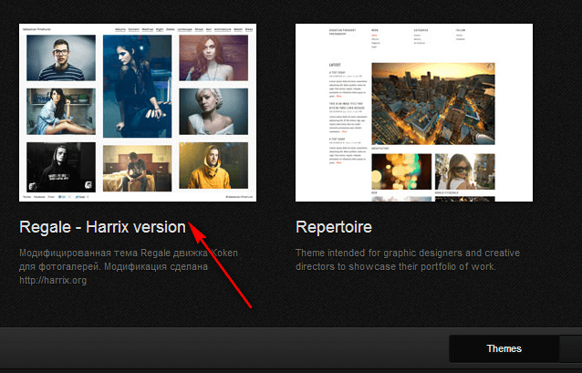

Выберите ее и активируйте:

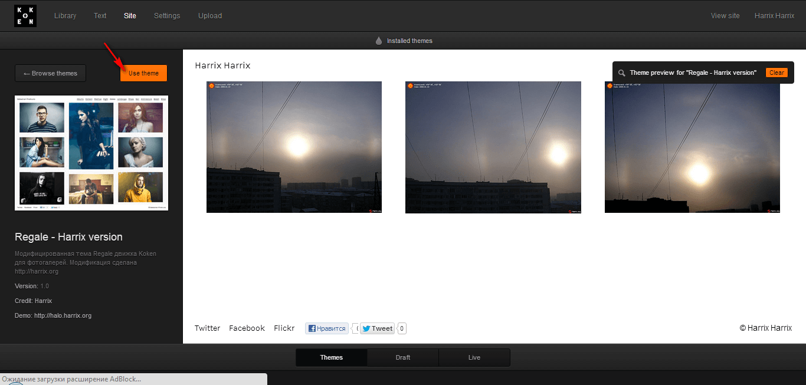

И примените изменения к сайту:

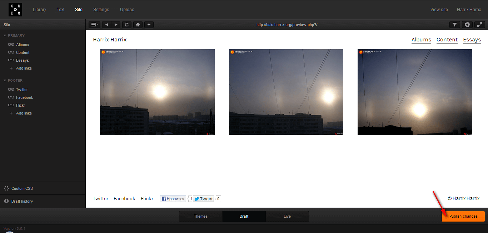

Вуаля! Теперь ваша фотогалерея находится под управлением новой темы, которую мы будем дальше изменять под себя. Не рекомендуется изменять стандартные темы, без создания новых, а то все изменения слетят при обновлениях стандартных тем.

## Ставим lightbox в теме

Небольшая поправка. Я откладывал в этом месте написание статьи на несколько дней по техническим причинам. За это время вышло еще одно обновление Koken, в котором были исправлены некоторые места, которые мне не нравились. И это замечательно! Так как я переустанавливал еще движок, то не удивляйтесь, что фотографии будут другими. Это не важно — всё остальное точно такое же, как и было раньше.

Сама тема представляет набор множества файлов, которые потом интерпретируются движком по своим правилам, поэтому в коде этих файлов вы найдете много нестандартных тэгов и команд вперемешку с обычными тэгами HTML.

Итак, на данный момент, наш сайт выглядит вот так:

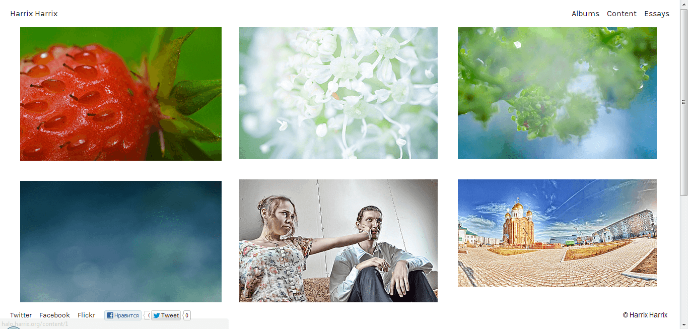

При клике на фотографию загружается фотография отдельно:

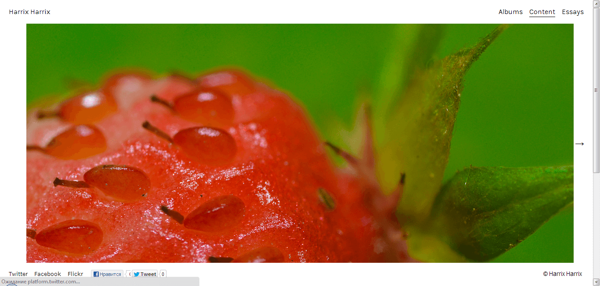

Исправим ситуацию.

В папке нашей темы находим файл `inc/grid.html`. Он отвечает за прорисовку сетки фотографий в режиме `Content`:

```html
<koken:include file="js/grid.js" />

<div id="grid" class="col-{{ settings.grid_col_num }}"><div class="column"></div></div>

<koken:loop>
  <div class="item">
    <koken:link> <koken:img lazy="true" fade="true" /> </koken:link>
  </div>
</koken:loop>
```

Находим строчки, отвечающие за отображение фотографии и ссылки для него:

```html
<koken:link> <koken:img lazy="true" fade="true" /> </koken:link>
```

И меняем их на одну строчку, отвечающую за показ lightbox:

```html
<koken:link lightbox="true"><koken:img /></koken:link>
```

Сохраним и перенесем на сервер. Если мы сейчас откроем сайт, то ничего не изменится, так как тему нужно применить измененную. Почему-то это в движке не продумано — нет кнопки принудительного просмотра изменений. Можно вначале поставить другую тему, а затем эту. Но я предлагаю по-другому. Переходим в режим Site и щелкнете по настройкам темы (шестеренка справа наверху):

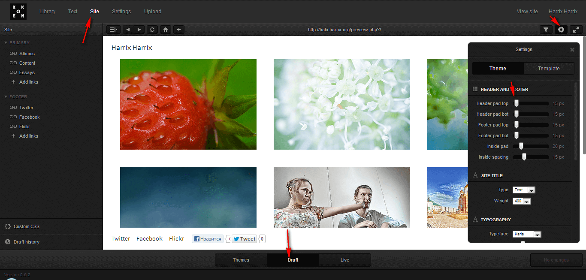

Сдвиньте ползунок параметра `Header pad top` и примените изменения, а потом верните обратно и опять примените изменения:

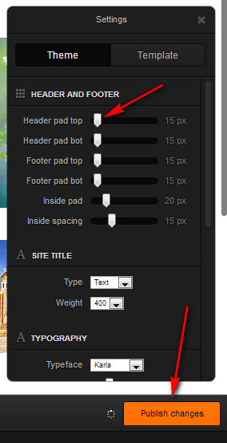

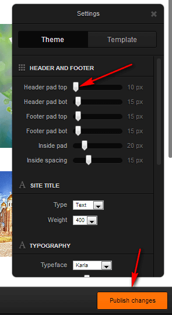

И теперь наш сайт поменял свою работу. Если мы кликнем по фотографии на главной странице, то увидим уже lightbox, как в нормальных галереях:

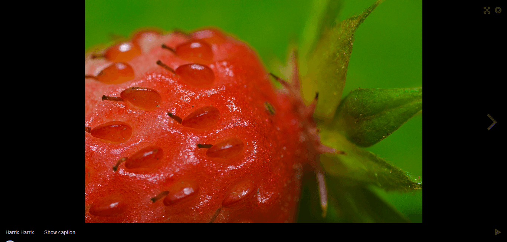

## Чистка сайта от ненужных элементов

У нас уже есть отличный фотосайт, но будем доводить всё до ума. Но есть некоторые элементы, которые мне не нужны (вам могут и пригодиться).

Мне не нравится наличие вот этих ссылок:

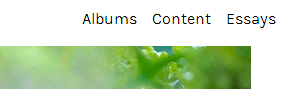

Пока ничего не хочу добавлять: альбом будет только один, текстовых заметок не хочу добавлять. Удалим.

В разделе сайт посмотрим на левую панель. В ней находятся те самые ссылки и ссылки в «подвале»:

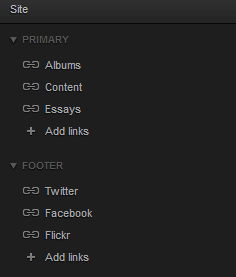

Если щелкнете по шестеренке, то увидите, что ссылку можно удалить, переименовать или сделать главной на главную страницу сайта:

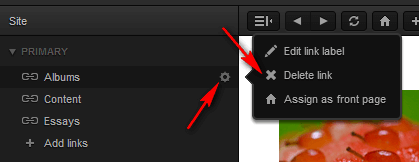

Мы же всё удалим, плюс из футера тоже всё нафиг удалим. И применим изменения:

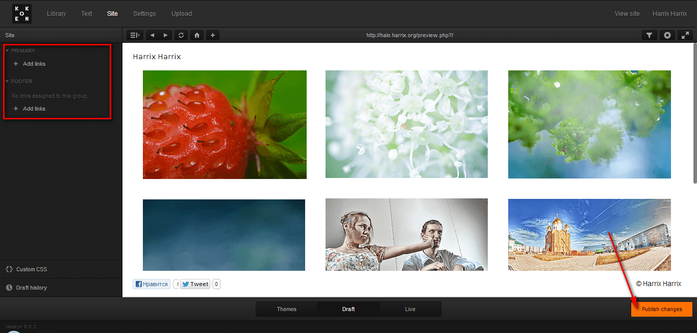

Не беспокойтесь, если вам потом эти ссылки будут нужны, то через `Add Links…` всё добавите:

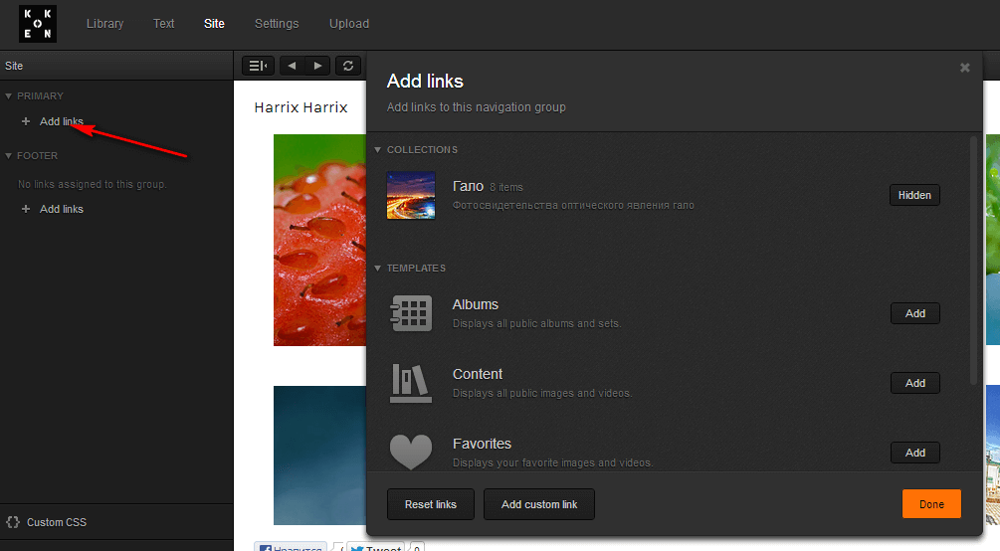

Внизу еще остались социальные кнопки:

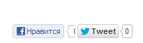

Открываем файл `inc/footer.html` и комментируем кнопки (а вдруг потом захочется?). Вы, наоборот, можете новые социальные приблуды добавить или что-то своё:

```html
  </div> <!-- close container -->

  <footer class="main">

    <span class="copyright">
      {{ site.copyright }}
    </span>

    <koken:navigation group="footer" />

    <koken:if true="settings.show_social">
      <div class="social">
        <!--<a class="addthis_button_facebook_like" fb:like:layout="button_count"></a>
        <a class="addthis_button_tweet"></a>-->
      </div>
    </koken:if>

  </footer>

</body>

</html>
```

И также примените изменения к теме, как я выше писал.

Вроде почистили от мусора:

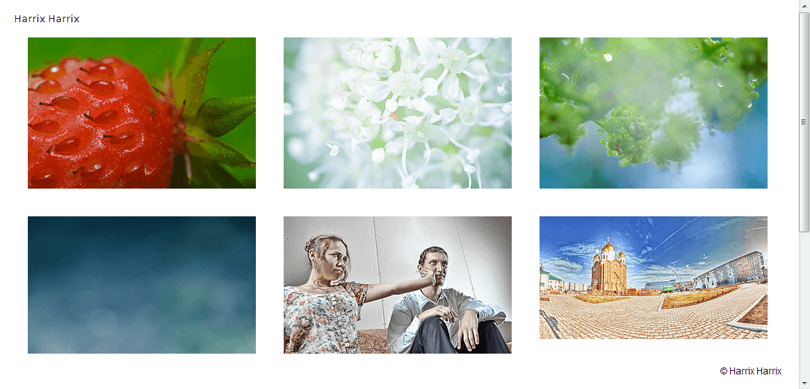

## Редактирование настроек сайта

Теперь можно заняться редактированием настроек сайта.

Заходим в настройки `Settings`:

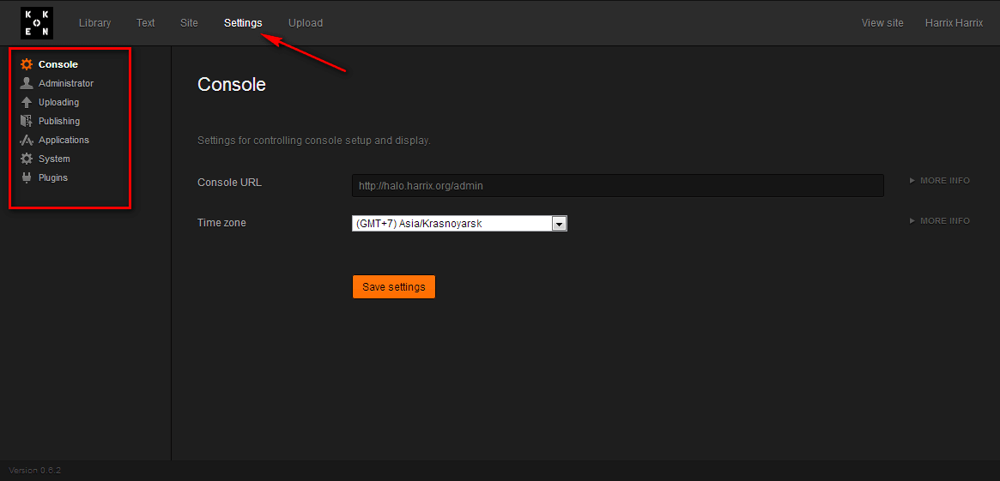

В первом пункте `Console` вы можете только поменять часовой пояс.

В пункте `Administrator` вы меняете системные параметры, которые назначали при установке. Из интересного, вы можете вставить ссылки на Twitter и Facebook (для удаленных ссылок из «подвала»):

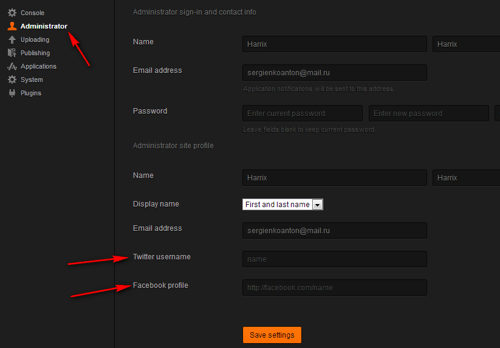

В разделе `Uploading` настройки для загрузки фотографий и видео. Ничего интересного. По умолчанию и так всё в порядке:

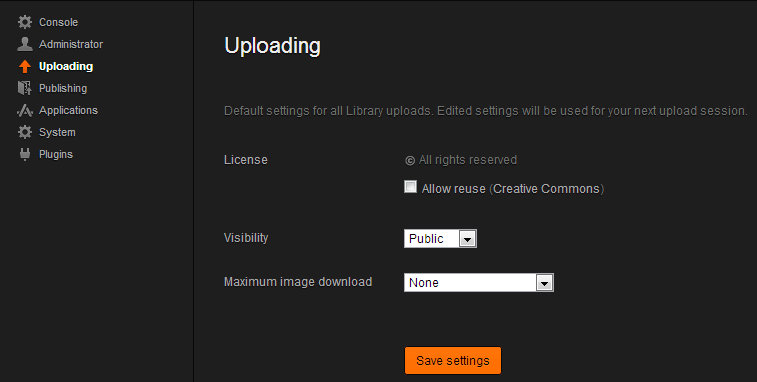

В разделах `Applications`, `System`, `Plugins` тоже нет ничего интересного:

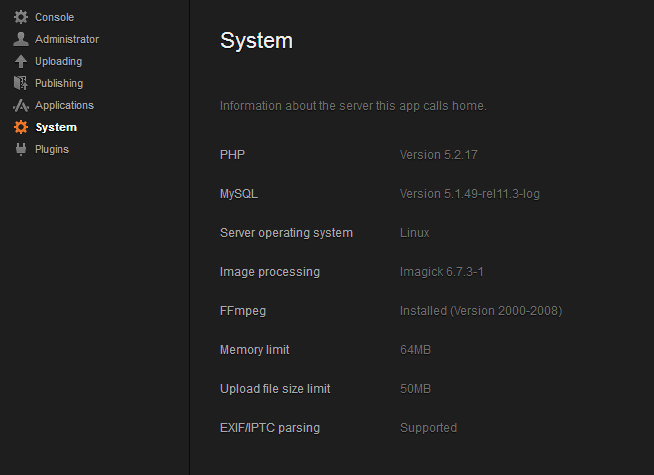

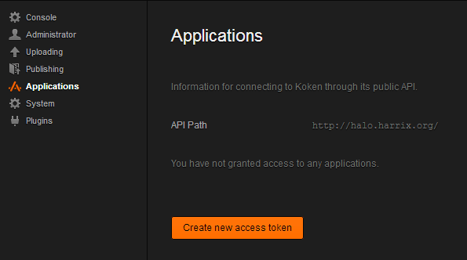

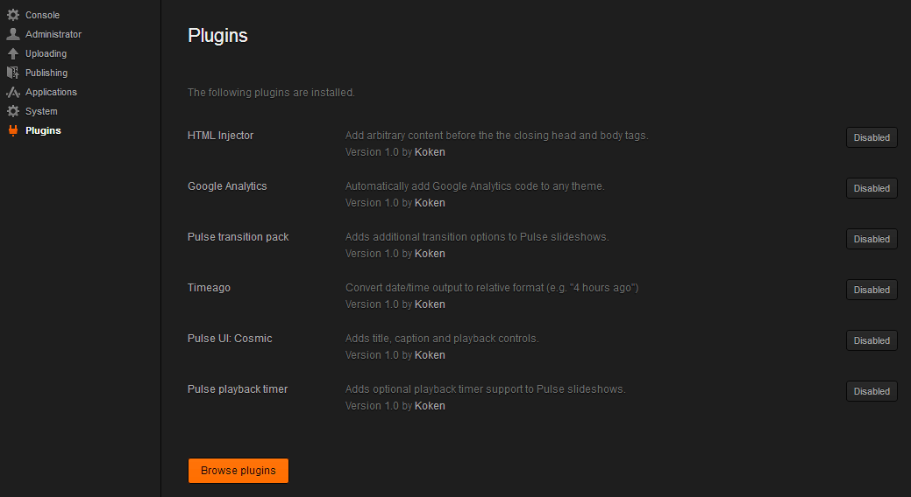

Ну и раздел `Publishing`. Самый интересный для нас:

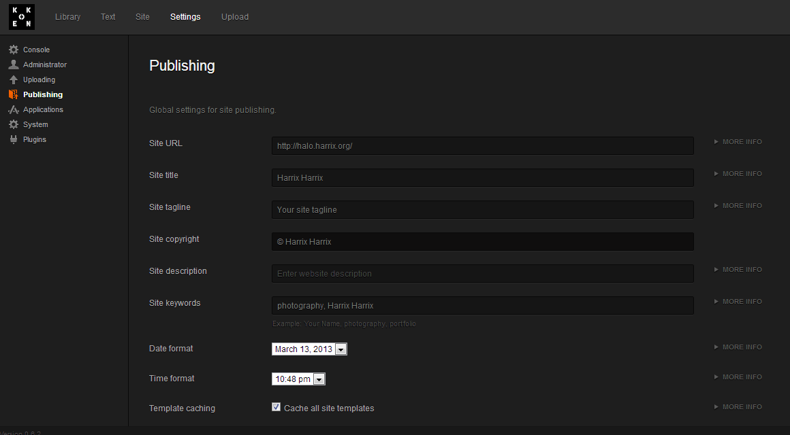

В пункте `Site title` введите имя своего сайта, а то пока оно в виде вашего имени и фамилии. А в пункте `Site tagline` подпись к названию сайта (в некоторых темах присутствуют):

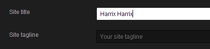

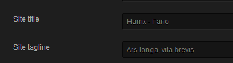

В трех других пунктах аналогично:


Остальное меняйте по своему усмотрению. Я не трогал. И не забудьте сохранить изменения:

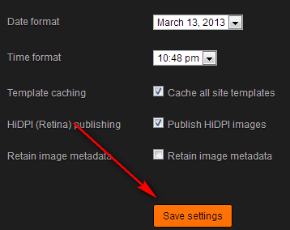

В итоге получаем такой сайт:


## Редактирование темы

Теперь настроим тему под себя инструментами самого движка

Зайдите в раздел `Site` и справа нажмите шестеренку:

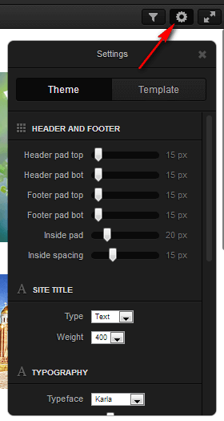

Первый блок позволяет менять отступы, положение названия сайта и верхушку сайта. Я выставил такие:

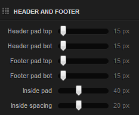

В следующем блоке вы редактируете заголовок. Он может быть или в виде текста:

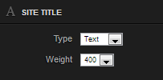

Либо в виде рисунка, который предварительно загружается, так как там только url его указывается:


В следующих частях настраивается параметры шрифтов и социальных кнопок (ой, а может и не надо было комментировать тот блок в теме, а тут просто отщелкнуть?):

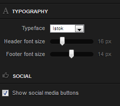

И далее настраиваются цвета текста, ссылок и фона. Я выбрал такие цвета:

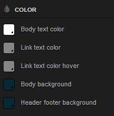

Не забудьте сохранить изменения:

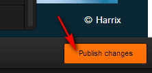

И теперь наш сайт выглядит вот так:

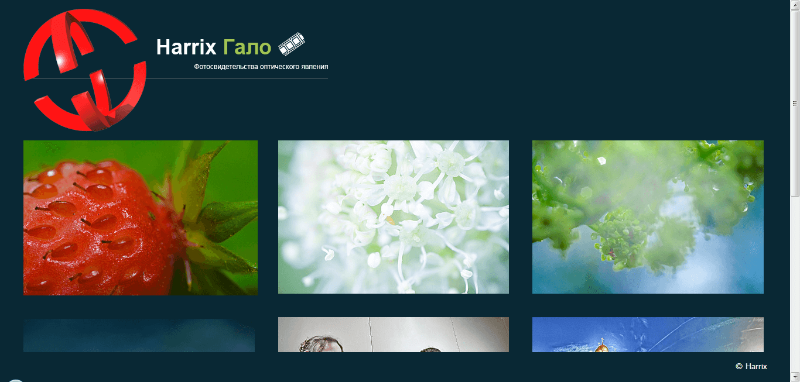

Но есть недостатки, которые не убрались средствами движка:

- Фоновые рисунки я бы поставил, а не только цветом.
- Подчеркивается логотип линией как для ссылок.
- Рисунки я бы надвинул бы на сам логотип.
- Футер бы сделал не приклеенным к низу окна браузера.

## Редактирование CSS

Значит, надо доредактировать средствами CSS вручную. По способу настройки можно найти информацию в [статье создателей движка](http://help.koken.me/customer/portal/articles/1033530-apply-custom-css-to-a-theme).

В режиме `Site` находим снизу слева `Custom CSS`:

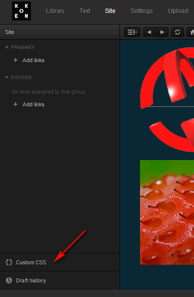

И появляется окно добавления CSS кода:

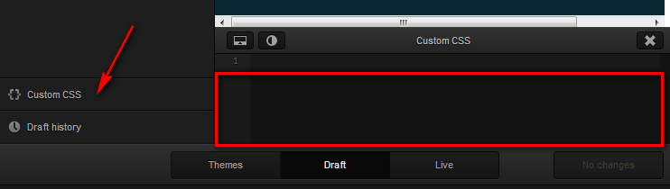

В настройках темы, как я делал выше поменял параметр `Inside pad на 10px`. Это такое отступление:

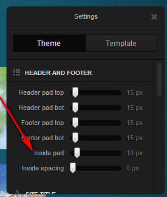

Ну, а в блок CSS я вставил следующий текст:

```css
body {
  background-image: url("body.png");
}
header.main {
  background-image: url("body.png");
  margin-bottom: -60px;
}
footer.main {
  background-image: url("body.png");
  position: relative;
  height: 50px;
}
a {
  border-bottom: 0px;
}
div #grid {
  margin-left: 100px;
  margin-right: 100px;
}

div#grid div.column a {
  margin-bottom: 25px;
  margin-right: 30px;
}
```

Разумеется, что файл `body.png` я скопировал в корень домена, где находится Koken.

И не забудьте сохранить изменения.

Как я искал нужные элементы, чтобы понять, что и как в CSS менять? В Chrome выделял объект, который хочу поменять, правый клик мыши, и шел `Посмотреть код элемента`, и там уже искал свойства и имена элементов. Например, ниже я искал свойства картинки в как элемента сетки:

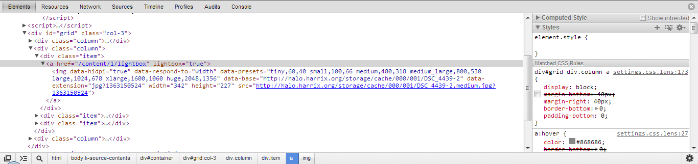

В итоге мы получаем всё, что нужно:

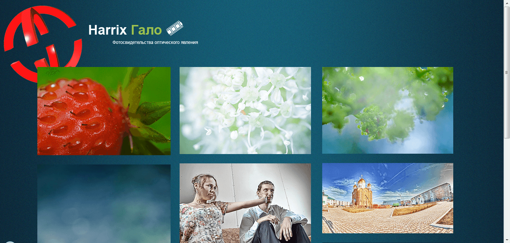

Осталось еще два момента:

1. Перевод полученного сайта.
2. Внедрение системы комментариев.

Но, это уже другая статья.

Помните, что при выборе другой темы, все изменения не сохраняются. Вам придется их заново вбивать. Так что сохраняйте у себя на компе.
