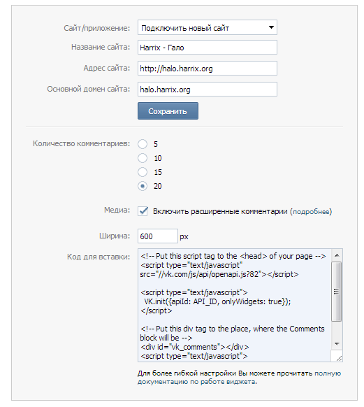
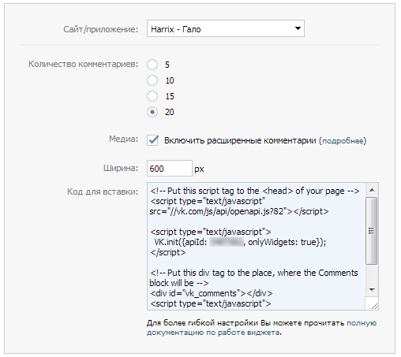
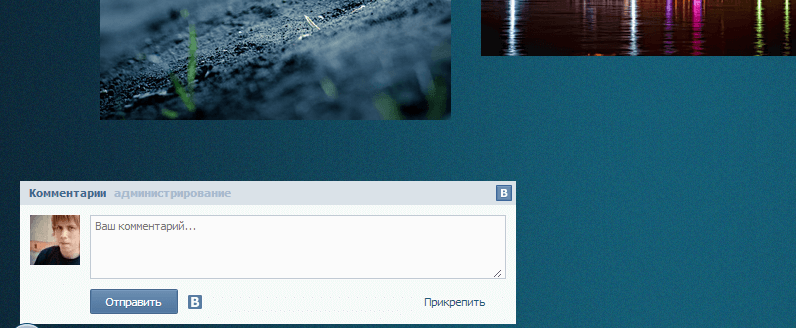
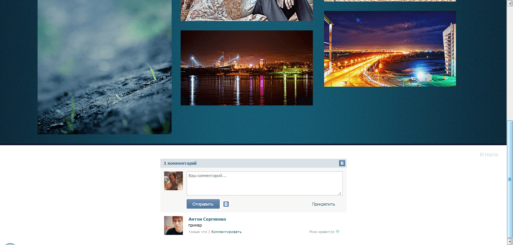

# Koken — CMS для фотогалерей — Подключение комментариев

Koken всем хорош, но нет системы комментирования. Может потом и появится, но на данный момент, этой функции нет. Логика понятна — обычно портфолио не подразумевают комментирование, так как художники ранимые натуры, а именно для портфолио и создавался этот движок в первую очередь. Что делать?

---

**Внимание!** <!-- !important -->

Кроме данного обзора, я этой CMS больше не занимался. Поэтому знаний больше, чем в статьях на этом блоге, у меня нет. Поэтому ответить на все ваши вопросы я не могу. Но [на официальном сайте](http://help.koken.me/customer/portal/questions/new) создатели активно и оперативно отвечают на вопросы (по крайней мере, когда писалась эта статья). Мне за сутки обычно отвечали. Спрашивайте, пожалуйста, у них. Они гораздо больше меня знают о своей системе.

---

Комментирование. Придется использовать сторонние сервисы для этого. На вскидку можно использовать несколько вариантов, например, ВКонтакте и Disqus. Также есть два варианта расположения комментариев: в контенте или в только на главной странице. Я рассмотрю ВКонтакте и на всех страницах кроме lightbox.

## Система комментирования ВКонтакте

Идем на сайт <https://vk.com/dev/Comments>

Регистрируем свой сайт:



После регистрации вы получаете коды для вашего сайта. Не забывайте, что у вас будет свой код со своим ID сайта:



Открываем, например, файл `[Ваша тема]/inc/header.html` и помещаем первый блок из системы комментирования ВКонтакте:

```html
<!-- Put this script tag to the <head> of your page -->
<script type="text/javascript" src="//vk.com/js/api/openapi.js?82"></script>
```

```html
<!DOCTYPE html>
<html lang="en">
  <head>
    <meta charset="utf-8" />
    <meta http-equiv="X-UA-Compatible" content="IE=edge,chrome=1" />
    <meta name="description" content="{{ site.description }}" />
    <meta name="author" content="{{ site.title }}" />
    <meta name="keywords" content="{{ site.keywords }}" />
    <meta name="viewport" content="width=device-width, initial-scale=1, minimum-scale=1, maximum-scale=1" />

    <koken:title />

    <koken:asset file="reset.css" common="true" />

    <koken:settings />

    <!-- Put this script tag to the <head> of your page -->
    <script type="text/javascript" src="//vk.com/js/api/openapi.js?82"></script>
  </head>
</html>
```

Открываем, например, файл `[Ваша тема]/inc/footer.html` и помещаем второй и третий блок из системы комментирования ВКонтакте:

```html
<script type="text/javascript">
  VK.init({ apiId: ВАШ_ID, onlyWidgets: true });
</script>

<!-- Put this div tag to the place, where the Comments block will be -->
<div id="vk_comments"></div>
<script type="text/javascript">
  VK.Widgets.Comments("vk_comments", { limit: 10, width: "496", attach: "*" });
</script>
```

```html
  </div> <!-- close container -->

  <footer class="main">

    <span class="copyright">
      {{ site.copyright }}
    </span>

    <koken:navigation group="footer" />

    <koken:if true="settings.show_social">
      <div class="social">
        <!--<a class="addthis_button_facebook_like" fb:like:layout="button_count"></a>
        <a class="addthis_button_tweet"></a>-->
      </div>
    </koken:if>

<script type="text/javascript">
  VK.init({apiId: ВАШ_ID, onlyWidgets: true});
</script>

<!-- Put this div tag to the place, where the Comments block will be -->
<div id="vk_comments"></div>
<script type="text/javascript">
VK.Widgets.Comments("vk_comments", {limit: 10, width: "496", attach: "*"});
</script>

  </footer>

</body>

</html>
```

Применяем изменения в теме, и на сайте появилась система комментирования:



Ну и отредактируйте или сам footer.html, или (и) через `Custom CSS`, как в прошлой статье, чтобы система комментирования смотрелась органично. Я поменял в `Custom CSS`:

```css
footer.main {
  background-color: white;
  position: relative;
  margin-bottom: -100px;
}
```

A `footer.html` поменял на такой:

```html
  </div> <!-- close container -->

  <div style="width:100%;height:4px;background-color:#071327;">
  </div>

  <footer class="main">

    <span class="copyright" style="color:#d7d7d7;">
      {{ site.copyright }}
    </span>

    <koken:navigation group="footer" />

    <koken:if true="settings.show_social">
      <div class="social">
        <!--<a class="addthis_button_facebook_like" fb:like:layout="button_count"></a>
        <a class="addthis_button_tweet"></a>-->
      </div>
    </koken:if>

<script type="text/javascript">
  VK.init({apiId: 3497362, onlyWidgets: true});
</script>

<!-- Put this div tag to the place, where the Comments block will be -->
<div id="vk_comments" style="margin: 0 auto;"></div>
<script type="text/javascript">
VK.Widgets.Comments("vk_comments", {limit: 20, width: "496", attach: "*"});
</script>

  </footer>

</body>

</html>
```

В общем, можно сделать, всё, что вы захотите. В итоге получил следующее:


