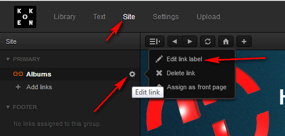
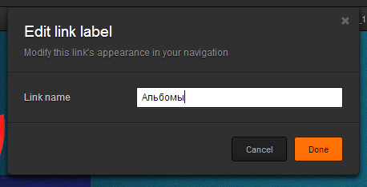
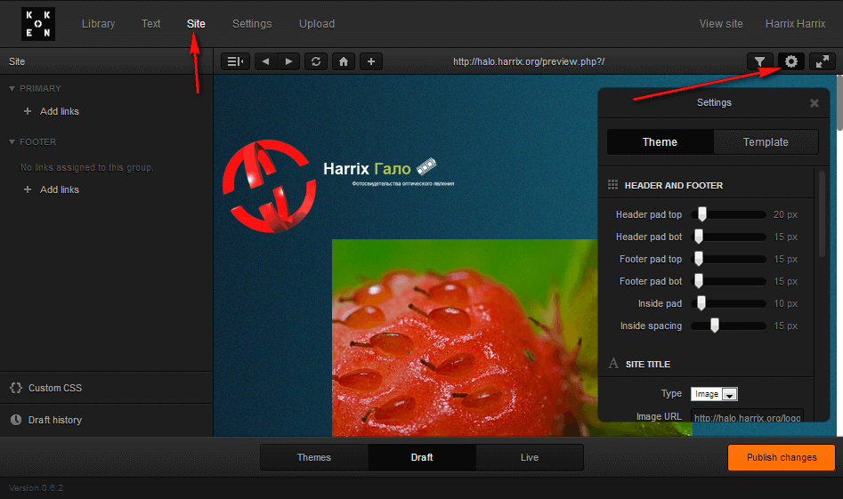
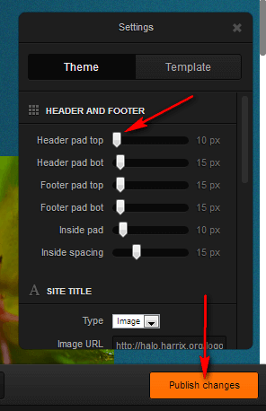
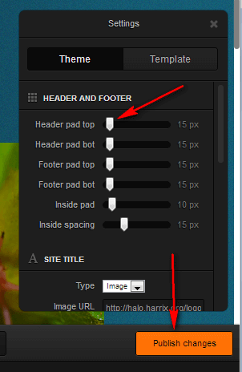
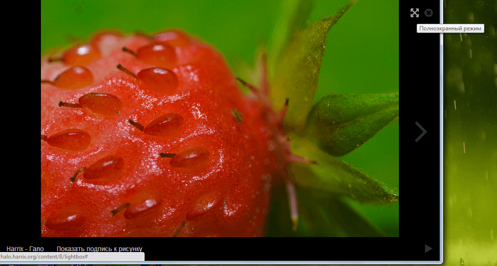
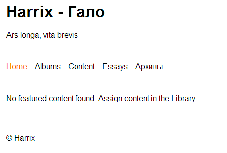
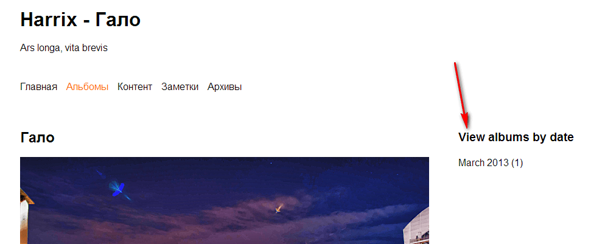

# Koken — CMS для фотогалерей — Принцип перевода сайта

В предыдущих статьях было подробно рассмотрено как установить, движок, настроить его, поменять тему и ее настроить, а теперь поговорим, как можно локализовать полученный сайт.

Вообще то, создатели движка обещают сделать в будущем мультиязычность, но пока этого нет.

---

**Внимание!** <!-- !important -->

Кроме данного обзора, я этой CMS больше не занимался. Поэтому знаний больше, чем в статьях на этом блоге, у меня нет. Поэтому ответить на все ваши вопросы я не могу. Но [на официальном сайте](http://help.koken.me/customer/portal/questions/new) создатели активно и оперативно отвечают на вопросы (по крайней мере, когда писалась эта статья). Мне за сутки обычно отвечали. Спрашивайте, пожалуйста, у них. Они гораздо больше меня знают о своей системе.

---

На самом деле в том варианте, который я создал, сайт не содержит много элементов, требующих перевода, но всё-таки есть, а в других темах вообще много английских терминов. Попробуем исправить.

## Перевод меню

Часть вариантов можно перевести способом, который я указывал в предыдущих статьях. Это относится к пунктам меню в верхнем меню и в «подвале»:





## Перевод lightbox

Это критично для меня, так как именно lightbox у меня и не переведен. Всё остальное я выпилил из темы.

Скопируйте файл `[Ваш домен]/app/site/themes/lightbox.lens` в папку с вашей темой. У меня это `[Ваш домен]/storage/themes/regale_harrix`.

Переведите всё, что там содержится, там где нужно. Привожу список переведенных фраз (находите их и меняйте):

- `Show caption` — `Показать подпись к рисунку`
- `Hide caption` — `Скрыть подпись к рисунку`
- `Enter fullscreen` — `Полноэкранный режим`
- `Exit fullscreen` — `Закрыть полноэкранный режим`
- `Close lightbox` — `Закрыть просмотр фотографии`
- `Back to sit`e — `Вернуться на сайт`
- `of ... from the album` — `из ... из альбома`

Перенесите все на сервер. И примените изменения темы. Я делаю это так: меняю что-то в теме, сохраняю, возвращаю, сохраняю. Костыль, но всё же:







И теперь lightbox переведен:



## Перевод всего сайта

Например, вы использовали тему не `Regale`, как я, а `Blueprint` как основу для своей. Я при применении темы вижу вот это:



Если пункты меню мы знаем перевести, то фразу `No featured content found. Assign content in the Library.` нет. Поиск текста в файлах движка (через Notepad++) показал, что этот текст содержится в файле `[Ваш домен]/storage/themes/blueprint_harrix/index.lens/lightbox.lens`. То есть это файл в самой теме. Открываем его и переводим текст. Было:

```html
<koken:include file="inc/header.html" />

<div id="content">

  <!-- Load this template's source data (featured content) -->
  <koken:load>

    <!-- Slideshow that loads template data (Featured Content by default) -->
    <koken:pulse />

    <!-- Fallback content if no data was loaded by koken:load -->
    <koken:else>

      <p>
        No featured content found. Assign content in the Library.
      </p>

  </koken:load>

</div> <!-- close #content -->

<koken:include file="inc/footer.html" />
```

Стало:

```html
<koken:include file="inc/header.html" />

<div id="content">

  <!-- Load this template's source data (featured content) -->
  <koken:load>

    <!-- Slideshow that loads template data (Featured Content by default) -->
    <koken:pulse />

    <!-- Fallback content if no data was loaded by koken:load -->
    <koken:else>

      <p>
        Избранный контент не найден. Добавьте его в Library в админке сайта.
      </p>

  </koken:load>

</div> <!-- close #content -->

<koken:include file="inc/footer.html" />
```

Если зайдем в альбомы, то найдем еще непереведенный текст:



Поиск по файлам показал, что текст `View albums by date` содержится в файле: `[Ваш домен]/storage/themes/blueprint_harrix/index.lens/albums.lens`. Переводим нужный текст там, копируем на сервер, применяем изменения и всё переведено.

Итак, общий принцип перевода: ищем текст. Если текст содержится в файле в папке с темой, то просто переводим. Если текст содержится не в папке с темой, то копируем этот файл в папку с темой и там переводим. Копируем на сервер. Применяем изменения. Данный подход применим к файлам с расширением `.lens`, либо к файлам, находящимся в папке с темой.

Переводить файлы не в папке с темой нежелательно, потому что перевод то будет осуществлен, но когда движок обновится или темы стандартные обновятся, то после обновлений все переводы исчезнут. А оно вам надо?

## Перевод дат и некоторых системных параметров

Осталось перевести даты и некоторые системные моменты. Вот тут засада. Тексты содержатся в PHP файлах в папке `[Ваш домен]/app/language/english`. То есть это свидетельство того, что мультиязычность будет поддерживаться, но пока (версия 0.6.2) этого нет. Так что придется редактировать эти файлы, и сохранять резервно, чтобы при обновлении заменять (но заменять с умом, смотря, что за изменения произошли).

Так как в моей теме ничего больше переводить не нужно, то я только укажу на файл с датами `calendar_lang.php`. Переводите пока сами) Может потом и займусь.
