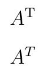

# FAQ по LaTeX

Здесь будут публиковаться бессистемные моменты по LaTeX, которые могут пригодиться вам, а я смогу не забыть их.

## Установил TeXstudio, но ничего не компилируется и PDF файлы не создаются

TeXstudio — это только редактор кода. За компиляцию отвечает другая программа, например, можно установить MiKTeX.

## Как вставить пустую строку

Вставьте следующий код:

```tex
\vspace{\baselineskip}
```

Или так:

```tex
\newline
```

## Как вставить разрыв новой страницы

Вставьте следующий код:

```tex
\newpage
```

## Как получить отступ красной строки для первой строки абзаца

Вставьте следующий код в преамбулу:

```tex
\usepackage{indentfirst} % Красная строка
```

## Как подключить русский язык

Вставьте следующий код в преамбулу:

```tex
%%% Кодировки и шрифты %%%
\usepackage{cmap} % Улучшенный поиск русских слов в полученном pdf-файле
\usepackage[T2A]{fontenc} % Поддержка русских букв
\usepackage[utf8]{inputenc} % Кодировка utf8
\usepackage[english, russian]{babel} % Языки: русский, английский
\usepackage{pscyr} % Нормальные шрифты
```

Вот тут говорится, как установить модуль Pscyr: [Установка PSCyr для LaTeX](/blog/2018/pscyr/).

## Как поставить логотип на титульной странице в LaTeX типа article

Читайте тут: [Логотип на титульной странице в LaTeX](/blog/2013/logo-on-title-page-latex/).

## Как установить модуль Pscyr

Читайте тут: [Установка PSCyr для LaTeX](/blog/2018/pscyr/).

## Как сделать гиперссылки в LaTeX

Читайте тут: [Ссылки и гиперссылки в LaTeX](/blog/2013/latex-links-and-hyperlinks/).

## Как сделать проверку орфографии в LaTeX

Читайте тут: [Проверка орфографии в TeXstudio](/blog/2013/spell-check-in-texstudio/).

## Как оформить псевдокод в LaTeX

Читайте тут: [Псевдокод в LaTeX для русского текста — algorithm2e](/blog/2013/algorithm2e-cyrillic/).

Но лучше тут: [Псевдокод в LaTeX для русского текста — algorithmicx](/blog/2013/algorithmicx-cyrillic/)

## Как оформить подсветку синтаксиса с кириллицей в LaTeX

Читайте тут: [Подсветка синтаксиса в LaTeX с кириллицей](/blog/2013/latex-highlight-cyrillic/).

## Как убрать отступ у списка itemize перед предыдущим текстом

Читайте тут: [Как убрать отступ у списка itemize перед предыдущим текстом](/blog/2013/remove-indent-of-itemize/).

## Как вставить обратный слэш

Вот такой командой:

```tex
\textbackslash
```

## Как вставить знак тильды

Вот такой командой:

```tex
\textasciitilde
```

Или так:

```tex
$\sim$
```

## Как оформлять список литературы в LaTeX

Читать тут: [Как оформлять список литературы в LaTeX](/blog/2013/bibliography-in-latex/).

## Какой символ использовать для знака транспонирования

```tex
\mathrm{T}
```

Сравните:

```tex
$ A^\mathrm{T} $

$ A^T $
```



## Как вставить принудительно отступ красной строки

Через команду:

```tex
\indent
```

## Как удалить принудительно отступ красной строки

Через команду:

```tex
\noindent
```

## Как вставить неразрывный пробел

Через символ `~` Например:

```tex
и т.~д.
```

## Как в подписи к рисункам поменять двоеточие на точку

Добавьте в преамбуле код:

```tex
\RequirePackage{caption}
\DeclareCaptionLabelSeparator{defffis}{. }
\captionsetup{justification=centering,labelsep=defffis}
```

Если вам нужен другой символ, то во второй строчке поменяйте на свою комбинацию символов в последних фигурных стрелках.

## Как сделать полуторный, двойной интервал между строчками

Используйте в преамбуле следующий код для одинарного интервала (по умолчанию):

```tex
\usepackage{setspace}
\singlespacing
```

Используйте в преамбуле следующий код для полуторного интервала:

```tex
\usepackage{setspace}
\onehalfspacing
```

Используйте в преамбуле следующий код для двойного интервала:

```tex
\usepackage{setspace}
\doublespacing
```

Используйте в преамбуле следующий код для своего интервала между строками:

```tex
\usepackage{setspace}
\setstretch{1.25}
```

## Как LaTeX текст вставить в Illustrator

Читайте в статье [LaTeX и Illustrator](/blog/2013/latex-and-illustrator/)

## Как оформить двойной индекс в формулах

Читайте в статье [Двойной индекс в LaTeX](/blog/2013/double-index-in-latex/).

## При компиляции возникает ошибка «TeX capacity exceeded, sorry [main memory size=3000000]»

Настройте MiKTeX как указано в статье [Установка и настройка программ для редактирования LaTeX файлов](/blog/2018/install-latex/). Это увеличит объем памяти для компиляции LaTeX файлов.
