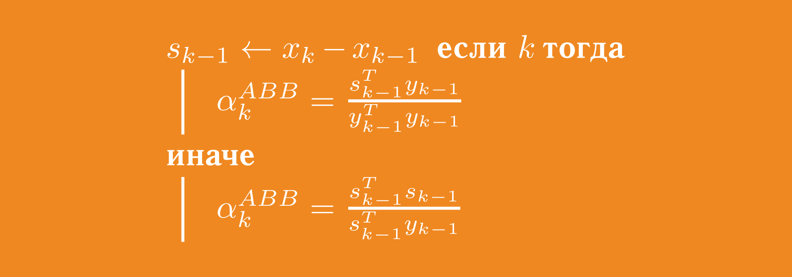
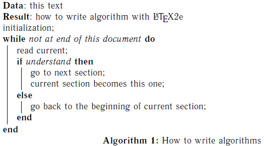
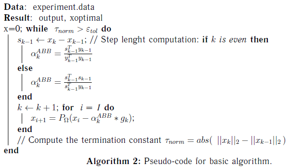
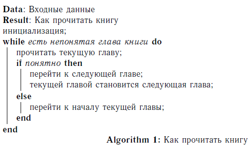
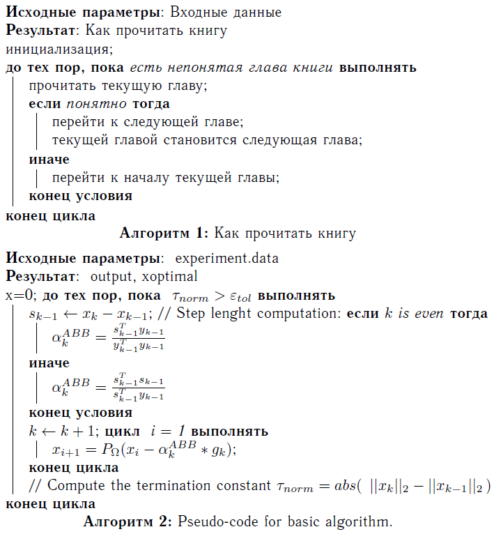

# Псевдокод в LaTeX для русского текста — algorithm2e



В прошлой [статье](https://github.com/Harrix/harrix.dev-articles-2013/blob/main/latex-highlight-cyrillic/latex-highlight-cyrillic.md) | [🡥](https://harrix.dev/ru/articles/2013/latex-highlight-cyrillic/) писал о подсветке синтаксиса, но иногда надо нарисовать псевдокод в красивой форме. Что делать?

- [Установка](#установка)
- [Использование](#использование)
- [Перевод](#перевод)

> [!info]
> **Внимание!**
>
> Если планируете использовать пакет для отображения алгоритмов больше одной страницы в длину, то откажитесь от него, так как он не приспособлен для разрезания алгоритмов по страницам. Используйте лучше пакет [algorithmicx](https://github.com/Harrix/harrix.dev-articles-2013/blob/main/algorithmicx-cyrillic/algorithmicx-cyrillic.md) | [🡥](https://harrix.dev/ru/articles/2013/algorithmicx-cyrillic/).

## Установка

Скачиваем файл **algorithm2e.sty** тут в разделе `tex`:

<https://ctan.org/tex-archive/macros/latex/contrib/algorithm2e/>

Кидаем файл **algorithm2e.sty** в папку с tex файлом.

Пишем в в tex файле подключение плагина:

```tex
\usepackage{algorithm2e}
```

## Использование

И уже в тексте пишем свой псевдокод:

```tex
\begin{algorithm}[H]
  \SetAlgoLined
  \KwData{this text}
  \KwResult{how to write algorithm with LaTeX2e }
  initialization;
  \While{not at end of this document}{
    read current;
    \eIf{understand}{
      go to next section; current section becomes this one;
    }{
    go back to the beginning of current section;
  }
}
\caption{How to write algorithms}
\end{algorithm}
```

Получим следующее:



_Рисунок 1 — Простой пример псевдокода_

На этот код получим следующее:

```tex
% Второй алгоритм
\begin{algorithm}[H]
  \SetAlgoLined %% Это соединяет линиями логические части
  %% алгоритма типа if-then-else

  \KwData{ experiment.data} %% здесь можно указать исходные параметры
  \KwResult{ output, xoptimal } %% результат работы программы
  x=0;
  \While{ $\tau_{norm} > \varepsilon_{tol}$ }{
    $s_{k-1} \leftarrow x_k - x_{k-1}$;
    // Step length computation: %% это комментарий, который будет виден.
    \eIf{$k$ is even}{
      $ \alpha_k^{ABB} = \frac{ s_{k-1}^T y_{k-1}}{y_{k-1}^T y_{k-1}}$
    }{ %% ELSE
    $\alpha_k^{ABB} = \frac{ s_{k-1}^T s_{k-1}}{s_{k-1}^T y_{k-1}}$
  } %% END eIf{$k$ is even}{
  $k \leftarrow k + 1$;
  \For{ i = 1}{
    $x_{i+1} = P_\Omega(x_i - \alpha_k^{ABB}*g_k)$;
  } %% END For{ i = 1}{
  // Compute the termination constant %% это комментарий, который будет виден.
  $\tau_{norm} = abs ( ||x_{k}||_2 - ||x_{k-1}||_2)$
} %% END While{ $\tau_{norm} > \varepsilon_{tol}$ }{
\caption{Pseudo-code for basic algorithm.}
\label{alg:generalGP}
\end{algorithm}
```



_Рисунок 2 — Пример псевдокода с формулами_

Русский текст плагин понимает хорошо:

```tex
% Первый алгоритм
\begin{algorithm}[H]
    \SetAlgoLined
    \KwData{Входные данные}
    \KwResult{Как прочитать книгу }
    инициализация;
    \While{есть непонятая глава книги}{
      прочитать текущую главу;
      \eIf{понятно}{
        перейти к следующей главе; текущей главой становится следующая глава;
      }{
      перейти к началу текущей главы;
    }
  }
  \caption{Как прочитать книгу}
\end{algorithm}
```

Получим следующий результат:



_Рисунок 3 — Пример псевдокода с русским текстом_

## Перевод

Если мы добавим вот такие параметры, то после подключения плагина, то произведем перевод плагина на русский язык:

```tex
% Перевод плагина
\SetKwInput{KwData}{Исходные параметры}
\SetKwInput{KwResult}{Результат}
\SetKwInput{KwIn}{Входные данные}
\SetKwInput{KwOut}{Выходные данные}
\SetKwIF{If}{ElseIf}{Else}{если}{тогда}{иначе если}{иначе}{конец условия}
\SetKwFor{While}{до тех пор, пока}{выполнять}{конец цикла}
\SetKw{KwTo}{от}
\SetKw{KwRet}{возвратить}
\SetKw{Return}{возвратить}
\SetKwBlock{Begin}{начало блока}{конец блока}
\SetKwSwitch{Switch}{Case}{Other}{Проверить значение}{и выполнить}{вариант}{в противном случае}{конец варианта}{конец проверки значений}
\SetKwFor{For}{цикл}{выполнять}{конец цикла}
\SetKwFor{ForEach}{для каждого}{выполнять}{конец цикла}
\SetKwRepeat{Repeat}{повторять}{до тех пор, пока}
\SetAlgorithmName{Алгоритм}{алгоритм}{Список алгоритмов}
```

Итак, если возьмем следующий документ (аналогичные примеры, как и выше), то получим следующее:

```tex
\documentclass{article}

\usepackage[T2A]{fontenc} % Поддержка русских букв
\usepackage[utf8]{inputenc} % Кодировка utf8
\usepackage[english, russian]{babel} % Языки: русский, английский
\usepackage{pscyr} % Нормальные шрифты

\usepackage{algorithm2e}

% Перевод плагина
\SetKwInput{KwData}{Исходные параметры}
\SetKwInput{KwResult}{Результат}
\SetKwInput{KwIn}{Входные данные}
\SetKwInput{KwOut}{Выходные данные}
\SetKwIF{If}{ElseIf}{Else}{если}{тогда}{иначе если}{иначе}{конец условия}
\SetKwFor{While}{до тех пор, пока}{выполнять}{конец цикла}
\SetKw{KwTo}{от}
\SetKw{KwRet}{возвратить}
\SetKw{Return}{возвратить}
\SetKwBlock{Begin}{начало блока}{конец блока}
\SetKwSwitch{Switch}{Case}{Other}{Проверить значение}{и выполнить}{вариант}{в противном случае}{конец варианта}{конец проверки значений}
\SetKwFor{For}{цикл}{выполнять}{конец цикла}
\SetKwFor{ForEach}{для каждого}{выполнять}{конец цикла}
\SetKwRepeat{Repeat}{повторять}{до тех пор, пока}
\SetAlgorithmName{Алгоритм}{алгоритм}{Список алгоритмов}

\begin{document}

  % Первый алгоритм
  \begin{algorithm}[H]
    \SetAlgoLined
    \KwData{Входные данные}
    \KwResult{Как прочитать книгу }
    инициализация;
    \While{есть непонятая глава книги}{
      прочитать текущую главу;
      \eIf{понятно}{
        перейти к следующей главе; текущей главой становится следующая глава;
      }{
      перейти к началу текущей главы;
    }
  }
  \caption{Как прочитать книгу}
\end{algorithm}

% Второй алгоритм
\begin{algorithm}[H]
  \SetAlgoLined %% Это соединяет линиями логические части
  %% алгоритма типа if-then-else

  \KwData{ experiment.data} %% здесь можно указать исходные параметры
  \KwResult{ output, xoptimal } %% результат работы программы
  x=0;
  \While{ $\tau_{norm} > \varepsilon_{tol}$ }{
    $s_{k-1} \leftarrow x_k - x_{k-1}$;
    // Step length computation: %% это комментарий, который будет виден.
    \eIf{$k$ is even}{
      $ \alpha_k^{ABB} = \frac{ s_{k-1}^T y_{k-1}}{y_{k-1}^T y_{k-1}}$
    }{ %% ELSE
    $\alpha_k^{ABB} = \frac{ s_{k-1}^T s_{k-1}}{s_{k-1}^T y_{k-1}}$
  } %% END eIf{$k$ is even}{
  $k \leftarrow k + 1$;
  \For{ i = 1}{
    $x_{i+1} = P_\Omega(x_i - \alpha_k^{ABB}*g_k)$;
  } %% END For{ i = 1}{
  // Compute the termination constant %% это комментарий, который будет виден.
  $\tau_{norm} = abs ( ||x_{k}||_2 - ||x_{k-1}||_2)$
} %% END While{ $\tau_{norm} > \varepsilon_{tol}$ }{
\caption{Pseudo-code for basic algorithm.}
\label{alg:generalGP}
\end{algorithm}

\end{document}
```



_Рисунок 4 — Пример псевдокода с русскими командами_

В руководстве есть множество примеров, которые вы можете самостоятельно разобрать.
