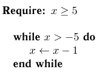

# Псевдокод в LaTeX для русского текста — algorithmicx


Остановился на пакете **algorithmicx** для отображения псевдокодов в LaTeX. Ниже его описание и примеры использования.

Если хотите, то можете сразу перейти к полному [примеру](#пример-использования) внизу статьи.

## Установка

Если у вас не будет в вашем LaTeX редакторе данного пакета **algorithmicx**, то можно скачать на официальном репозитории: <https://ctan.org/tex-archive/macros/latex/contrib/algorithmicx>.

Скопируйте файлы в папку с вашим LaTeX документом (но в том же MiKTex пакет и так есть, так что копировать ничего не надо).

Документация на сайте: [algorithmicx.pdf](http://mirror.macomnet.net/pub/CTAN/macros/latex/contrib/algorithmicx/algorithmicx.pdf).

Ну, а теперь подключаем пакет в LaTeX документе:

```tex
\usepackage{algorithm}
\usepackage{algpseudocode}
```

## Использование

Уже в теле документа пишем свой псевдокод:

```tex
\begin{algorithmic}
  \If {$i\geq maxval$}
  \State $i\gets 0$
  \Else
  \If {$i+k\leq maxval$}
  \State $i\gets i+k$
  \EndIf
  \EndIf
\end{algorithmic}
```

Получим следующее:


_Рисунок 1 — Псевдокод в PDF_

Если мы хотим обернуть алгоритм в нормальную обертку с заголовком алгоритма, то используйте обертку, как в следующем примере:

```tex
\begin{algorithm}
\caption{Какой-то алгоритм}\label{alg:Example}
\begin{algorithmic}[1]

\If {$i\geq maxval$}
  \State $i\gets 0$
\Else
  \If {$i+k\leq maxval$}
    \State $i\gets i+k$
  \EndIf
\EndIf

\end{algorithmic}
\end{algorithm}
```

Получим вот это:


_Рисунок 2 — Псевдокод с оберткой в PDF_

Полный документ ниже представлен:

```tex
\documentclass{article}

\usepackage[T2A]{fontenc} % Поддержка русских букв
\usepackage[utf8]{inputenc} % Кодировка utf8
\usepackage[english, russian]{babel} % Языки: русский, английский
\usepackage{pscyr} % Нормальные шрифты

\usepackage{algorithm}
\usepackage{algpseudocode}

\begin{document}

\begin{algorithm}
\caption{Какой-то алгоритм}\label{alg:Example}
\begin{algorithmic}[1]

\If {$i\geq maxval$}
  \State $i\gets 0$
\Else
  \If {$i+k\leq maxval$}
    \State $i\gets i+k$
  \EndIf
\EndIf

\end{algorithmic}
\end{algorithm}

\end{document}
```

## Описание некоторых команд

### Цикл

```tex
\For{<text>}
<body>
\EndFor
```


_Рисунок 3 — Цикл_

```tex
\For{<text>}
\State Линия 1
\State Линия 1
\EndFor
```


_Рисунок 4 — Цикл с несколькими командами_

### Цикл для всех элементов

```tex
\ForAll{<text>}
<body>
\EndFor
```


_Рисунок 5 — Цикл для всех элементов_

### Цикл с предусловием

```tex
\While{<text>}
<body>
\EndWhile
```


_Рисунок 6 — Цикл с предусловием_

```tex
\While{$ile n$}
\State $sum\gets sum+i$
\State $i\gets i+1$
\EndWhile
```


_Рисунок 7 — Цикл с предусловием с несколькими командами_

### Цикл с постусловием

```tex
\Repeat
<body>
\Until{<text>}
```


_Рисунок 8 — Цикл с постусловием_

```tex
\Repeat
\State $sum\gets sum+i$
\State $i\gets i+1$
\Until{$i>n$}
```


_Рисунок 9 — Цикл с постусловием с несколькими командами_

### Условие

```tex
\If{$quality\ge 9$}
\State $a\gets perfect$
\ElsIf{$quality\ge 7$}
\State $a\gets good$
\ElsIf{$quality\ge 5$}
\State $a\gets medium$
\ElsIf{$quality\ge 3$}
\State $a\gets bad$
\Else
\State $a\gets unusable$
\EndIf
```


_Рисунок 10 — Условие_

### Процедура

```tex
\Procedure{<name>}{<params>}
<body>
\EndProcedure
```


_Рисунок 11 — Процедура_

Если хотите потом выделить в псевдокоде вызов процедуры или функции, то используйте конструкцию:

```tex
\State \Call{<name>}{<params>}
```

Например:

```tex
\Procedure{MakeArray}{Число элементов}
\State $X=new int[5]$
\EndProcedure

\Statex
\State \Call{MakeArray}{10}
```


_Рисунок 12 — Вызов процедуры_

### Функция

```tex
\Function{<name>}{<params>}
<body>
\EndFunction
```


_Рисунок 13 — Функция_

### Зациклить

```tex
\Loop
<body>
\EndLoop
```


_Рисунок 14 — Зацикливание_

### Обязательные условия

```tex
\Require $x\ge5$
\Statex
\While{$x>-5$}
\State $x\gets x-1$
\EndWhile
```



_Рисунок 15 — Обязательные условия_

### Обеспечивающие условия

```tex
\Ensure $x\le-5$
\Statex
\While{$x>-5$}
\State $x\gets x-1$
\EndWhile
```


_Рисунок 16 — Обеспечивающие условия_

### Возвратить какое-то значение

Используйте конструкцию:

```tex
\State \Return <text>
```

Например:

```tex
\If {$i\geq maxval$}
  \State $i\gets 0$
\Else
  \If {$i+k\leq maxval$}
    \State $i\gets i+k$
  \EndIf
  \State \Return $X$
\EndIf
```


_Рисунок 17 — Возвращение какое-то значение_

## Дополнительные настройки

### Нумерация строк

Чтобы была нумерация строк, то вставьте в строке в квадратных скобках число, которое говорит какую каждую строку нумеровать:

```tex
\begin{algorithmic}
```

```tex
\begin{algorithmic}[1]
```

Для `\begin{algorithmic}` получим:


_Рисунок 18 — Без нумерации строк_

Для `\begin{algorithmic}[1]` получим:


_Рисунок 19 — Нумерация строк_

Для `\begin{algorithmic}[2]` получим:


_Рисунок 20 — Нумерация строк через одну_

### Пустые строки

Чтобы вставить пустую строку, то используйте команду:

```tex
\Statex
```

Например:

```tex
\begin{algorithm}
\caption{Какой-то алгоритм}\label{alg:Example}
\begin{algorithmic}[1]

\If {$i\geq maxval$}
  \State $i\gets 0$
\Statex
\Else
  \If {$i+k\leq maxval$}
    \State $i\gets i+k$
  \EndIf
\EndIf

\end{algorithmic}
\end{algorithm}
```


_Рисунок 21 — Пустая строка_

### Блоки кода без команд закрытия

Чтобы не писались окончания команд, например, `end if`, `end for` и др., то вызовите пакет algorithmicx с параметром `noend`.

Было:

```tex
\usepackage{algorithm}
\usepackage{algpseudocode}
```

Стало:

```tex
\usepackage{algorithm}
\usepackage[noend]{algpseudocode}
```

Было:


_Рисунок 22 — С окончанием end в командах_

Стало:


_Рисунок 23 — Без окончания end в командах_

### Список алгоритмов

Чтобы вывести список алгоритмов используйте конструкцию:

```tex
\listofalgorithms
```

В полном варианте:

```tex
\documentclass{article}

\usepackage[T2A]{fontenc} % Поддержка русских букв
\usepackage[utf8]{inputenc} % Кодировка utf8
\usepackage[english, russian]{babel} % Языки: русский, английский
\usepackage{pscyr} % Нормальные шрифты

\usepackage{algorithm}
\usepackage{algpseudocode}

\begin{document}

\begin{algorithm}
\caption{Какой-то алгоритм}\label{alg:Example}
\begin{algorithmic}[1]

\If {$i\geq maxval$}
  \State $i\gets 0$
\Else
  \If {$i+k\leq maxval$}
    \State $i\gets i+k$
  \EndIf
\EndIf

\end{algorithmic}
\end{algorithm}

\listofalgorithms

\end{document}
```

В итоге получим:


_Рисунок 24 — Список алгоритмов_

### Комментарии

Чтобы вставить комментарий, используйте команду:

```tex
\Comment{Текст комментария}
```

Например:

```tex
\documentclass{article}

\usepackage[T2A]{fontenc} % Поддержка русских букв
\usepackage[utf8]{inputenc} % Кодировка utf8
\usepackage[english, russian]{babel} % Языки: русский, английский
\usepackage{pscyr} % Нормальные шрифты

\usepackage{algorithm}
\usepackage{algpseudocode}

\begin{document}

\begin{algorithm}
\caption{Какой-то алгоритм}\label{alg:Example}
\begin{algorithmic}[1]

\If {$i\geq maxval$}
  \State $i\gets 0$
  \Comment{Тут что-то интересное}
\Else
  \If {$i+k\leq maxval$}
    \State $i\gets i+k$
  \EndIf
\EndIf

\end{algorithmic}
\end{algorithm}

\end{document}
```


_Рисунок 25 — Комментарии_

### Добавление своих команд

Мне, например, нужны блоки, обозначающие начало и конец алгоритма.

Для блоков вставьте такую конструкцию:

```tex
\algblock[ALGORITHMBLOCK]{BeginAlgorithm}{EndAlgorithm}
\algblock[BLOCK]{BeginBlock}{EndBlock}
```

В общем это будет так:

```tex
\documentclass{article}

\usepackage[T2A]{fontenc} % Поддержка русских букв
\usepackage[utf8]{inputenc} % Кодировка utf8
\usepackage[english, russian]{babel} % Языки: русский, английский
\usepackage{pscyr} % Нормальные шрифты

\usepackage{algorithm}
\usepackage{algpseudocode}

\begin{document}

\algblock[ALGORITHMBLOCK]{BeginAlgorithm}{EndAlgorithm}
\algblock[BLOCK]{BeginBlock}{EndBlock}

\begin{algorithmic}[1]
\BeginAlgorithm
\BeginBlock Пример
\BeginBlock Еще один блок
\State $X=2$
\EndBlock
\EndBlock
\EndAlgorithm
\end{algorithmic}

\end{document}
```

Получим:


_Рисунок 26 — Собственные команды_

### Правильный перенос длинных строк

Иногда вы будете использовать длинные строки в каких-то параметрах, например, как в следующем примере:

```tex
\documentclass{article}

\usepackage{algorithm}
\usepackage{algpseudocode}

\begin{document}

\begin{algorithmic}

\If {$i\geq maxval$}
  \State bla bla bla bla bla bla bla bla bla bla bla bla bla bla bla bla bla bla bla bla bla bla bla bla bla bla bla bla bla bla bla bla bla bla bla bla bla bla bla bla bla bla
\Else
  \If {$i+k\leq maxval$}
    \State bla bla bla bla bla bla bla bla bla bla bla bla bla bla bla bla bla bla bla bla bla bla bla bla bla bla bla bla bla bla bla bla bla bla bla bla bla bla bla bla bla bla
  \EndIf
\EndIf

\end{algorithmic}

\end{document}
```


_Рисунок 27 — Некрасивый перенос длинных строк_

Как видите, отступы при переносе строки не такие, какие нам нужны. Чтобы это решить, заключайте текст соответствующей строки в конструкцию:

```tex
\parbox[t]{\dimexpr\linewidth-\algorithmicindent}{<text>strut}
```

На примере:

```tex
\documentclass{article}

\usepackage{algorithm}
\usepackage{algpseudocode}

\begin{document}

\begin{algorithmic}

\If {$i\geq maxval$}
  \State \parbox[t]{\dimexpr\linewidth-\algorithmicindent}{bla bla bla bla bla bla bla bla bla bla bla bla bla bla bla bla bla bla bla bla bla bla bla bla bla bla bla bla bla bla bla bla bla bla bla bla bla bla bla bla bla bla}
\Else
  \If {$i+k\leq maxval$}
    \State \parbox[t]{\dimexpr\linewidth-\algorithmicindent}{bla bla bla bla bla bla bla bla bla bla bla bla bla bla bla bla bla bla bla bla bla bla bla bla bla bla bla bla bla bla bla bla bla bla bla bla bla bla bla bla bla bla}
  \EndIf
\EndIf

\end{algorithmic}

\end{document}
```


_Рисунок 28 — Перенос длинных строк_

Если у вас несколько вложенностей, то такой сдвинутый блок может съехать:


_Рисунок 29 — Сдвинутый блок съехал_

Чтобы этого не происходило, то надо в структуре `\parbox[t]{\dimexpr\linewidth-\algorithmicindent}{<text>strut}` несколько раз отнять `\algorithmicindent` по числу вложенностей. Для неправильного выше примера это будет выглядеть так:

```tex
\documentclass{article}
\usepackage{algpseudocode}
\usepackage{algorithm}

\begin{document}

\begin{algorithm}
  \caption{Examples}\label{alg:Examples}
  \begin{algorithmic}
  \While{$Y<5$}
  \While{$Y<5$}

  \If{$quality\ge 9$}
  \State \parbox[t]{\dimexpr\linewidth-\algorithmicindent-\algorithmicindent-\algorithmicindent}{bla bla bla bla bla bla bla bla bla bla bla bla bla bla bla bla bla bla bla bla bla bla bla bla bla bla bla bla bla bla bla bla bla bla bla bla bla bla bla bla bla bla strut}
  \EndIf

  \EndWhile
  \EndWhile
  \end{algorithmic}
\end{algorithm}

\end{document}
```


_Рисунок 30 — Перенос длинных строк во вложенных блоках_

### Вертикальные линии

В пакете algorithm2e мне нравились вертикальные линии, которые ставились для обозначения уровня вложенности. В данном пакете дела похуже, но костыль есть, хоть и не такой хороший.

Подключите еще один пакет:

```tex
\usepackage{etoolbox}
```

Вставьте следующий код (сразу с блоками, которые я выше описывал):

```tex
\makeatletter

\algblock[ALGORITHMBLOCK]{BeginAlgorithm}{EndAlgorithm}
\algblock[BLOCK]{BeginBlock}{EndBlock}

% start with some helper code
% This is the vertical rule that is inserted
\newcommand*{\algrule}[1][\algorithmicindent]{
  \makebox[#1][l]{
    \hspace*{.2em}% <------------- This is where the rule starts from
    \vrule height .75\baselineskip depth .25\baselineskip
  }
}

\newcount\ALG@printindent@tempcnta
\def\ALG@printindent{
  \ifnum \theALG@nested>0% is there anything to print
  \ifx\ALG@text\ALG@x@notext% is this an end group without any text?
  % do nothing
  \else
  \unskip
  % draw a rule for each indent level
  \ALG@printindent@tempcnta=1
  \loop
  \algrule[\csname ALG@ind@\the\ALG@printindent@tempcnta\endcsname]
  \advance \ALG@printindent@tempcnta 1
  \ifnum \ALG@printindent@tempcnta<\numexpr\theALG@nested+1\relax
  \repeat
  \fi
  \fi
}
% the following line injects our new indent handling code in place of the default spacing
\patchcmd{\ALG@doentity}{\noindent\hskip\ALG@tlm}{\ALG@printindent}{}{\errmessage{failed to patch}}
\patchcmd{\ALG@doentity}{\item[]\nointerlineskip}{}{}{} % no spurious vertical space
% end vertical rule patch for algorithmicx
\makeatother
```

Полный пример выглядит так:

```tex
\documentclass{article}

\usepackage[T2A]{fontenc} % Поддержка русских букв
\usepackage[utf8]{inputenc} % Кодировка utf8
\usepackage[english, russian]{babel} % Языки: русский, английский
\usepackage{pscyr} % Нормальные шрифты

\usepackage{algorithm}
\usepackage{algpseudocode}
\usepackage{etoolbox}

\makeatletter

\algblock[ALGORITHMBLOCK]{BeginAlgorithm}{EndAlgorithm}
\algblock[BLOCK]{BeginBlock}{EndBlock}

% start with some helper code
% This is the vertical rule that is inserted
\newcommand*{\algrule}[1][\algorithmicindent]{
  \makebox[#1][l]{
    \hspace*{.2em}% <------------- This is where the rule starts from
    \vrule height .75\baselineskip depth .25\baselineskip
  }
}

\newcount\ALG@printindent@tempcnta
\def\ALG@printindent{
  \ifnum \theALG@nested>0% is there anything to print
  \ifx\ALG@text\ALG@x@notext% is this an end group without any text?
  % do nothing
  \else
  \unskip
  % draw a rule for each indent level
  \ALG@printindent@tempcnta=1
  \loop
  \algrule[\csname ALG@ind@\the\ALG@printindent@tempcnta\endcsname]
  \advance \ALG@printindent@tempcnta 1
  \ifnum \ALG@printindent@tempcnta<\numexpr\theALG@nested+1\relax
  \repeat
  \fi
  \fi
}
% the following line injects our new indent handling code in place of the default spacing
\patchcmd{\ALG@doentity}{\noindent\hskip\ALG@tlm}{\ALG@printindent}{}{\errmessage{failed to patch}}
\patchcmd{\ALG@doentity}{\item[]\nointerlineskip}{}{}{} % no spurious vertical space
% end vertical rule patch for algorithmicx
\makeatother

\begin{document}

  \renewcommand{\listalgorithmname}{Список алгоритмов}
  \floatname{algorithm}{Алгоритм}

  \begin{algorithm}
    \caption{Euclid’s algorithm}\label{euclid}
    \begin{algorithmic}[1]
      \Procedure{Euclid}{$a,b$} \Comment{The g.c.d. of a and b}
      $r\gets a\bmod b$
      \While{$r\not=0$} \Comment{We have the answer if r is 0}
      \State $a\gets b$
      \State $a\gets b$
      \BeginBlock
      \State $b\gets r$ Еще один блок
      \State $b\gets r$
      \EndBlock
      \BeginBlock
      \State $b\gets r$ Еще один блок Еще один блок Еще один блок Еще один блок Еще один блок Еще один блок Еще один блок Еще один блок Еще один блок Еще один блок Еще один блок Еще один блок Еще один блок Еще один блок Еще один блок Еще один блок Еще один блок Еще один блок
      \State $b\gets r$
      \EndBlock
      \State $b\gets r$
      \State $r\gets a\bmod b$
      \EndWhile\label{euclidendwhile}
      \Return $b$\Comment{The gcd is b}
      \EndProcedure
    \end{algorithmic}
  \end{algorithm}

  \begin{algorithmic}[1]
    \BeginAlgorithm
    \BeginBlock Пример
    \BeginBlock Еще один блок Еще один блок Еще один блок Еще один блок Еще один блок Еще один блок Еще один блок Еще один блок Еще один блок Еще один блок Еще один блок Еще один блок Еще один блок Еще один блок Еще один блок Еще один блок Еще один блок Еще один блок
    \State $X=2$
    \EndBlock
    \EndBlock
    \EndAlgorithm
  \end{algorithmic}

\end{document}
```


_Рисунок 31 — Вертикальные линии в псевдокоде_

### Разрыв псевдокода на страницы

Вот и подошли к главной особенности данного пакета, которое отличает от **algorithm2e**, который не умеет разбивать псевдокод на несколько страниц. А этот умеет. Но надо с умом разбивать. Если просто так написать длинный алгоритм, то сам не разделится:


_Рисунок 32 — Длинный алгоритм не поместился на страницу_

Допустим у нас есть такой алгоритм:

```tex
\begin{algorithm}
  \caption{Пример алгоритма}\label{alg:Examples}
  \begin{algorithmic}[1]
  \State $X=45$
  \For{\textbf{от} $i=0$ \textbf{до} 5}
  \State $X=X-2$
  \State \Call {Find}{$X$}
  \While{$Y_2<5$}

  \If{$quality\ge 9$}
  \State $a\gets perfect$
  \ElsIf{$quality\ge 7$}
  \State $a\gets good$
  \ElsIf{$quality\ge 5$}
  \State $a\gets medium$
  \ElsIf{$quality\ge 3$}
  \State $a\gets bad$
  \Else
  \State $a\gets unusable$
  \EndIf

  \EndWhile
  \State \Return $X$
  \EndFor
  \end{algorithmic}
\end{algorithm}
```

Разобьем его на две части, то есть на два полноценных алгоритма. При этом в месте разрыва в первом алгоритме пишем:

```tex
  \algstore{bkbreak}
```

А во втором в начале пишем:

```tex
\algrestore{bkbreak}
```

В итоге получаем:

```tex
\documentclass{article}

\usepackage[T2A]{fontenc} % Поддержка русских букв
\usepackage[utf8]{inputenc} % Кодировка utf8
\usepackage[english, russian]{babel} % Языки: русский, английский
\usepackage{pscyr} % Нормальные шрифты

\usepackage{algorithm}
\usepackage{algpseudocode}

\begin{document}

\begin{algorithm}
  \caption{Пример алгоритма}\label{alg:Examples}
  \begin{algorithmic}[1]
  \State $X=45$
  \For{\textbf{от} $i=0$ \textbf{до} 5}
  \State $X=X-2$
  \State \Call {Find}{$X$}
  \While{$Y_2<5$}

  \If{$quality\ge 9$}
  \State $a\gets perfect$

  \algstore{bkbreak}

  \end{algorithmic}
\end{algorithm}

Пример текста между двумя алгоритмами.

\begin{algorithm}
  \caption{Пример алгоритма}\label{alg:Examples}
  \begin{algorithmic}[1]

\algrestore{bkbreak}

  \ElsIf{$quality\ge 7$}
  \State $a\gets good$
  \ElsIf{$quality\ge 5$}
  \State $a\gets medium$
  \ElsIf{$quality\ge 3$}
  \State $a\gets bad$
  \Else
  \State $a\gets unusable$
  \EndIf

  \EndWhile
  \State \Return $X$
  \EndFor
  \end{algorithmic}
\end{algorithm}

\end{document}
```


_Рисунок 33 — Алгоритм разделен на две части_

### Длинные формулы

Иногда приходится вставлять формулы, которые не помещаются в одну строку и их надо разнести на несколько строк. Этот пакет в отличии от algorithm2e не умеет переносить длинные формулы.

Используем следующие конструкции. Если нужно выравнивание по правому краю:

```tex
\State <text> \begin{flalign*}
<формула>\
<формула>
\end{flalign*}
```

Если по левому краю, то:

```tex
\State <text> \begin{flalign*}
&<формула>\
&<формула>
\end{flalign*}
```

Например:

```tex
\documentclass{article}

\usepackage[T2A]{fontenc} % Поддержка русских букв
\usepackage[utf8]{inputenc} % Кодировка utf8
\usepackage[english, russian]{babel} % Языки: русский, английский
\usepackage{pscyr} % Нормальные шрифты

\usepackage{algorithm}
\usepackage{algpseudocode}

%%% Математические пакеты %%%
\usepackage{amsthm,amsfonts,amsmath,amssymb,amscd} % Математические дополнения от AMS

\begin{document}

  \begin{algorithm}
    \caption{Пример алгоритма}\label{alg:Examples}

    \begin{algorithmic}[1]
      \State $X=45$
      \State Вычисляем \begin{flalign*}
      &\left( \begin{array}{c} X_{B} \\ f_B\left( \bar{x}_{B}\right)  \\ {g_i}_B\left( \bar{x}_B\right) \\ {h_j}_B\left( \bar{x}_B\right) \\ ParametersOfBinaryGA\end{array}\right)=\\
      &=ConvertingIntoBinaryGA\left( \begin{array}{c} X \\ f\left( \bar{x}\right) \\ g_i\left( \bar{x}\right) \\ h_j\left( \bar{x}\right) \\ ParametersOfBinaryGA \\ ParametersOfConvertingIntoBinaryGA \end{array}\right);
      \end{flalign*}
      \State $X=45$
      \State $X=45$
      \State $X=45$


    \end{algorithmic}
  \end{algorithm}

\end{document}
```


_Рисунок 34 — Длинная формула_

### Нумерация алгоритмов

С нумерацией алгоритмов есть две проблемы.

Во-первых, в заголовке алгоритма нет точки после номера:


_Рисунок 35 — Проблема с нумерацией алгоритмов_

Исправим это, добавив код:

```tex
\usepackage{caption}% http://ctan.org/pkg/caption
\captionsetup[ruled]{labelsep=period}
\renewcommand{\thealgorithm}{\arabic{algorithm}}%
```

В полном примере:

```tex
\documentclass{article}

\usepackage[T2A]{fontenc} % Поддержка русских букв
\usepackage[utf8]{inputenc} % Кодировка utf8
\usepackage[english, russian]{babel} % Языки: русский, английский
\usepackage{pscyr} % Нормальные шрифты

\usepackage{algorithm}
\usepackage{algpseudocode}

\usepackage{caption}% http://ctan.org/pkg/caption
\captionsetup[ruled]{labelsep=period}
\renewcommand{\thealgorithm}{\arabic{algorithm}}%

\begin{document}

  \begin{algorithm}
    \caption{Examples}\label{alg:Examples}
    \begin{algorithmic}
      \State $X_2=45$
      \State $X_2=45$
      \State $X_2=45$
      \State $X_2=45$
    \end{algorithmic}
  \end{algorithm}

  \begin{algorithm}
    \caption{Examples}\label{alg:Examples}
    \begin{algorithmic}
      \State $X_2=45$
      \State $X_2=45$
      \State $X_2=45$
      \State $X_2=45$
    \end{algorithmic}
  \end{algorithm}

\end{document}
```


_Рисунок 36 — Нумерация алгоритмов_

Во-вторых, если используется документ в виде report с несколькими главами, но нумерация должна быть в виде `Algorithm 1.1`.

Исправим это добавив не тот кусок кода, что был выше, а следующий код:

```tex
\usepackage{caption}% http://ctan.org/pkg/caption
\captionsetup[ruled]{labelsep=period}
\makeatletter
\@addtoreset{algorithm}{chapter}% algorithm counter resets every chapter
\makeatother
\renewcommand{\thealgorithm}{\thechapter.\arabic{algorithm}}% Algorithm # is <chapter>.<algorithm>
```

В полном примере:

```tex
\documentclass[a4paper,12pt]{report}

\usepackage{algorithm}
\usepackage{algpseudocode}

\usepackage{caption}% http://ctan.org/pkg/caption
\captionsetup[ruled]{labelsep=period}
\makeatletter
\@addtoreset{algorithm}{chapter}% algorithm counter resets every chapter
\makeatother
\renewcommand{\thealgorithm}{\thechapter.\arabic{algorithm}}% Algorithm # is <chapter>.<algorithm>

\begin{document}

  \chapter{A chapter}

  \begin{equation}
  X_2=4
  \end{equation}

  \begin{algorithm}
    \caption{Examples}\label{alg:Examples}
    \begin{algorithmic}[1]
      \State $X=45$
      \State $X=45$
      \State $X=45$
      \State $X=45$
      \State $X=45$

    \end{algorithmic}
  \end{algorithm}

  Text

  \begin{algorithm}
    \caption{Examples}\label{alg:Examples}
    \begin{algorithmic}[1]
      \State $X=45$
      \State $X=45$
      \State $X=45$
      \State $X=45$
      \State $X=45$

    \end{algorithmic}
  \end{algorithm}

  \chapter{A chapter second}

  \begin{equation}
  X_2=4
  \end{equation}

  \begin{algorithm}
    \caption{Examples}\label{alg:Examples}
    \begin{algorithmic}[1]
      \State $X=45$
      \State $X=45$
      \State $X=45$
      \State $X=45$
      \State $X=45$

    \end{algorithmic}
  \end{algorithm}

\end{document}
```


_Рисунок 37 — Нумерация алгоритмов в документе с главами_

## Перевод

Чтобы использовать пакет в русском документе то, как минимум, надо перевести названия наименование `Algorithm` и название списка алгоритмов. Делаем это вот так:

```tex
\renewcommand{\listalgorithmname}{Список алгоритмов}
\floatname{algorithm}{Алгоритм}
```

Вот полный пример:

```tex
\documentclass{article}

\usepackage[T2A]{fontenc} % Поддержка русских букв
\usepackage[utf8]{inputenc} % Кодировка utf8
\usepackage[english, russian]{babel} % Языки: русский, английский
\usepackage{pscyr} % Нормальные шрифты

\usepackage{algorithm}
\usepackage{algpseudocode}

\begin{document}

\renewcommand{\listalgorithmname}{Список алгоритмов}
\floatname{algorithm}{Алгоритм}

\begin{algorithm}
\caption{Какой-то алгоритм}\label{alg:Example}
\begin{algorithmic}[1]

\If {$i\geq maxval$}
  \State $i\gets 0$
\Else
  \If {$i+k\leq maxval$}
    \State $i\gets i+k$
  \EndIf
\EndIf

\end{algorithmic}
\end{algorithm}

\listofalgorithms

\end{document}
```

В итоге получим:


_Рисунок 38 — Алгоритм имеет подпись на русском_

Если хотите перевести псевдокод, то вставьте следующую конструкцию (если не используете вертикальные линии, но используете блоки, что я ввел выше):

```tex
\algrenewcommand\algorithmicwhile{\textbf{До тех пока}}
\algrenewcommand\algorithmicdo{\textbf{выполнять}}
\algrenewcommand\algorithmicrepeat{\textbf{Повторять}}
\algrenewcommand\algorithmicuntil{\textbf{Пока выполняется}}
\algrenewcommand\algorithmicend{\textbf{Конец}}
\algrenewcommand\algorithmicif{\textbf{Если}}
\algrenewcommand\algorithmicelse{\textbf{иначе}}
\algrenewcommand\algorithmicthen{\textbf{тогда}}
\algrenewcommand\algorithmicfor{\textbf{Цикл}}
\algrenewcommand\algorithmicforall{\textbf{Выполнить для всех}}
\algrenewcommand\algorithmicfunction{\textbf{Функция}}
\algrenewcommand\algorithmicprocedure{\textbf{Процедура}}
\algrenewcommand\algorithmicloop{\textbf{Зациклить}}
\algrenewcommand\algorithmicrequire{\textbf{Условия:}}
\algrenewcommand\algorithmicensure{\textbf{Обеспечивающие условия:}}
\algrenewcommand\algorithmicreturn{\textbf{Возвратить}}
\algrenewtext{EndWhile}{\textbf{Конец цикла}}
\algrenewtext{EndLoop}{\textbf{Конец зацикливания}}
\algrenewtext{EndFor}{\textbf{Конец цикла}}
\algrenewtext{EndFunction}{\textbf{Конец функции}}
\algrenewtext{EndProcedure}{\textbf{Конец процедуры}}
\algrenewtext{EndIf}{\textbf{Конец условия}}
\algrenewtext{EndFor}{\textbf{Конец цикла}}
\algrenewtext{BeginAlgorithm}{\textbf{Начало алгоритма}}
\algrenewtext{EndAlgorithm}{\textbf{Конец алгоритма}}
\algrenewtext{BeginBlock}{\textbf{Начало блока. }}
\algrenewtext{EndBlock}{\textbf{Конец блока}}
\algrenewtext{ElsIf}{\textbf{иначе если }}
```

## «Болванки» документов с настройками

Ниже вначале даны две «болванки» для использования с теми вещями, о которых написано выше.

«Болванка» с русскими названиями команд, без использования вертикальных линий, с точкой в нумерации алгоритмов, с блоками и функциями начала и конца алгоритма:

```tex
\documentclass{article}

\usepackage[T2A]{fontenc} % Поддержка русских букв
\usepackage[utf8]{inputenc} % Кодировка utf8
\usepackage[english, russian]{babel} % Языки: русский, английский
\usepackage{pscyr} % Нормальные шрифты

\usepackage{algorithm}
\usepackage{algpseudocode}

% Добавляем свои блоки
\makeatletter
\algblock[ALGORITHMBLOCK]{BeginAlgorithm}{EndAlgorithm}
\algblock[BLOCK]{BeginBlock}{EndBlock}
\makeatother

% Нумерация блоков
\usepackage{caption}% http://ctan.org/pkg/caption
\captionsetup[ruled]{labelsep=period}
\renewcommand{\thealgorithm}{\arabic{algorithm}}

\begin{document}

  % Перевод данных об алгоритмах
  \renewcommand{\listalgorithmname}{Список алгоритмов}
  \floatname{algorithm}{Алгоритм}

  % Перевод команд псевдокода
  \algrenewcommand\algorithmicwhile{\textbf{До тех пока}}
  \algrenewcommand\algorithmicdo{\textbf{выполнять}}
  \algrenewcommand\algorithmicrepeat{\textbf{Повторять}}
  \algrenewcommand\algorithmicuntil{\textbf{Пока выполняется}}
  \algrenewcommand\algorithmicend{\textbf{Конец}}
  \algrenewcommand\algorithmicif{\textbf{Если}}
  \algrenewcommand\algorithmicelse{\textbf{иначе}}
  \algrenewcommand\algorithmicthen{\textbf{тогда}}
  \algrenewcommand\algorithmicfor{\textbf{Цикл}}
  \algrenewcommand\algorithmicforall{\textbf{Выполнить для всех}}
  \algrenewcommand\algorithmicfunction{\textbf{Функция}}
  \algrenewcommand\algorithmicprocedure{\textbf{Процедура}}
  \algrenewcommand\algorithmicloop{\textbf{Зациклить}}
  \algrenewcommand\algorithmicrequire{\textbf{Условия:}}
  \algrenewcommand\algorithmicensure{\textbf{Обеспечивающие условия:}}
  \algrenewcommand\algorithmicreturn{\textbf{Возвратить}}
  \algrenewtext{EndWhile}{\textbf{Конец цикла}}
  \algrenewtext{EndLoop}{\textbf{Конец зацикливания}}
  \algrenewtext{EndFor}{\textbf{Конец цикла}}
  \algrenewtext{EndFunction}{\textbf{Конец функции}}
  \algrenewtext{EndProcedure}{\textbf{Конец процедуры}}
  \algrenewtext{EndIf}{\textbf{Конец условия}}
  \algrenewtext{EndFor}{\textbf{Конец цикла}}
  \algrenewtext{BeginAlgorithm}{\textbf{Начало алгоритма}}
  \algrenewtext{EndAlgorithm}{\textbf{Конец алгоритма}}
  \algrenewtext{BeginBlock}{\textbf{Начало блока. }}
  \algrenewtext{EndBlock}{\textbf{Конец блока}}
  \algrenewtext{ElsIf}{\textbf{иначе если }}

  \begin{algorithm}
    \caption{Пример алгоритма}\label{alg:Examples}
    \begin{algorithmic}[1]

    \end{algorithmic}
  \end{algorithm}

  \listofalgorithms

\end{document}
```

«Болванка» с русскими названиями команд, без использования вертикальных линий, с точкой в нумерации алгоритмов, с блоками и функциями начала и конца алгоритма и с правильной нумерацией для глав для документа report:

```tex
\documentclass[a4paper,12pt]{report}

\usepackage[T2A]{fontenc} % Поддержка русских букв
\usepackage[utf8]{inputenc} % Кодировка utf8
\usepackage[english, russian]{babel} % Языки: русский, английский
\usepackage{pscyr} % Нормальные шрифты

\usepackage{algorithm}
\usepackage{algpseudocode}

% Добавляем свои блоки
\makeatletter
\algblock[ALGORITHMBLOCK]{BeginAlgorithm}{EndAlgorithm}
\algblock[BLOCK]{BeginBlock}{EndBlock}
\makeatother

% Нумерация блоков
\usepackage{caption}% http://ctan.org/pkg/caption
\captionsetup[ruled]{labelsep=period}
\makeatletter
\@addtoreset{algorithm}{chapter}% algorithm counter resets every chapter
\makeatother
\renewcommand{\thealgorithm}{\thechapter.\arabic{algorithm}}% Algorithm # is <chapter>.<algorithm>

\begin{document}

  % Перевод данных об алгоритмах
  \renewcommand{\listalgorithmname}{Список алгоритмов}
  \floatname{algorithm}{Алгоритм}

  % Перевод команд псевдокода
  \algrenewcommand\algorithmicwhile{\textbf{До тех пока}}
  \algrenewcommand\algorithmicdo{\textbf{выполнять}}
  \algrenewcommand\algorithmicrepeat{\textbf{Повторять}}
  \algrenewcommand\algorithmicuntil{\textbf{Пока выполняется}}
  \algrenewcommand\algorithmicend{\textbf{Конец}}
  \algrenewcommand\algorithmicif{\textbf{Если}}
  \algrenewcommand\algorithmicelse{\textbf{иначе}}
  \algrenewcommand\algorithmicthen{\textbf{тогда}}
  \algrenewcommand\algorithmicfor{\textbf{Цикл}}
  \algrenewcommand\algorithmicforall{\textbf{Выполнить для всех}}
  \algrenewcommand\algorithmicfunction{\textbf{Функция}}
  \algrenewcommand\algorithmicprocedure{\textbf{Процедура}}
  \algrenewcommand\algorithmicloop{\textbf{Зациклить}}
  \algrenewcommand\algorithmicrequire{\textbf{Условия:}}
  \algrenewcommand\algorithmicensure{\textbf{Обеспечивающие условия:}}
  \algrenewcommand\algorithmicreturn{\textbf{Возвратить}}
  \algrenewtext{EndWhile}{\textbf{Конец цикла}}
  \algrenewtext{EndLoop}{\textbf{Конец зацикливания}}
  \algrenewtext{EndFor}{\textbf{Конец цикла}}
  \algrenewtext{EndFunction}{\textbf{Конец функции}}
  \algrenewtext{EndProcedure}{\textbf{Конец процедуры}}
  \algrenewtext{EndIf}{\textbf{Конец условия}}
  \algrenewtext{EndFor}{\textbf{Конец цикла}}
  \algrenewtext{BeginAlgorithm}{\textbf{Начало алгоритма}}
  \algrenewtext{EndAlgorithm}{\textbf{Конец алгоритма}}
  \algrenewtext{BeginBlock}{\textbf{Начало блока. }}
  \algrenewtext{EndBlock}{\textbf{Конец блока}}
  \algrenewtext{ElsIf}{\textbf{иначе если }}

\chapter{Chapter 1}

  \begin{algorithm}
    \caption{Пример алгоритма}\label{alg:Examples}
    \begin{algorithmic}[1]

    \end{algorithmic}
  \end{algorithm}

  \listofalgorithms

\end{document}
```

## Пример использования

Пример использования с полным набором функций и установок:

```tex
\documentclass{article}

\usepackage[T2A]{fontenc} % Поддержка русских букв
\usepackage[utf8]{inputenc} % Кодировка utf8
\usepackage[english, russian]{babel} % Языки: русский, английский
\usepackage{pscyr} % Нормальные шрифты

\usepackage{algorithm}
\usepackage{algpseudocode}

% Добавляем свои блоки
\makeatletter
\algblock[ALGORITHMBLOCK]{BeginAlgorithm}{EndAlgorithm}
\algblock[BLOCK]{BeginBlock}{EndBlock}
\makeatother

% Нумерация блоков
\usepackage{caption}% http://ctan.org/pkg/caption
\captionsetup[ruled]{labelsep=period}
\renewcommand{\thealgorithm}{\arabic{algorithm}}

\begin{document}

  % Перевод данных об алгоритмах
  \renewcommand{\listalgorithmname}{Список алгоритмов}
  \floatname{algorithm}{Алгоритм}

  % Перевод команд псевдокода
  \algrenewcommand\algorithmicwhile{\textbf{До тех пока}}
  \algrenewcommand\algorithmicdo{\textbf{выполнять}}
  \algrenewcommand\algorithmicrepeat{\textbf{Повторять}}
  \algrenewcommand\algorithmicuntil{\textbf{Пока выполняется}}
  \algrenewcommand\algorithmicend{\textbf{Конец}}
  \algrenewcommand\algorithmicif{\textbf{Если}}
  \algrenewcommand\algorithmicelse{\textbf{иначе}}
  \algrenewcommand\algorithmicthen{\textbf{тогда}}
  \algrenewcommand\algorithmicfor{\textbf{Цикл}}
  \algrenewcommand\algorithmicforall{\textbf{Выполнить для всех}}
  \algrenewcommand\algorithmicfunction{\textbf{Функция}}
  \algrenewcommand\algorithmicprocedure{\textbf{Процедура}}
  \algrenewcommand\algorithmicloop{\textbf{Зациклить}}
  \algrenewcommand\algorithmicrequire{\textbf{Условия:}}
  \algrenewcommand\algorithmicensure{\textbf{Обеспечивающие условия:}}
  \algrenewcommand\algorithmicreturn{\textbf{Возвратить}}
  \algrenewtext{EndWhile}{\textbf{Конец цикла}}
  \algrenewtext{EndLoop}{\textbf{Конец зацикливания}}
  \algrenewtext{EndFor}{\textbf{Конец цикла}}
  \algrenewtext{EndFunction}{\textbf{Конец функции}}
  \algrenewtext{EndProcedure}{\textbf{Конец процедуры}}
  \algrenewtext{EndIf}{\textbf{Конец условия}}
  \algrenewtext{EndFor}{\textbf{Конец цикла}}
  \algrenewtext{BeginAlgorithm}{\textbf{Начало алгоритма}}
  \algrenewtext{EndAlgorithm}{\textbf{Конец алгоритма}}
  \algrenewtext{BeginBlock}{\textbf{Начало блока. }}
  \algrenewtext{EndBlock}{\textbf{Конец блока}}
  \algrenewtext{ElsIf}{\textbf{иначе если }}

  \begin{algorithm}
    \caption{Пример алгоритма}\label{alg:Examples}
    \begin{algorithmic}[1]
      \State $X=45$
      \For{\textbf{от} $i=0$ \textbf{до} 5}
      \State $X=X-2$
      \State \Call {Find}{$X$}
      \While{$Y_2<5$}

      \If{$quality\ge 9$}
      \State $a\gets perfect$
      \ElsIf{$quality\ge 7$}
      \State $a\gets good$
      \ElsIf{$quality\ge 5$}
      \State $a\gets medium$
      \ElsIf{$quality\ge 3$}
      \State $a\gets bad$
      \Else
      \State $a\gets unusable$
      \EndIf

      \EndWhile
      \State \Return $X$
      \BeginBlock Прибавление 2:
      \State $X+=2$
      \EndBlock
      \EndFor
    \end{algorithmic}
  \end{algorithm}

  \begin{algorithm}
    \caption{Пример алгоритма 2}\label{alg:Examples2}
    \begin{algorithmic}[1]
      \Require $x\ge5$
      \Statex
      \While{$x>-5$}
      \State $x\gets x-1$
      \EndWhile
    \end{algorithmic}
  \end{algorithm}

  \listofalgorithms

\end{document}
```


_Рисунок 39 — Итоговый результат_
