# Аналог Align alClient в Qt Gui Application

В свое время я много программировал в C++ Builder 6. Но потом перешел на Qt. И если пользуешься этой системой, то не видишь свойств alClient по расширению компонент на всё окно. В литературе предлагают использовать Layout, но при добавлении соответствующих компонент всё растягивается, но только в не растягиваемых Layout. Как быть?

Использую Qt Creator 2.7.0 и Qt 5.0.1.

Итак создаем `Qt Gui Application`:

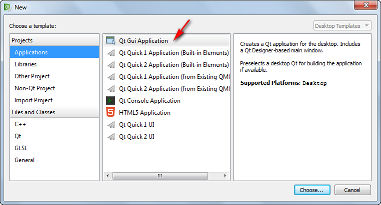

_Рисунок 1 — Создание Qt Gui Application_

Далее в окнах или все по умолчанию оставляете (если ничего не знаете) или меняйте на то, что вам нужно.

Перейдите на форму:

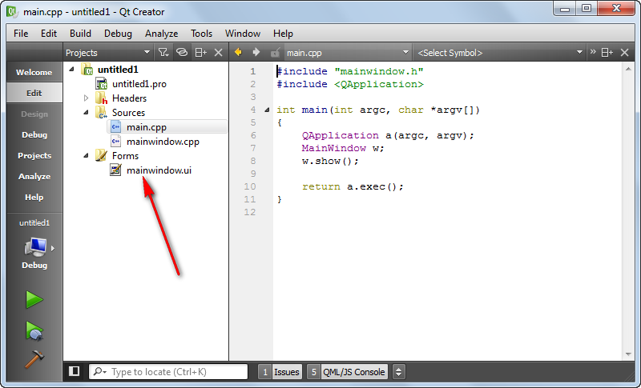

_Рисунок 2 — Переход на форму_

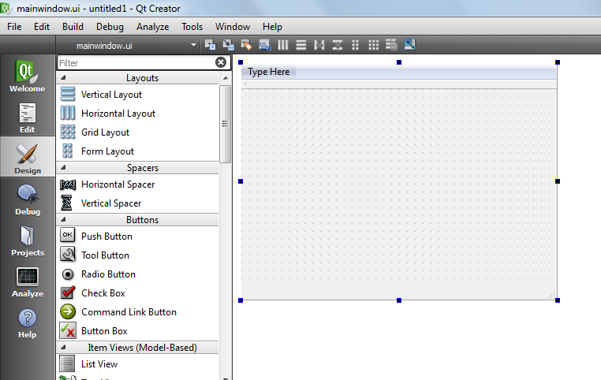

_Рисунок 3 — Переход на форму_

Добавьте какие-нибудь компоненты. Например, `pushButton` и `textEdit`:

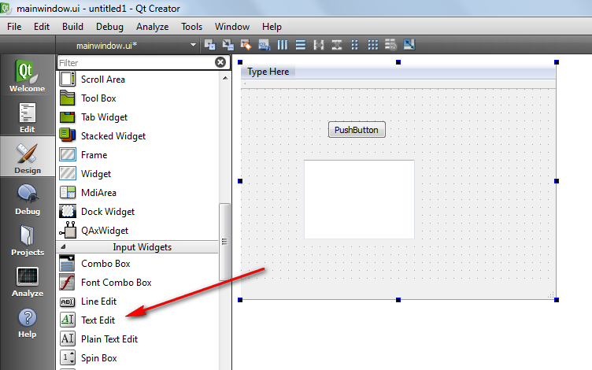

_Рисунок 4 — Новые компоненты на форме_

Теперь щелкните где-нибудь на форме правой кнопкой и выберете `Lay out` → `Lay out Vertically`:

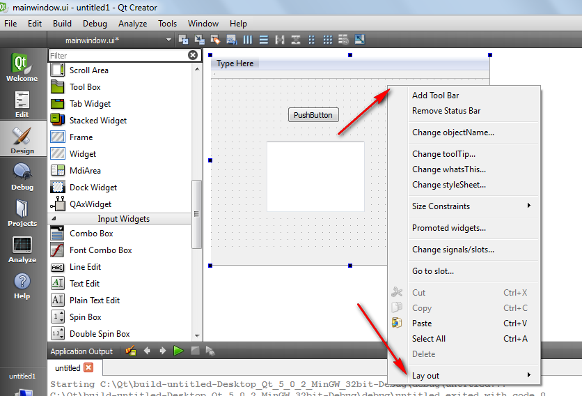

_Рисунок 5 — Lay out Vertically_

Можно выбрать любой вариант, который вам нравится:

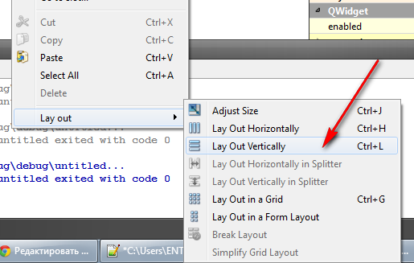

_Рисунок 6 — Разные варианты разметки_

Всё! Теперь все элементы расширены до общего окна. К тому же будут изменять свои размеры при изменении окна:

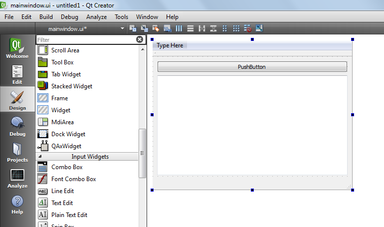

_Рисунок 7 — Внешний вид разметки_

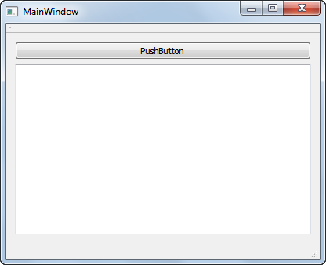

_Рисунок 8 — Внешний вид разметки в скомпилированном приложении_

Кстати, отменить такую привязку можно в том же меню в виде подменю `Break Layout`.

А вот какой тут аналог `TPanel`? Используйте для этого `Frame`:

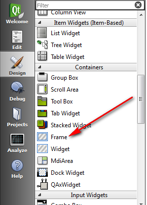

_Рисунок 9 — Компонент Frame_

Но, даже если вы добавите что-нибудь туда, то при использовании `Layout` все пойдет наперекосяк:

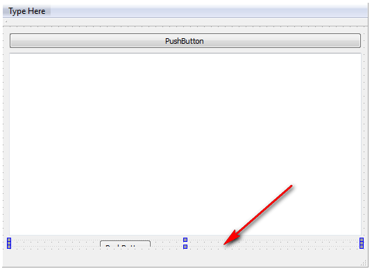

_Рисунок 10 — Высота компонента неправильная_

Для этого поменяйте у `Frame` свойство минимальной высоты или ширины (в зависимости от случая):

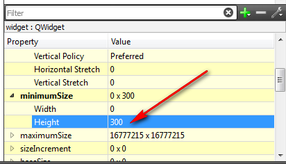

_Рисунок 11 — Минимальная высота Frame_

И все заработает:

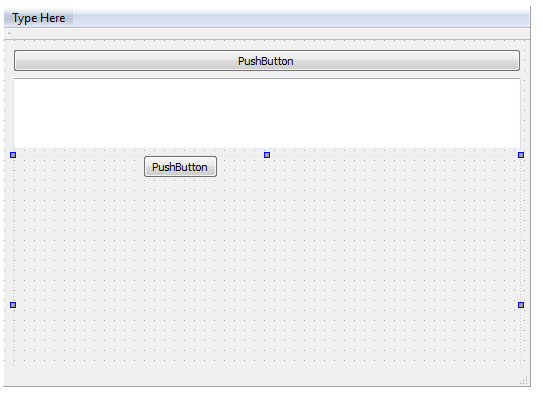

_Рисунок 12 — Компонент Frame с правильной высотой_
