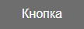
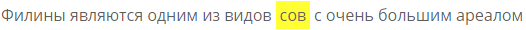

# Обзор плагина Arconix Shortcodes для WordPress


Малопопулярный плагин с шорткодами был выбран мной из ряда других в первую очередь простотой и красивыми по умолчанию элементами без ядовитых цветов, градиентов и так далее. Умеет делать кнопки, текстовые блоки, и другие красивые вещи.

**Update 2018.** Пользовался этим плагином, когда держал собственный сайт на Wordpress.

## Установка

Страница плагина на <https://wordpress.org/plugins/arconix-shortcodes/>.

Устанавливается, как и все остальные плагины. В режиме редактирования статьи справа внизу появляется следующая панель:


_Рис. Панель Arconix Shortcodes в WordPress_

Как я понял, она носит лишь информативный характер. Ну что ж, пусть плагин и не удобен в использовании, зато результат его удобен. К тому же я лично многие из них повесил на плагин [AddQuicktag](https://wordpress.org/plugins/addquicktag/).

## Текстовые блоки

Ради них и взял фактически этот плагин:

```html
[box]Простой блок[/box]
```


_Рис. Простой блок_

```html
[box color="blue"]Блок с синей заливкой[/box]
```


_Рис. Блок с синей заливкой_

```html
[box color="green"]Блок с зеленой заливкой[/box]
```


_Рис. Блок с зеленой заливкой_

```html
[box color="grey"]Блок с серой заливкой[/box]
```


_Рис. Блок с серой заливкой_

```html
[box color="red"]Блок с красной заливкой[/box]
```


_Рис. Блок с красной заливкой_

```html
[box color="tan"]Блок с дубильной заливкой[/box]
```


_Рис. Блок с дубильной заливкой_

```html
[box color="yellow"]Блок с желтой заливкой[/box]
```


_Рис. Блок с желтой заливкой_

```html
[box color="orange"]Блок с оранжевой заливкой[/box]
```


_Рис. Блок с оранжевой заливкой_

```html
[box style="alert"]Блок с предупреждением[/box]
```


_Рис. Блок с предупреждением_

```html
[box style="comment"]Блок с комментарием[/box]
```


_Рис. Блок с комментарием_

```html
[box style="download"]Блок с загрузкой[/box]
```


_Рис. Блок с загрузкой_

```html
[box style="info"]Блок с информацией[/box]
```


_Рис. Блок с информацией_

```html
[box style="tip"]Блок с советом[/box]
```


_Рис. Блок с советом_

```html
[box icon="fa-bolt" color="orange"]Блок с оранжевой заливкой и иконкой[/box]
```


_Рис. Блок с оранжевой заливкой и иконкой_

Обратите внимание, что вы можете указать свою иконку в виде названия любой иконки из шрифта [Font-Awesome](https://fontawesome.com/icons).

## Спойлеры

Вот это полезная штука. Мне нравится:

```html
[toggle title="Спойлер"]Текст спойлера[/toggle]
```

<video controls autoplay loop muted src="img/toggle_01.mp4"></video>


_Рис. Спойлер_

Или вот так нагляднее:

<video controls autoplay loop muted src="img/toggle_02.mp4"></video>


_Рис. Спойлер_

## Кнопки

Кнопки, при нажатии на которые, производится переход на какую-то страницу.

Простая кнопка:

```html
[button url="http://blog.harrix.org" style="flat"]Кнопка[/button]
```


_Рис. Простая кнопка_

Кнопка может быть нескольких цветов (`color = black, blue, green, grey, orange, pink, red, white`):

```html
[button url="http://blog.harrix.org" color="black" style="flat"]Кнопка[/button]
```


_Рис. Кнопка черная_

```html
[button url="http://blog.harrix.org" color="blue" style="flat"]Кнопка[/button]
```


_Рис. Кнопка синяя_

```html
[button url="http://blog.harrix.org" color="green" style="flat"]Кнопка[/button]
```


_Рис. Кнопка зеленая_

```html
[button url="http://blog.harrix.org" color="grey" style="flat"]Кнопка[/button]
```


_Рис. Кнопка серая_

```html
[button url="http://blog.harrix.org" color="orange" style="flat"]Кнопка[/button]
```


_Рис. Кнопка оранжевая_

```html
[button url="http://blog.harrix.org" color="red" style="flat"]Кнопка[/button]
```


_Рис. Кнопка красная_

```html
[button url="http://blog.harrix.org" color="white" style="flat"]Кнопка[/button]
```


_Рис. Кнопка белая_

Кнопки могут быть трех размеров (`size = small, medium, large`):

```html
[button url="http://blog.harrix.org" size="small" style="flat"]Кнопка[/button]
```


_Рис. Кнопка маленькая_

```html
[button url="http://blog.harrix.org" size="medium" style="flat"]Кнопка[/button]
```


_Рис. Кнопка средняя_

```html
[button url="http://blog.harrix.org" size="large" style="flat"]Кнопка[/button]
```



_Рис. Кнопка большая_

Кнопки могут быть трех стилей (`style = classic, flat, clear`):

```html
[button url="http://blog.harrix.org" style="classic"]Кнопка[/button]
```


_Рис. Кнопка классическая_

```html
[button url="http://blog.harrix.org" style="flat"]Кнопка[/button]
```


_Рис. Кнопка плоская_

```html
[button url="http://blog.harrix.org" style="clear"]Кнопка[/button]
```


_Рис. Кнопка контурная_

Страница может открываться либо в той же вкладке или в новой (`target = self, blank`).

В той же:

```html
[button url="http://blog.harrix.org" target="self" style="flat"]Кнопка[/button]
```

В другой вкладке:

```html
[button url="http://blog.harrix.org" target="blank" style="flat"]Кнопка[/button]
```

Все параметры могут сочетаться:

```html
[button url="http://blog.harrix.org" color="orange" size="large"]Кнопка[/button]
```


_Рис. Кнопка классическая, оранжевая и большая_

```html
[button url="http://blog.harrix.org" color="black" size="small" target="blank"]Кнопка[/button]
```

_Рис. Кнопка классическая, черная и маленькая_


## Вкладки

```html
[tabs] [tab title="Вкладка 1"] Первый блок информации [/tab] [tab title="Вкладка 2"] Второй блок информации [/tab] [tab
title="Вкладка 3"] Третий блок информации [/tab] [/tabs]
```


_Рис. Вкладки_

## Разное

### Пояснение при наведении на слово — всплывающая подсказка (В общем объяснение чего-то)

```html
[abbr title="По моему скромному мнению"]ИМХО[/abbr]
```

<video controls autoplay loop muted src="img/abbr.mp4"></video>


_Рис. Всплывающая подсказка_

### Выделенный текст

```html
[highlight]текст[/highlight]
```



_Рис. Выделенный текст_

### Ссылка на ваш сайт

```html
[site-link]
```

<video controls autoplay loop muted src="img/site-link.mp4"></video>


_Рис. Ссылка на ваш сайт_

### Данные о текущем годе

```html
[the-year before="©" start="2001" after="All Rights Reserved"]
```


_Рис. Данные о текущем годе_

### Ссылка на сайт Wordpress

```html
[wp-link]
```

<video controls autoplay loop muted src="img/wp-link.mp4"></video>


_Рис. Ссылка на сайт Wordpress_

Более подробную исходную документацию можете прочитать тут: <https://www.tychesoftwares.com/docs/docs/shortcodes/>.
