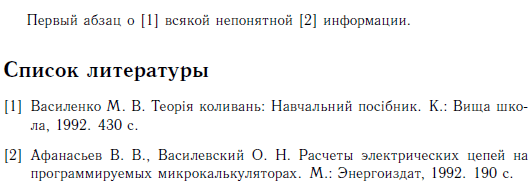

# Как оформлять список литературы в LaTeX


Что делать со списком литературы в LaTeX? Намучился с ним, так как много нюансов, которые портят все настроение. Плюс надо пробовать под ГОСТ всё привести.

Рассматриваю случай MiKTex + TeXstudio, но для других сборок тоже все должно выполняться.

Пусть у вас есть документ LaTeX:

```tex
\documentclass[titlepage]{article}

\usepackage[T2A]{fontenc} % Поддержка русских букв
\usepackage[utf8]{inputenc} % Кодировка utf8
\usepackage[english, russian]{babel} % Языки: русский, английский
\usepackage{pscyr} % Нормальные шрифты

\begin{document}

Первый абзац о всякой непонятной информации.

\end{document}
```

Теперь добавьте в папку с этим документом файл `utf8gost705u.bst` из архива: [utf8gost705u.zip](http://blog.harrix.org/wp-content/uploads/2013/04/utf8gost705u.zip).

Этот файл будет настраивать список литературы по ГОСТ.

Создайте текстовой файл `biblio.bib` в той же папке со следующим содержимым:

```tex
@BOOK{Afanasyev92,
author = "Афанасьев, В. В. and Василевский, О. Н.",
title = "Расчеты электрических цепей
на программируемых микрокалькуляторах",
address = "М.",
publisher = "Энергоиздат",
year = 1992,
numpages = 190,
language = "russian"
}

@BOOK{Vasylenko92,
author = "Василенко, М. В.",
title = "Теорiя коливань: Навчальний посiбник",
address = "К.",
publisher = "Вища школа",
year = 1992,
numpages = 430,
language = "ukrainian"
}

@MISC{doe:website,
      AUTHOR = "John Doe",
      TITLE = "the website title",
      MONTH = feb,
      YEAR = 2011,
      NOTE = "url{http://whereever/file.ext}"
}
```

Это база книг, которая будет переводиться в список литературы. Обратите внимание, что каждая книга имеет некий идентификатор в виде первого параметра: `Afanasyev92`, `Vasylenko92`, `doe:website`.

Теперь пропишите в месте, где у вас будет список литературы такие строки:

```tex
\bibliographystyle{utf8gost705u} %% стилевой файл для оформления по ГОСТу
\bibliography{biblio} %% имя библиографической базы (bib-файла)
```

Теперь в тексте пропишите ссылки на книги, например, так:

```tex
\documentclass[titlepage]{article}

\usepackage[T2A]{fontenc} % Поддержка русских букв
\usepackage[utf8]{inputenc} % Кодировка utf8
\usepackage[english, russian]{babel} % Языки: русский, английский
\usepackage{pscyr} % Нормальные шрифты

\begin{document}

Первый абзац о \cite{Vasylenko92} всякой непонятной \cite{Afanasyev92} информации.

\bibliographystyle{utf8gost705u} %% стилевой файл для оформления по ГОСТу
\bibliography{biblio} %% имя библиографической базы (bib-файла)

\end{document}
```

В итоге получите:



_Рисунок 1 — Результат в PDF_

Если вы используете содержание, то список литературы не появится автоматически. Нужно заменить данный код:

```tex
\bibliographystyle{utf8gost705u} %% стилевой файл для оформления по ГОСТу
\bibliography{biblio} %% имя библиографической базы (bib-файла)
```

И заменить нужно на этот код:

```tex
\addcontentsline{toc}{chapter}{bibname}
\bibliographystyle{utf8gost705u} %% стилевой файл для оформления по ГОСТу
\bibliography{biblio} %% имя библиографической базы (bib-файла)
```

Поговорим о возможных проблемах:

- Если в тексте нет ссылок на литературу в виде `cite{идентификатор}`, то книги не появятся в списке литературы, даже, если они есть в `biblio.bib`.
- Если вы все сделали правильно, при конвертировании в PDF документ список литературы не появился или появились не все книги, то попробуйте несколько раз прогнать конвертирование.
- Если это не помогло, то удалите файл `[название вашего tex файла].bbl`, который появляется при конвертировании в `*.pdf`, а затем заново сконвертируйте.
- Если это не помогло, то удалите все файлы `[название вашего tex файла].[расширение]`, которые появляются при конвертировании в `*.pdf`, кроме главного файла `[название вашего tex файла].tex`.
- Не рекомендую список литературы выносить в отдельный файл, прикрепляемый через `input` или `include`: размещайте в главном `*.tex` файле. У меня вначале было все в отдельных файлах и из-за этого я намучался (MiKTex + TeXstudio).

Другие примеры чего и как заносить в файл biblio.bib можно посмотреть тут: <http://www.machinelearning.ru/wiki/images/d/d4/Gost780.pdf>.

Как вставить ссылки на web-документы?

Вот примеры:

```tex
@MISC{web:makingSimpleGA,
      AUTHOR = "80.250.188.26",
      TITLE = "Разработка простого генетического алгоритма",
      YEAR = 2007,
      NOTE = "url{http://www.wikiznanie.ru/ru-wz/index.php/%D0%A0%D0%B0%D0%B7%D1%80%D0%B0%D0%B1%D0%BE%D1%82%D0%BA%D0%B0_%D0%BF%D1%80%D0%BE%D1%81%D1%82%D0%BE%D0%B3%D0%BE_%D0%B3%D0%B5%D0%BD%D0%B5%D1%82%D0%B8%D1%87%D0%B5%D1%81%D0%BA%D0%BE%D0%B3%D0%BE_%D0%B0%D0%BB%D0%B3%D0%BE%D1%80%D0%B8%D1%82%D0%BC%D0%B0}"
}

@MISC{web:GrayCode,
      TITLE = "Код Грея",
      NOTE = "url{http://ru.wikipedia.org/wiki/%D0%9A%D0%BE%D0%B4_%D0%93%D1%80%D0%B5%D1%8F}"
}

@MISC{web:OptimalCoding,
      AUTHOR = "Савчук, В. Л.",
      TITLE = "Оптимальное кодирование",
      NOTE = "url{http://www.ie.tusur.ru/books/COI/page_07.htm}"
}
```
