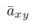
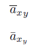
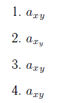

# Двойной индекс в LaTeX

Столкнулся с проблемой двойного индекса с применением `\bar`: вызывалась ошибка `Double subscript`. Заодно покажу и другие варианты отображения двойного индекса.

Итак, дан простейший код:

```tex
${\bar{a}_x}_y$
```

То есть нужно сделать двойной индекс для буквы с верхним подчеркиванием. При этом выдается ошибка в MiKTex по поводу двойного индекса, хотя без `\bar` двойной индекс проставляется замечательно.

На [http://tex.stackexchange.com](http://tex.stackexchange.com/questions/107846/double-subscript-with-bar) подсказали решение:

```tex
$\bar{a}{ { }_x}_y$
```

Что дает результат:



Находил сам два костыля:

```tex
${\overline{a}_x}_y$

$\bar{a}_{x_y}$
```

Дают такой результат:



И, как обещал, показываю другие примеры использования двойных индексов:

```tex
1. $ a_x{}_y $

2. $ a_{x_y} $

3. $ {a_x}_y $

4. $ a_{xy} $
```

Эти примеры дают такой результат:


