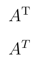

# FAQ по LaTeX


Здесь будут публиковаться бессистемные моменты по LaTeX, которые могут пригодиться вам, а я смогу не забыть их.

<details>
<summary>📖 Содержание</summary>

## Содержание

- [Установил TeXstudio, но ничего не компилируется и PDF файлы не создаются](#установил-texstudio-но-ничего-не-компилируется-и-pdf-файлы-не-создаются)
- [Как вставить пустую строку](#как-вставить-пустую-строку)
- [Как вставить разрыв новой страницы](#как-вставить-разрыв-новой-страницы)
- [Как получить отступ красной строки для первой строки абзаца](#как-получить-отступ-красной-строки-для-первой-строки-абзаца)
- [Как подключить русский язык](#как-подключить-русский-язык)
- [Как поставить логотип на титульной странице в LaTeX типа article](#как-поставить-логотип-на-титульной-странице-в-latex-типа-article)
- [Как установить модуль PSCyr](#как-установить-модуль-pscyr)
- [Как сделать гиперссылки в LaTeX](#как-сделать-гиперссылки-в-latex)
- [Как сделать проверку орфографии в LaTeX](#как-сделать-проверку-орфографии-в-latex)
- [Как оформить псевдокод в LaTeX](#как-оформить-псевдокод-в-latex)
- [Как оформить подсветку синтаксиса с кириллицей в LaTeX](#как-оформить-подсветку-синтаксиса-с-кириллицей-в-latex)
- [Как убрать отступ у списка itemize перед предыдущим текстом](#как-убрать-отступ-у-списка-itemize-перед-предыдущим-текстом)
- [Как вставить обратный слэш](#как-вставить-обратный-слэш)
- [Как вставить знак тильды](#как-вставить-знак-тильды)
- [Как оформлять список литературы в LaTeX](#как-оформлять-список-литературы-в-latex)
- [Какой символ использовать для знака транспонирования](#какой-символ-использовать-для-знака-транспонирования)
- [Как вставить принудительно отступ красной строки](#как-вставить-принудительно-отступ-красной-строки)
- [Как удалить принудительно отступ красной строки](#как-удалить-принудительно-отступ-красной-строки)
- [Как вставить неразрывный пробел](#как-вставить-неразрывный-пробел)
- [Как в подписи к рисункам поменять двоеточие на точку](#как-в-подписи-к-рисункам-поменять-двоеточие-на-точку)
- [Как сделать полуторный, двойной интервал между строчками](#как-сделать-полуторный-двойной-интервал-между-строчками)
- [Как LaTeX текст вставить в Illustrator](#как-latex-текст-вставить-в-illustrator)
- [Как оформить двойной индекс в формулах](#как-оформить-двойной-индекс-в-формулах)
- [При компиляции возникает ошибка «TeX capacity exceeded, sorry [main memory size=3000000]»](#при-компиляции-возникает-ошибка-tex-capacity-exceeded-sorry-main-memory-size3000000)

</details>

## Установил TeXstudio, но ничего не компилируется и PDF файлы не создаются

TeXstudio — это только редактор кода. За компиляцию отвечает другая программа, например, можно установить MiKTeX.

## Как вставить пустую строку

Вставьте следующий код:

```tex
\vspace{\baselineskip}
```

Или так:

```tex
\newline
```

## Как вставить разрыв новой страницы

Вставьте следующий код:

```tex
\newpage
```

## Как получить отступ красной строки для первой строки абзаца

Вставьте следующий код в преамбулу:

```tex
\usepackage{indentfirst} % Красная строка
```

## Как подключить русский язык

Вставьте следующий код в преамбулу:

```tex
%%% Кодировки и шрифты %%%
\usepackage{cmap} % Улучшенный поиск русских слов в полученном pdf-файле
\usepackage[T2A]{fontenc} % Поддержка русских букв
\usepackage[utf8]{inputenc} % Кодировка utf8
\usepackage[english, russian]{babel} % Языки: русский, английский
\usepackage{pscyr} % Нормальные шрифты
```

Вот тут говорится, как установить модуль Pscyr: [Установка PSCyr для LaTeX](https://github.com/Harrix/harrix.dev-articles-2018/blob/main/pscyr/pscyr.md) | [🡥](https://harrix.dev/ru/articles/2018/pscyr/).

## Как поставить логотип на титульной странице в LaTeX типа article

Читайте тут: [Логотип на титульной странице в LaTeX](https://github.com/Harrix/harrix.dev-articles-2013/blob/main/logo-on-title-page-latex/logo-on-title-page-latex.md) | [🡥](https://harrix.dev/ru/articles/2013/logo-on-title-page-latex/).

## Как установить модуль PSCyr

Читайте тут: [Установка PSCyr для LaTeX](https://github.com/Harrix/harrix.dev-articles-2018/blob/main/pscyr/pscyr.md) | [🡥](https://harrix.dev/ru/articles/2018/pscyr/).

## Как сделать гиперссылки в LaTeX

Читайте тут: [Ссылки и гиперссылки в LaTeX](https://github.com/Harrix/harrix.dev-articles-2013/blob/main/latex-links-and-hyperlinks/latex-links-and-hyperlinks.md) | [🡥](https://harrix.dev/ru/articles/2013/latex-links-and-hyperlinks/).

## Как сделать проверку орфографии в LaTeX

Читайте тут: [Проверка орфографии в TeXstudio](https://github.com/Harrix/harrix.dev-articles-2013/blob/main/spell-check-in-texstudio/spell-check-in-texstudio.md) | [🡥](https://harrix.dev/ru/articles/2013/spell-check-in-texstudio/).

## Как оформить псевдокод в LaTeX

Читайте тут: [Псевдокод в LaTeX для русского текста — algorithm2e](https://github.com/Harrix/harrix.dev-articles-2013/blob/main/algorithm2e-cyrillic/algorithm2e-cyrillic.md) | [🡥](https://harrix.dev/ru/articles/2013/algorithm2e-cyrillic/).

Но лучше тут: [Псевдокод в LaTeX для русского текста — algorithmicx](https://github.com/Harrix/harrix.dev-articles-2013/blob/main/algorithmicx-cyrillic/algorithmicx-cyrillic.md) | [🡥](https://harrix.dev/ru/articles/2013/algorithmicx-cyrillic/)

## Как оформить подсветку синтаксиса с кириллицей в LaTeX

Читайте тут: [Подсветка синтаксиса в LaTeX с кириллицей](https://github.com/Harrix/harrix.dev-articles-2013/blob/main/latex-highlight-cyrillic/latex-highlight-cyrillic.md) | [🡥](https://harrix.dev/ru/articles/2013/latex-highlight-cyrillic/).

## Как убрать отступ у списка itemize перед предыдущим текстом

Читайте тут: [Как убрать отступ у списка itemize перед предыдущим текстом](https://github.com/Harrix/harrix.dev-articles-2013/blob/main/remove-indent-of-itemize/remove-indent-of-itemize.md) | [🡥](https://harrix.dev/ru/articles/2013/remove-indent-of-itemize/).

## Как вставить обратный слэш

Вот такой командой:

```tex
\textbackslash
```

## Как вставить знак тильды

Вот такой командой:

```tex
\textasciitilde
```

Или так:

```tex
$\sim$
```

## Как оформлять список литературы в LaTeX

Читать тут: [Как оформлять список литературы в LaTeX](https://github.com/Harrix/harrix.dev-articles-2013/blob/main/bibliography-in-latex/bibliography-in-latex.md) | [🡥](https://harrix.dev/ru/articles/2013/bibliography-in-latex/).

## Какой символ использовать для знака транспонирования

```tex
\mathrm{T}
```

Сравните:

```tex
$ A^\mathrm{T} $

$ A^T $
```



_Рисунок 1 — Сравнение двух вариантов знака транспонирования_

## Как вставить принудительно отступ красной строки

Через команду:

```tex
\indent
```

## Как удалить принудительно отступ красной строки

Через команду:

```tex
\noindent
```

## Как вставить неразрывный пробел

Через символ `~` Например:

```tex
и т.~д.
```

## Как в подписи к рисункам поменять двоеточие на точку

Добавьте в преамбуле код:

```tex
\RequirePackage{caption}
\DeclareCaptionLabelSeparator{defffis}{. }
\captionsetup{justification=centering,labelsep=defffis}
```

Если вам нужен другой символ, то во второй строчке поменяйте на свою комбинацию символов в последних фигурных стрелках.

## Как сделать полуторный, двойной интервал между строчками

Используйте в преамбуле следующий код для одинарного интервала (по умолчанию):

```tex
\usepackage{setspace}
\singlespacing
```

Используйте в преамбуле следующий код для полуторного интервала:

```tex
\usepackage{setspace}
\onehalfspacing
```

Используйте в преамбуле следующий код для двойного интервала:

```tex
\usepackage{setspace}
\doublespacing
```

Используйте в преамбуле следующий код для своего интервала между строками:

```tex
\usepackage{setspace}
\setstretch{1.25}
```

## Как LaTeX текст вставить в Illustrator

Читайте в статье [LaTeX и Illustrator](https://github.com/Harrix/harrix.dev-articles-2013/blob/main/latex-and-illustrator/latex-and-illustrator.md) | [🡥](https://harrix.dev/ru/articles/2013/latex-and-illustrator/)

## Как оформить двойной индекс в формулах

Читайте в статье [Двойной индекс в LaTeX](https://github.com/Harrix/harrix.dev-articles-2013/blob/main/double-index-in-latex/double-index-in-latex.md) | [🡥](https://harrix.dev/ru/articles/2013/double-index-in-latex/).

## При компиляции возникает ошибка «TeX capacity exceeded, sorry [main memory size=3000000]»

Настройте MiKTeX как указано в статье [Установка и настройка программ для редактирования LaTeX файлов](https://github.com/Harrix/harrix.dev-articles-2018/blob/main/install-latex/install-latex.md) | [🡥](https://harrix.dev/ru/articles/2018/install-latex/). Это увеличит объем памяти для компиляции LaTeX файлов.
