# Шпаргалка по Notepad++

Один из моих любимых текстовых редакторов. В статье будут описаны всякие такие вещи, которые стоит запомнить при работе с ним. Сортировка чисел, клавиатурные сокращения и так далее.

## Горячие клавиши

`Ctrl` + `S` — Сохранить файл.

`CTRL` + `D` — Дублирование выделенного кода.

`Ctrl` + `F2` — Ставим отметку у строки.

`F2` — Переход к следующей отмеченной строке.

`Shift` + `F2` — Переход к предыдущей отмеченной строке.

`Ctrl` + `J` — Объединение выделенных строк в одну.

`Ctrl` + `B` — Перейти к соответствующей скобке (закрывающейся или открывающейся).

`CTRL` + `Space` — Автодополнение кода:

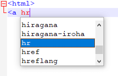

_Рисунок 1 — Автодополнение кода_

## Некоторые функции в меню

`Кодировки` → `Преобразовать в …` — Перекодирование файла.

`Кодировки` → `Кодировать в …` — Открыть файл в другой кодировке.

`Клик правой кнопки мыши` → `ПРОПИСНЫЕ` — Поменять регистр букв на верхний.

`Клик правой кнопки мыши` → `строчные` — Поменять регистр букв на нижний.

`Правка` → `Панель истории файлов` — История буфера обмена (Clipboard History):

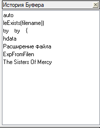

_Рисунок 2 — Clipboard History_

`Клик правой кнопки мыши` → `Вкл./Выкл. Комментарий строки` — Закомментировать код (раскомментировать аналогично).

`Клик правой кнопки мыши` → `Закомментировать выделенное` — Закомментировать код (раскомментировать автоматически нельзя).

`Клик правой кнопки мыши` → `ПРОПИСНЫЕ` — Поменять регистр букв на большие буквы.

`Клик правой кнопки мыши` → `строчные` — Поменять регистр букв на маленькие буквы.

`Вид` → `Операции с документом` → `Переместить в другое окно` — Разделить окно на две части.

`Синтаксис` → `…` — Выбор подсветки синтаксиса.

## Пути

`C:\Program Files (x86)\Notepad++` — в Windows 7 находятся все установленные плагины, настройки и так далее.

`C:\Program Files (x86)\Notepad++\plugins` — папка с плагинами.

`%appdata%\Notepad++` — папка с еще файлами Notepad++.

**Update 2018.** Сейчас есть x64 версия Notepad++, но я до сих пор рекомендую ставить 32-битную версию, так как много плагинов работает только под 32 бита.

## Установка плагинов

Идем `Плагины` → `Plugin Manager` → `Show Plugin Manager`:

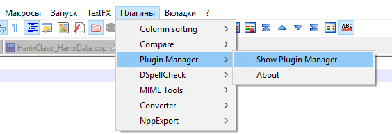

_Рисунок 3 — Plugin Manager_

И там выбираем нужный нам плагин.

**Update 2018.** Данный менеджер плагинов был выпилен из Notepad++. Поэтому его нужно устанавливать отдельно. Статью, где описана установка менеджера и остальные плагины, можно найти тут: [Плагины Notepad++](https://github.com/Harrix/harrix.dev-blog-2013/blob/main/notepad-plus-plus-plugins/notepad-plus-plus-plugins.md) <!-- https://harrix.dev/ru/blog/2013/notepad-plus-plus-plugins/ -->.

## Сортировка выделенных строк

**Update 2018.** В Notepad++ сейчас есть встроенные методы всевозможной сортировки:

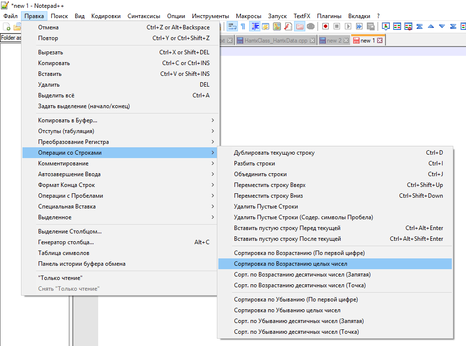

_Рисунок 4 — Сортировка_

## Проверка орфографии

[Проверка орфографии в Notepad++](https://github.com/Harrix/harrix.dev-blog-2014/blob/main/spell-check-in-notepad/spell-check-in-notepad.md) <!-- https://harrix.dev/ru/blog/2014/spell-check-in-notepad/ -->.

## Автодополнение

Выше уже отмечалось, что клавиши `CTRL` + `Space` вызывают окно автодополнения. Но каждый раз мне нажимать на клавиши не удобно (привет любителям Vim). Было бы проще, чтобы подсказки возникали сами. Это делается так: `Опции` → `Настройки` → `Автозавершение`. Отметьте нужные вам галочки:

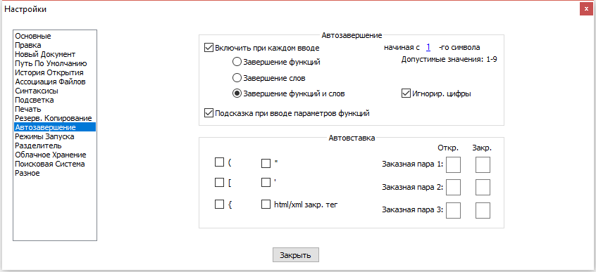

_Рисунок 5 — Настройки автодополнения_

**Update 2018.** Сейчас данные настройки по умолчанию включены.

## Особые выделения

Одной из «киллер-фич» в Sublime Text 2 считается мультивыделение. Оказывается, что оно есть и в Notepad++. Переходите в настройки программы `Опции` → `Настройки` → `Правка` и ставьте галочку:

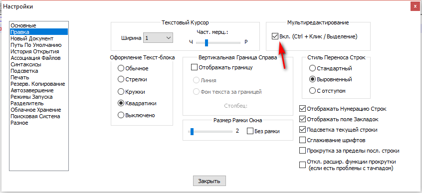

_Рисунок 6 — Настройка мультивыделения_

И теперь, если нажать клавишу `Ctrl`, то можно выделить сразу несколько текстовых блоков (множественное выделение). При этом, если не снимать выделение, то, когда начнете писать, то текст будет вводиться во всех выделенных местах:

А при зажатом `Alt` можно делать вертикальное выделение:

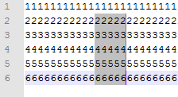

_Рисунок 7 — Вертикальное выделение_

## Миникарта

Одной из главной «киллер-фич» в Sublime Text 2 считается миникарта справа, которую можно использовать как бегунок. Оказывается, что оно есть и в Notepad++.

Идите `Вид` → `Карта документа`:

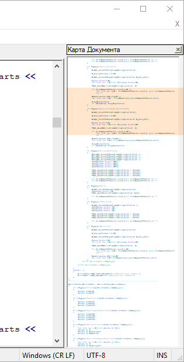

_Рисунок 8 — Карта документа_

Правда она не такая удобная, как в Sublime.

## Работа с проектами

Если вы работаете с каким-то проектом (сайт, программа и так далее), то вы работаете обычно со множеством файлов в одной папке с подпапками.

**Update 2018.** Ниже описан способ, который позволит работать с несколькими папками в одном проекте, но с одной папкой сейчас проще всего работать через `Файл` → `Открыть папку как Проект`:

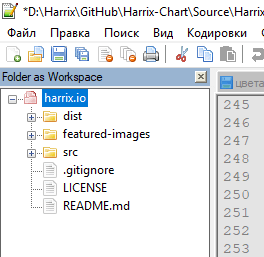

_Рисунок 9 — Пункт «Открыть папку как Проект»_

~~Лучше~~ в этом случае работать с функцией проекта `Вид` → `Проект (панель)` → `Панель проекта 1`:

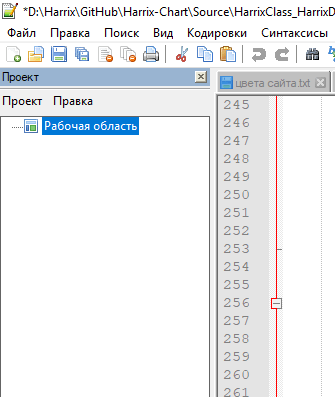

_Рисунок 10 — Панель проекта 1_

Щелкаете правой кнопкой мыши по пункту рабочая область и выбираете пункт `Добавить Новый проект` и как-то его называете:

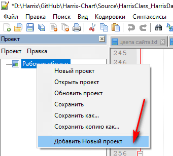

_Рисунок 11 — Добавление нового проекта_

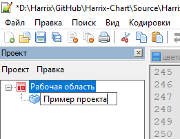

_Рисунок 12 — Ввод названия проекта_

Теперь правая кнопка мыши по проекту и пункт меню `Добавить файлы из директории`:

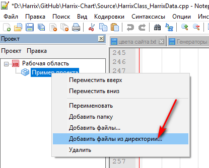

_Рисунок 13 — Добавление файлов из директории_

Теперь у нас есть дерево наших файлов, в котором удобно ориентироваться и редактировать. Причем сюда занесены не только тестовые файлы, но и все остальные. Разумеется, проект можно сохранять, добавлять файлы по отдельности. В общем удобная вещь:

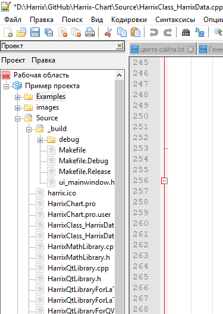

_Рисунок 14 — Пример проекта_

## Синхронизация вертикальной прокрутки

Еще одна важная для меня функция. Когда имеется два файла одного типа часто требуется просмотреть их синхронно. В Notepad++ все реализовано:

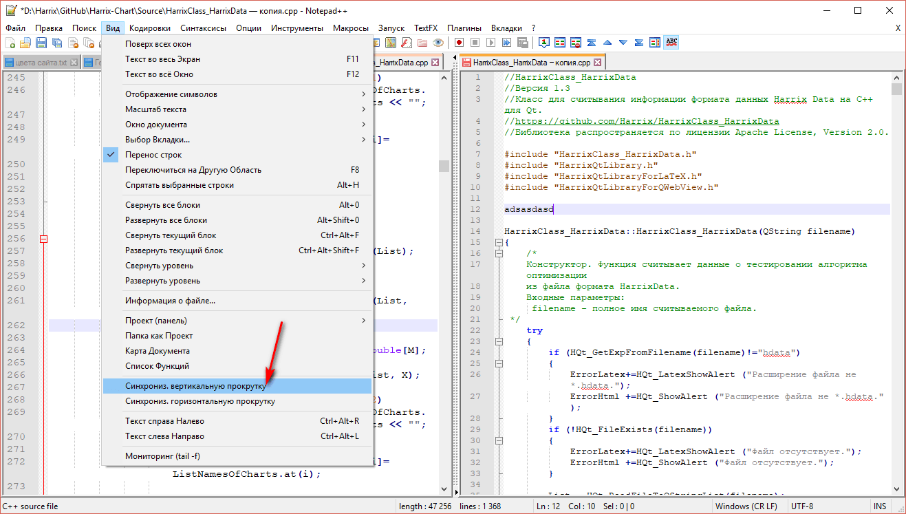

_Рисунок 15 — Синхронизация вертикальной прокрутки_

## Выделение определенного текста

В Notepad++ можно выделить конкретный текст (как будто маркером провели):

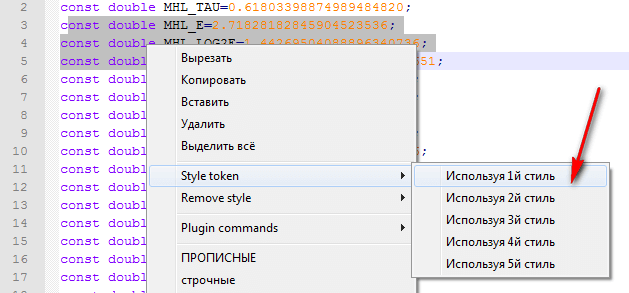

_Рисунок 16 — Назначение выделения тексту_

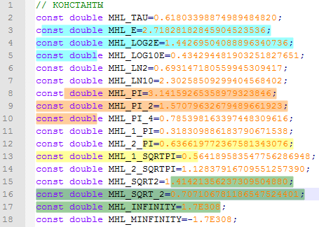

_Рисунок 17 — Результат выделения нескольких текстов разными стилями_

## Список открытых файлов

`Опции` → `Основные` → `Панель Списка документов` и там нажмите галочку на `Отображать`:

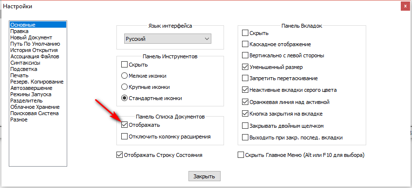

_Рисунок 18 — Опция отображения панели списка документов_

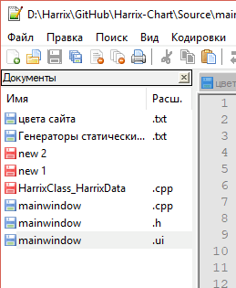

_Рисунок 19 — Панель списка документов_

## Как удалить повторяющиеся строки

Смотрите в [статье](https://github.com/Harrix/harrix.dev-blog-2014/blob/main/remove-duplicate-lines/remove-duplicate-lines.md) <!-- https://harrix.dev/ru/blog/2014/remove-duplicate-lines/ -->.

## Как удалить пустые строки в Notepad++ с помощью горячих клавиш

Смотрите в [статье](https://github.com/Harrix/harrix.dev-blog-2015/blob/main/remove-empty-lines-notepad/remove-empty-lines-notepad.md) <!-- https://harrix.dev/ru/blog/2015/remove-empty-lines-notepad/ -->.

## Как удалить каждую вторую строку в Notepad++

Смотрите в [статье](https://github.com/Harrix/harrix.dev-blog-2014/blob/main/delete-every-second-line/delete-every-second-line.md) <!-- https://harrix.dev/ru/blog/2014/delete-every-second-line/ -->.

## Знаки табуляции

Рекомендую использовать вместо знака табуляции 4 или 2 пробела:

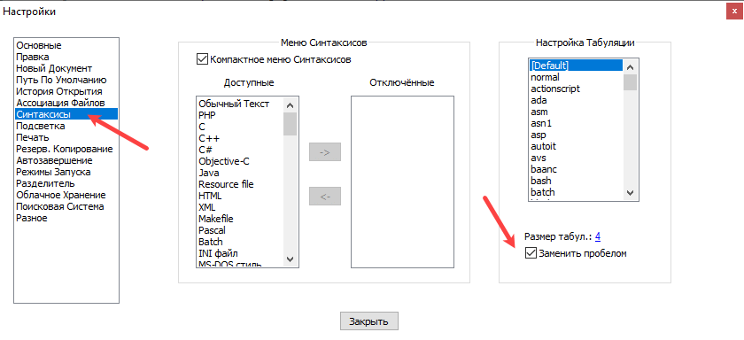

_Рисунок 20 — Настройка табуляции_

## Update 2021

Можно убрать устаревшую рамку:

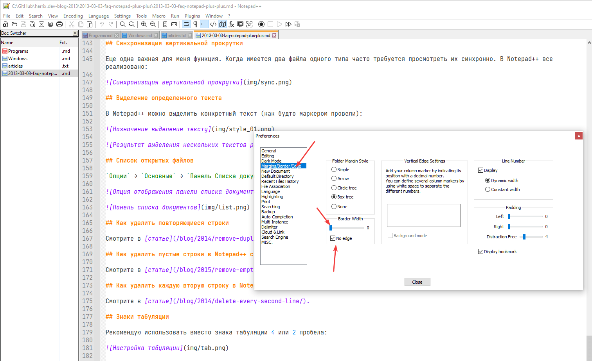

_Рисунок 21 — Убирание рамки_

А в качестве шрифта использую [JetBrains
Mono](https://www.jetbrains.com/ru-ru/lp/mono/)

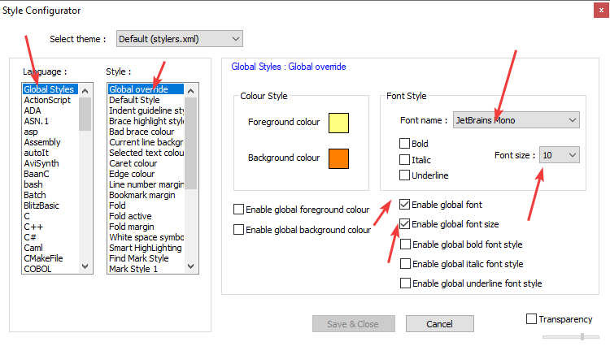

_Рисунок 22 — Настройки шрифта_
