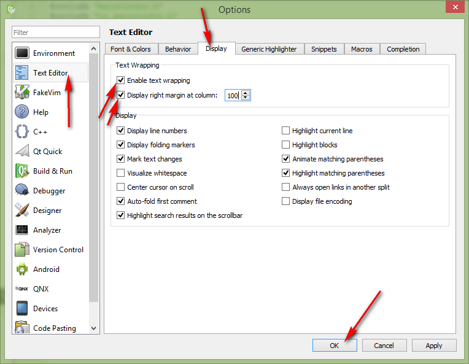
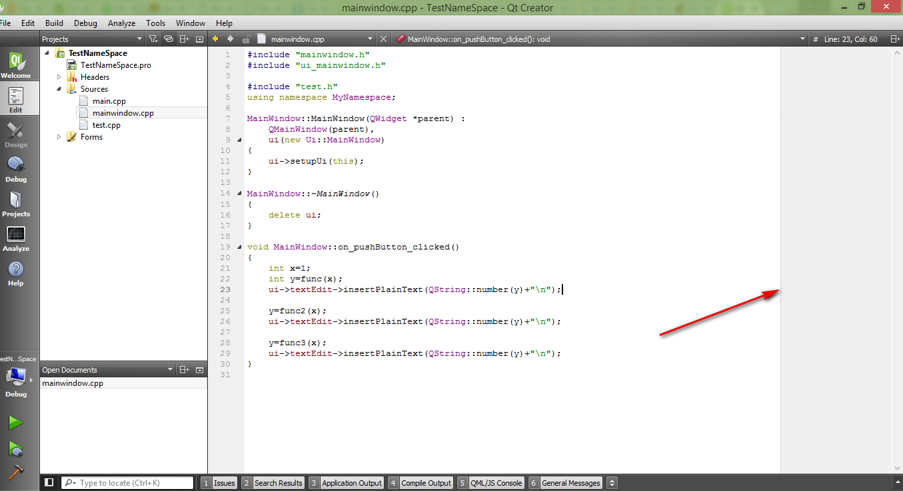

# FAQ по Qt

Здесь будут публиковаться бессистемные моменты по Qt, которые могут пригодиться вам, а я смогу не забыть их.

## Как написать русский текст, чтобы он отображался в Label и др

Если не возиться с универсальностью программы и возможностью перевода на другие языки, то так:

```cpp
ui->label->setText(QString::fromLocal8Bit("Русский текст"));
```

## Как добавить текст в textEdit

```cpp
QString A="Your string";

ui->textEdit->insertPlainText(A+"\n");
```

## Как считать значение с lineEdit

```cpp
QString A;
A=ui->lineEdit->text();
```

## Как перевести строку в число

```cpp
QString A="3.14";

int x;
x=A.toInt();//в целое число

double y;
y=A.toDouble();//в число с плавающей запятой
```

## Как перевести число в строку

```cpp
int x=3;
QString A;

A=QString::number(x);
```

## Как сделать иконку для EXE файла

Добавляем иконку с именем, например, `myappico.ico` в папку с проектом расширения `.pro`.

И просто допишите в файле проекта `.pro`:

```ini
RC_ICONS = myappico.ico
```

## Как развернуть приложение Qt Quick 2.0 во весь экран

В файле `main.cpp` строчку надо заменить:

```cpp
viewer.showExpanded();
```

И заменяем на:

```cpp
viewer.showFullScreen();
```

## Как сослаться на элемент в папке с программой в QtQuick 2.0

Через путь `file://`, например, вот так:

```cpp
Video {
      source: "file://video01.wmv"
}
```

## Как сослаться на элемент из ресурса в QtQuick 2.0

Через путь `qrc:/`, например, вот так:

```cpp
Image {
    source: "qrc:/images/images/bk.png"
}
```

## Как загрузить текстовой файл в QString

Подключите заголовочные файлы:

```cpp
#include <QDebug>
#include <QFile>
```

Можно воспользоваться любой из двоих функций:

```cpp
QString readFile(QString filename)
{
    /*
    Функция считывает текстовой файл в QString.
    Входные параметры:
     filename - имя файла.
    Возвращаемое значение:
     Строка со всем содержимым текстового файла.
    */
    QFile file(filename);
    QString line = "";
    if (!file.exists()) {
        qDebug() << "Не существует " << filename;
    } else {
        qDebug() << filename << " загружается...";
    }
    if (file.open(QIODevice::ReadOnly | QIODevice::Text))
        line = file.readAll();
    file.close();
    return line;
}
```

```cpp
QString readFile2(QString filename)
{
    /*
    Функция считывает текстовой файл в QString. Загружает построчно.
    Входные параметры:
     filename - имя файла.
    Возвращаемое значение:
     Строка со всем содержимым текстового файла.
    */
    QFile file(filename);
    QString line = "";
    if (!file.exists()) {
        qDebug() << "Не существует " << filename;
    } else {
        qDebug() << filename << " загружается...";
    }
    if (file.open(QIODevice::ReadOnly | QIODevice::Text)){
        QTextStream stream(&file);
        while (!stream.atEnd()){
           line+=stream.readLine()+"\n";
        }
    }
    file.close();
    return line;
}
```

Например, так:

```cpp
QString line;
line = readFile("test.txt");
```

## Как сохранить QString в текстовой файл

Подключите заголовочный файл:

```cpp
#include <QFile>
```

И используйте функцию:

```cpp
void saveFile(QString line, QString filename)
{
    /*
    Функция сохраняет QString в текстовой файл.
    Входные параметры:
     line - содержимое, которое нужно сохранить;
     filename - имя файла.
    Возвращаемое значение:
     Отсутствует.
    */
    QFile file(filename);
    if (file.open(QIODevice::WriteOnly | QIODevice::Text)) {
        QTextStream stream(&file);
        stream << line;
    }
    file.close();
}
```

Например, так:

```cpp
QString line="123";
saveFile(line,"test2.txt");
```

## Как получить путь к папке, в которой находится приложение

```cpp
QString path=QGuiApplication::applicationDirPath();
```

## Как открыть произвольный файл на компьютере через Qt

Подключите:

```cpp
#include <QDesktopServices>
#include <QUrl>
```

```cpp
QDesktopServices::openUrl(QUrl::fromLocalFile(path));
```

Например:

```cpp
QString path=QGuiApplication::applicationDirPath()+"/test.txt";
QDesktopServices::openUrl(QUrl::fromLocalFile(path));
```

## Как считать список всех файлов в директории

Подключите заголовочный файл:

```cpp
#include <QDir>
```

И используйте функцию:

```cpp
QString listFilesInDir(QString path)
{
    /*
    Функция считывает список файлов (включая скрытые) в директории в QString.
    Входные параметры:
     path - путь к папке.
    Возвращаемое значение:
     Строка со списком файлов в директории, разделенные n в алфавитном порядке.
    */
    QString line = "";
    QDir dir(path);
    bool ok = dir.exists();
    if (ok)
    {
        dir.setFilter(QDir::Files | QDir::Hidden | QDir::NoSymLinks);
        dir.setSorting(QDir::Name);
        QFileInfoList list = dir.entryInfoList();

        for (int i = 0; i < list.size(); ++i)
        {
            QFileInfo fileInfo = list.at(i);
            line += fileInfo.fileName() + "\n";
        }
    }
    return line;
}
```

## Как считать список всех директорий (папок) в директории

Подключите заголовочный файл:

```cpp
#include <QDir>
```

И используйте функцию:

```cpp
QString listDirsInDir(QString path)
{
    /*
    Функция считывает список директорий в директории в QString.
    Входные параметры:
     path - путь к папке.
    Возвращаемое значение:
     Строка со списком директорий в директории, разделенные n в алфавитном порядке.
    */
    QString line = "";
    QDir dir(path);
    bool ok = dir.exists();
    if (ok)
    {
        dir.setFilter(QDir::NoDotAndDotDot | QDir::Dirs );
        dir.setSorting(QDir::Name);
        QFileInfoList list = dir.entryInfoList();

        for (int i = 0; i < list.size(); ++i)
        {
            QFileInfo fileInfo = list.at(i);
            line += fileInfo.fileName() + "\n";
        }
    }
    return line;
}
```

## Как сделать так, чтобы при большом цикле в Qt приложение не застывало

Аналог `Application->ProcessMessages` в C++ Builder или `::Application::DoEvents()` в Visual Studio в Qt есть:

```cpp
QGuiApplication::processEvents();
```

Например:

```cpp
int s = 0;
for (int i = 0; i < 1000; i++)
{
    for (int j = 0;j < 1000; j++)
    {
        QString A = "Example";
        s++;
        QGuiApplication::processEvents();
    }
}
```

Но разумеется, что лучше [использовать потоки](https://github.com/Harrix/harrix.dev-blog-2016/blob/main/using-qthread/using-qthread.md) для этого.

## Как получить расширение файла по его имени

Используйте функцию:

```cpp
QString getExpFromFilename(QString filename)
{
    /*
    Функция получает расширение файла по его имени.
    Входные параметры:
     filename - имя файла.
    Возвращаемое значение:
     Строка значением расширения файла в нижнем регистре.
    */
    QString exp="";
    exp=filename.mid(filename.lastIndexOf(".")+1);
    exp=exp.toLower();
    return exp;
}
```

Например, можно использовать так:

```cpp
QString A = "test.txt";
QString B = getExpFromFilename(A);
//B == "txt"
```

## Как перевести QString в QStringList

Используйте функцию:

```cpp
QStringList qStringToQStringList(QString line)
{
    /*
    Функция переводит QString в QStringList.
    Входные параметры:
     line - строка.
    Возвращаемое значение:
     Список строк.
    */
    QStringList lines = line.split( "\n", QString::SkipEmptyParts );

    return lines;
}
```

## Как перевести QStringList в QString

Используйте функцию:

```cpp
QString qStringListToQString(QStringList lines)
{
    /*
    Функция переводит QStringList в QString.
    Входные параметры:
     lines - список строк.
    Возвращаемое значение:
     Строка с разделителем \n.
    */
    QString line = lines.join('\n');

    return line;
}
```

## Как добавить в ListView элементы списка

Пример кода показан ниже:

```cpp
QStandardItemModel *model = new QStandardItemModel;//новая модель списка
QStandardItem *item;//элемент списка

//добавление нового элемента
item = new QStandardItem(QString("TEST 1"));
model->appendRow(item);

//добавление нового элемента
item = new QStandardItem(QString("TEST 2"));
model->appendRow(item);

//соединение модели списка с конкретным списком
ui->listView->setModel(model);
```

## Как получить текст выделенного элемента в ListView

Если нужно узнать текст в произвольном месте программы, то используйте следующий код:

```cpp
QString Result;//Итоговый результат

QModelIndexList selectedIndexes = ui->listView->selectionModel()->selectedIndexes();
QStringList selectedTexts;//в теории может быть несколько выделенных пунктов списка

//пробегаем по всем элементам списка
foreach(const QModelIndex &idx, selectedIndexes)
{
    selectedTexts << idx.data(Qt::DisplayRole).toString();//выдергиваем наименования значений списка
}

Result=selectedTexts.join(',');//соединяем все найденные элементы

//используем результат
ui->textEdit->insertPlainText(Result);
```

Если текст нужно узнать из функции клика по самому компоненту ListView `on_listView_clicked`, то вот пример нужного кода:

```cpp
void MainWindow::on_listView_clicked(const QModelIndex &index)
{
    QString Result;//Итоговый результат

    //выдергиваем текст
    Result=index.data(Qt::DisplayRole).toString();

    //используем результат
    ui->textEdit->insertPlainText(Result);
}
```

## Как проверить QString на то, что строка пустая

Вот код:

```cpp
if (Temp.trimmed().isEmpty()) {
//строка пустая
}
```

Если вы допускаете, что строка может содержать пробелы и так далее, то используйте код:

```cpp
if (Temp.isEmpty()) {
//строка пустая
}
```

## Как создать папку

Вот код для создания папки:

```cpp
if (!(QDir(path).exists()==true) ) {
    QDir().mkdir(path);
}
```

## Как скопировать файл

Используйте следующую функцию:

```cpp
bool copyFile(QString filename, QString dir)
{
    /*
    Функция копирует файл filename в папку dir.
    Входные параметры:
     filename - имя файла (с полным путем),
     dir - путь к папке, куда нужно скопировать файл.
    Возвращаемое значение:
     true - если копирование прошло удачно,
     false - если копирование прошло неудачно.
    */
    QFileInfo fileInfo(filename);
    QString destinationFile = dir + QDir::separator() + fileInfo.fileName();
    bool result = QFile::copy(filename, destinationFile);
    return result;
}
```

## Какой аналог alAlign и TPanel в Qt

Как сделать так, чтобы элементы растягивались под размер окна в Gui Application?

Читайте тут: [Аналог Align alClient в Qt Gui Application](https://github.com/Harrix/harrix.dev-blog-2013/blob/main/analog-align-alclient-in-qt/analog-align-alclient-in-qt.md).

## Как поставить режим readonly для textEdit

Пропишите:

```cpp
ui->textEdit->setReadOnly(true);
```

Например, в функции:

```cpp
MainWindow::MainWindow(QWidget *parent) :
    QMainWindow(parent),
    ui(new Ui::MainWindow)
{
    ui->setupUi(this);

    ui->textEdit->setReadOnly(true);
}
```

## Как поставить режим readonly для listView

Пропишите:

```cpp
ui->listView->setEditTriggers(QAbstractItemView::NoEditTriggers);
```

Например, в функции:

```cpp
MainWindow::MainWindow(QWidget *parent) :
    QMainWindow(parent),
    ui(new Ui::MainWindow)
{
    ui->setupUi(this);

    ui->listView->setEditTriggers(QAbstractItemView::NoEditTriggers);
}
```

## Как исправить ошибку при компиляции при добавлении webView на форму

При добавлении webView на форму возникает ошибка при компиляции:

```cpp
error: undefined reference to `_imp___ZN8QWebViewC1EP7QWidget'
```

Откройте файл проекта `.pro` и данную строчку надо поменять:

```cpp
QT       += core gui
```

И замените на строчку:

```cpp
QT       += core gui webkitwidgets
```

## Как открыть локальный HTML файл через QWebView

Воспользуйтесь строчкой:

```cpp
ui->webView->setUrl(QUrl::fromLocalFile(path));
```

`path` — переменная типа QString. Для открытия файла index.html, находящийся в папке с программой воспользуйтесь кодом:

```cpp
QString path=QGuiApplication::applicationDirPath() + QDir::separator() + "index.html";
```

## Как в textEdit переместиться к последней добавленной строке

Например, это надо при добавлении новых строк, которые не влезают в окно textEdit. Воспользуйтесь кодом:

```cpp
QTextCursor c =  ui->textEdit->textCursor();
c.movePosition(QTextCursor::End);
ui->textEdit->setTextCursor(c);
```

## Как узнать длину строки QString

Вот код с функцией:

```cpp
QString A="Simple;d n;fr;";

int s=A.count();
```

## Как узнать число вхождений подстроки в QString

Вот код с функцией:

```cpp
QString A="Simple;d n;fr;";

int s=A.count(";");//s==3
```

## Как узнать время работы функции

```cpp
QTime myTimer;
myTimer.start();

// do something..

int nMilliseconds = myTimer.elapsed();
```

## Как вызвать диалог открытия файла

Для начала подключите модуль:

```cpp
#include <QFileDialog>
```

А потом в месте, где вызывается диалог, напишите:

```cpp
QString fileName = QFileDialog::getOpenFileName(this, tr("Open File"),"",tr("Files (*.*)"));//где пропуск - там путь
```

## Как заменить все вхождения подстроки на другую подстроки в QString

Пример ниже приведен:

```cpp
QString result="54128961234";

result = result.replace("1","2");
```

## Как заменить только первое вхождение подстроки на другую подстроки в QString

Пример ниже приведен:

```cpp
QString str("this is a string"); // The initial string.
QString subStr("is"); // String to replace.
QString newStr("at"); // Replacement string.

str.replace(str.indexOf(subStr), subStr.size(), newStr);
```

## Как в Qt Creator продублировать текущую строку

Для этого используется сочетания `Ctrl` + `Alt` + `Down`. Кстати, в Notepad++ аналогичное действие делает сочетание: `Ctrl` + `D`.

## Как установить Qt

[Установка Qt](https://github.com/Harrix/harrix.dev-blog-2018/blob/main/install-qt-mingw/install-qt-mingw.md)

[Установка Qt под Visual Studio, MinGW и для разработки под Android](https://github.com/Harrix/harrix.dev-blog-2018/blob/main/install-qt-advanced/install-qt-advanced.md)

## Как подключиться к базе данных в Microsoft SQL Server 2012 в Qt

Смотрите в [статье](https://github.com/Harrix/harrix.dev-blog-2014/blob/main/connect-to-sql-server-in-qt/connect-to-sql-server-in-qt.md).

## Как вывести данные в tableView в Qt

Смотрите в [статье](https://github.com/Harrix/harrix.dev-blog-2014/blob/main/output-data-to-qtableview/output-data-to-qtableview.md).

## Как сделать tableView только для чтения (ReadOnly)

Используйте в самом начале программы (например в конструкторе формы) такой вызов:

```cpp
ui->tableView->setEditTriggers(QTableWidget::NoEditTriggers);
```

## Как сохранить данные из QTextEdit в ODF

Читать [статью](https://github.com/Harrix/harrix.dev-blog-2014/blob/main/save-from-qtextedit-to-odf/save-from-qtextedit-to-odf.md).

## Как сохранять из QTableView данные в CSV формат

Читать [статью](https://github.com/Harrix/harrix.dev-blog-2014/blob/main/save-from-qtableview-to-csv/save-from-qtableview-to-csv.md).

## Как проиграть mp3 файл

Прочитать можно в [статье](https://github.com/Harrix/harrix.dev-blog-2014/blob/main/how-to-play-mp3-in-qt/how-to-play-mp3-in-qt.md).

## Как рисовать графики в Qt

[Графики в Qt через QCustomPlot](https://github.com/Harrix/harrix.dev-blog-2014/blob/main/qcustomplot/qcustomplot.md)

## Как сделать приложение, которое бы не разворачивалось

В `main.cpp` перед строчкой `w.show();` пишем строчки:

```cpp
w.setWindowFlags(Qt::Dialog);
w.setFixedSize(QSize(466, 485));
```

Вместо чисел ставите свои размеры окна.

## Как добавить в Qt Creator вертикальную линию, показывающую рекомендательную длину строк

Идите в настройки `Tools` → `Options`:





## Как вывести QMessageBox и узнать его результат

```cpp
QMessageBox::StandardButton reply;
  reply = QMessageBox::question(this, "Test", "Quit?",
                                QMessageBox::Yes|QMessageBox::No);
  if (reply == QMessageBox::Yes) {
    qDebug() << "Yes was clicked";
    QApplication::quit();
  } else {
    qDebug() << "Yes was *not* clicked";
  }
```

## Как перевести строку в дату

```cpp
QDate currentDate(QDate::fromString("20090512", "yyyyMMdd"));
```

## Как в statusBar записать сообщение

```cpp
statusBar->showMessage(tr("Ready"));
```
