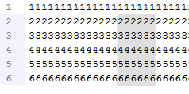
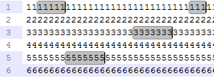
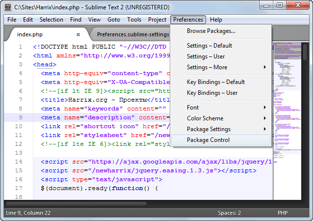

# Шпаргалка по Sublime Text 2

В предыдущей [статье](http://blog.harrix.org/?p=43) по Sublime Text 2 мы рассмотрели настройки после установки программы.

Здесь же я буду описывать шпаргалку для себя и вас по данной программе, чтобы не забывать, что и как делать.

## Горячие клавиши

`Ctrl` + `Ё` (`Ctrl` + `` ` ``) — Открытие/закрытие консоли.

`Ctrl` + `P` — Открытие/закрытие панели перехода и поиска `GoAnything`.

`Ctrl` + `S` — Сохранить файл.

`Ctrl` + `F` — Открыть панель поиска.

`Esc` — Закрыть панель поиска.

`Ctrl` + `Shift` + `F` — Открыть расширенную панель поиска и замены.

`Ctrl` + `F9` — Сортировка строк с учетом регистра.

`F9` — Сортировка строк.

`Ctrl` + `J` — Объединение выделенных строк в одну.

`Ctrl` + `Shift` + `D` — Дублирование выделенного кода.

`F6` — Включение/выключение режима проверки орфографии.

`Alt` + `O` (`Alt` + `Щ`) — Если в Sublime открыты `.cpp` и `.h` файлы, соответствующие друг другу, то эта комбинация клавиш переключит с `.cpp` на `.h` и наоборот.

`Ctrl` + `F2` — Добавить к строке отметку.

`F2` — Переход к следующей отмеченной строке.

`Shift` + `F2` — Переход к предыдущей отмеченной строке.

`Ctrl` + `/` — Закомментировать/раскомментировать код.

`Ctrl` + `K`, а потом `Ctrl` + `U` — Поменять регистр букв на верхний.

`Ctrl` + `K`, а потом `Ctrl` + `l` — Поменять регистр букв на нижний.

`Ctrl` + `M` — Перейти к соответствующей скобке (закрывающейся или открывающейся).

### Плагин Clipboard History

`Ctrl` + `Alt` + `V` — Окно истории буфера обмена.

`Ctrl` + `Shift` + `V` — Вставляет предпоследний кусок в буфере обмена.

## Некоторые функции в меню

`File` → `Save with Encoding` → `…` — Перекодирование файла.

`File` → `Reopen with Encoding` → `…` — Открыть файл в другой кодировке.

`Edit` → `Permute Lines` → `Unique` — Удалить повторяющиеся строки.

`Edit` → `Permute Lines` → `Reverse` — Обратить порядок строк.

`Edit` → `Permute Lines` → `Shuffle` — Перемешать строки в случайном порядке.

`View` → `Layout` → `Columns: 2` — Разделить окна на две части (там вы найдете и другие способы разделения окна).

`View` → `Syntax` → `…` — Выбор подсветки синтаксиса.

`Goto` → `Jump to Matching Bracket` — Перейти к соответствующей скобке (закрывающейся или открывающейся).

## Особые выделения

Если нажать на правую кнопку мыши и клавишу `Shift`, можно проводить вертикальное выделение текста:

_Рисунок 1 — Вертикальное выделение_

Если нажать клавишу `Ctrl`, то можно выделить сразу несколько текстовых блоков (Множественное выделение). При этом, если не снимать выделение, то, когда начнете писать, то текст будет вводиться во всех выделенных местах:

_Рисунок 2 — Множественное выделение_

## Работа с панелью перехода и поиска GoAnything `Ctrl` + `P`

`1.txt` — Набираете название файла, и вы перейдете к нему. Особенно важно в режиме работы `Project`.

`:10` — Переходите к 10 строке.

`#текст` — Если начинать с `#` в тексте документа ищется `текст`. При этом предлагает варианты слов, что содержать данный текст, а также потом подсвечивает все найденные варианты (слова, а не варианты, что содержать как фрагмент). Вот только не позволяет переходить ко второму и так далее результату. И предпочтение отдает словам, начинающихся с данного текста.

`#тет` — Также перейдете к слову `текст`.

`@func` — Переходите к функции, что содержит `func`.

`@fc` — Также переходите к функции `func`.

`ma#тет` или `ma@fc` или `ma:10` — Sublime открывает файл, в названии которого есть `ma`, а далее поиск как обычно.

## Пути

`C:\Users\[your username]\AppData\Roaming\Sublime Text 2` — в Windows 7 находятся все установленные плагины, настройки и так далее.

`%appdata%/Sublime Text 2` — аналогичный путь.

`Preferences` → `Browse Packages` — аналогичный путь.

`%appdata%/Sublime Text 2/Packages` — папка с плагинами.

## Плагины

Можно установить двумя способами:

- Распаковать архив с плагином в папку `Packages` с плагинами, что находится `%appdata%/Sublime Text 2/Packages`.
- Через `Package Control`:

_Рисунок 3 — Package Control_

Набираем `Install Package` и производим установку плагина.

## Работа с проектами

Если вы работаете с каким-то проектом (сайт, программа и так далее), то вы работаете обычно со множеством файлов в одной папке с подпапками. Лучше в этом случае работать с функцией проекта `Вид` → `Проект` → `Панель проекта 1`.
