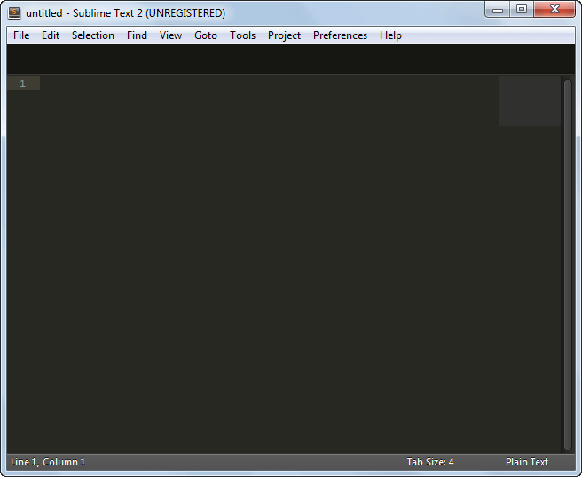
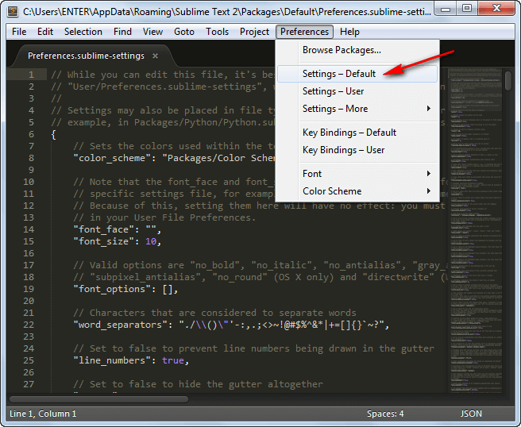
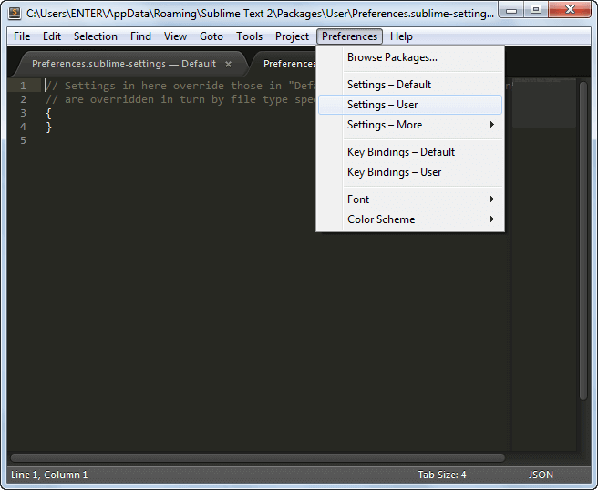
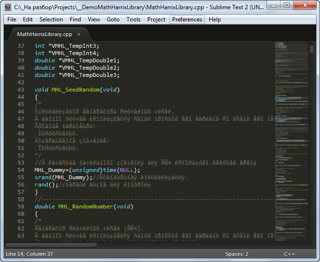
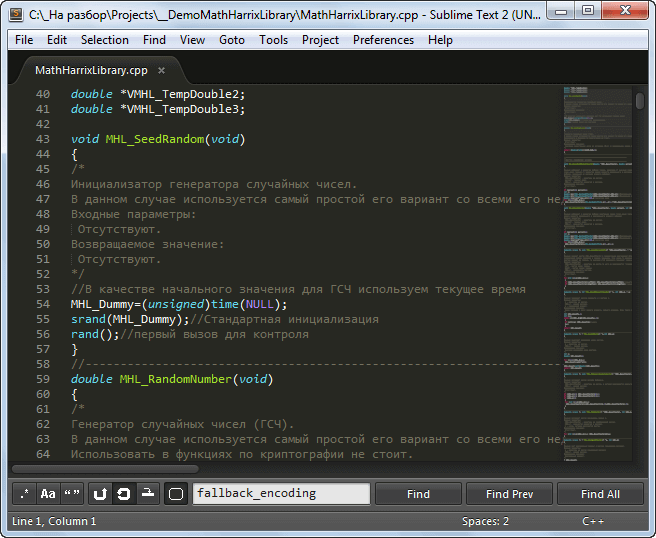
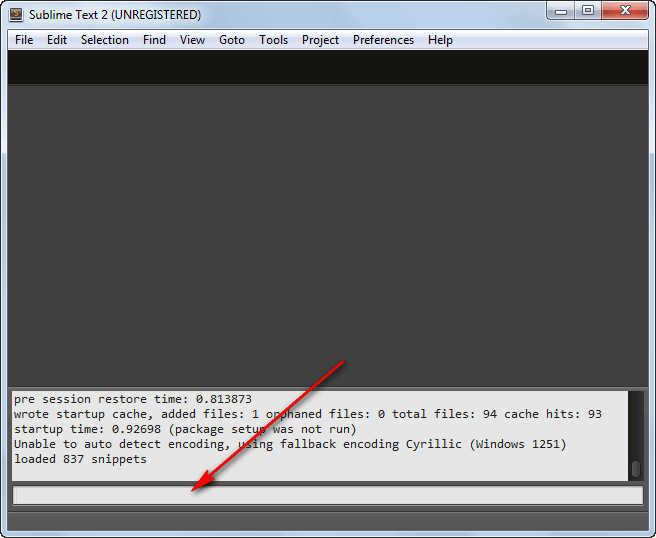
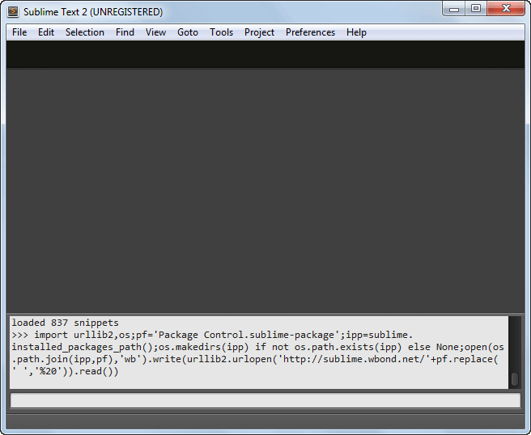
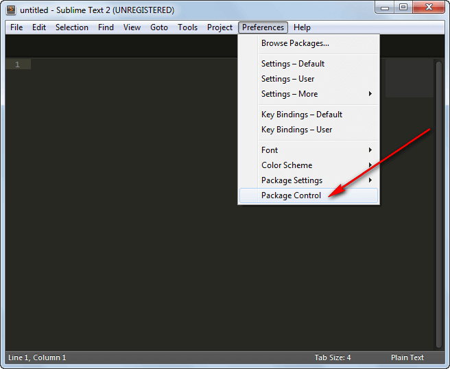
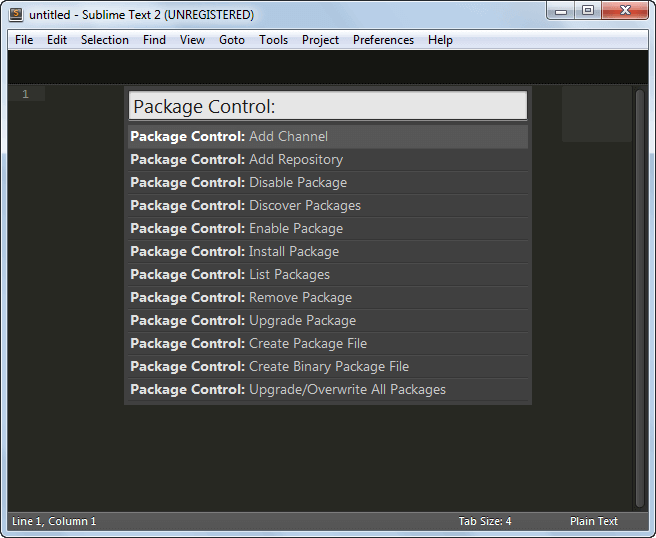

# Первоначальная настройка Sublime Text 2


Сейчас всё больше становится популярным текстовой редактор `Sublime Text 2`. Но к сожалению «из коробки» редактор не очень приспособлен к работе. В статье описываются первоначальные настройки программы. Все примеры описываются для среды Windows.

<details>
<summary>📖 Содержание</summary>

## Содержание

- [Где скачать программу](#где-скачать-программу)
- [Где находятся настройки программы](#где-находятся-настройки-программы)
- [Многие файлы с русским текстом открываются с крякозябрами. Как исправить](#многие-файлы-с-русским-текстом-открываются-с-крякозябрами-как-исправить)
- [Установка Package Control](#установка-package-control)

</details>

## Где скачать программу

Стабильную версию программы можно скачать по адресу: <https://www.sublimetext.com/2>.

А последнюю рабочую версию можно скачать по адресу: <https://www.sublimetext.com/dev>.

После установки получим программу с таким внешним видом:



_Рисунок 1 — Внешний вид программы_

## Где находятся настройки программы

Настройки программы делятся на несколько типов.

Общие настройки:



_Рисунок 2 — Общие настройки_

Настройки пользователя:



_Рисунок 3 — Настройки пользователя_

При сохранении изменений в этих файлах программа автоматически поменяет свои настройки.

## Многие файлы с русским текстом открываются с крякозябрами. Как исправить

Если мы откроем многие файлы с русским текстом, то получим следующее:



_Рисунок 4 — Крякозябры_

Для этого исправим кодировку по умолчанию в настройках программы.

Идем в общие настройки `Preferences` → `Settings — Default`.

Находим там строки:

```json
// The encoding to use when the encoding can''t be determined automatically.
// ASCII, UTF-8 and UTF-16 encodings will be automatically detected.
"fallback_encoding": "Western (Windows 1252)",
```

Исправляем на такие:

```json
// The encoding to use when the encoding can''t be determined automatically.
// ASCII, UTF-8 and UTF-16 encodings will be automatically detected.
"fallback_encoding": "Cyrillic (Windows 1251)",
```

И сохраняем настройки `Ctrl` + `S`.

Теперь при открытии файлов с русским текстом всё будет отображаться корректно:



_Рисунок 5 — Крякозябры исчезли_

## Установка Package Control

В дальнейшей работе вы скорее всего будете устанавливать дополнительные плагины. Для этого лучшего всего установить дополнительный менеджер пакетов `Package Control`:

Войдите в консоль. Для этого нажмите `Ctrl` + `Ё`:



_Рисунок 6 — Консоль_

Введите в консоли строчку:

```python
import urllib2,os;pf='Package Control.sublime-package';ipp=sublime.installed_packages_path();os.makedirs(ipp) if not os.path.exists(ipp) else None;open(os.path.join(ipp,pf),'wb').write(urllib2.urlopen('http://sublime.wbond.net/'+pf.replace(' ','%20')).read())
```

Нажмите `Enter` и ждём, пока всё скачается:



_Рисунок 7 — Процесс ожидания в консоли_

Перезапускаем программу и теперь в настройках в настройках у нас есть `Package Control`: `Preferences` → `Package Control`:



_Рисунок 8 — Package Control_



_Рисунок 9 — Package Control_

Теперь заходя в `Package Control` вы сможете устанавливать плагины для `Sublime Text 2` быстрее и проще.

Вроде с основными настройками справились. В начале статьи есть список статей данного блога по данной программе, в которых вы можете почерпнуть что-то полезное.
