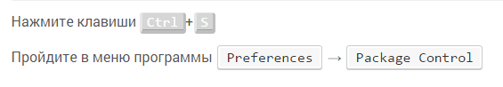

# Изменение оформления тэга kbd

На просторах интернета встретил, что в тексте статей иногда клавиатурные комбинации изображаются с помощью имитации изображений кнопок. Делается это с помощью тега `<kbd>` и его оформлением в CSS.

Использую (**Update:** сейчас не использую эти оформления) в статьях два вида оформления тэга `<kbd>`: для отображения кнопок и для отображения пунктов меню в программах, по которым нужно пройти.

Добавьте в ваш CSS файл следующий код:

```css
kbd {
  margin: 0;
  padding: 0;
  border: 0;
  outline: 0;
  color: white;
  font-size: 100%;
  font-family: monospace, sans-serif;
  vertical-align: baseline;
  background: transparent;
  border-color: #e6e6e6 #bebebe #bebebe #e6e6e6;
  border-style: solid;
  border-width: 1px 3px 4px;
  padding: 0 5px;
  background-color: #d2d2d2;
  background-color: rgba(210, 210, 210, 0.9);
  -webkit-border-radius: 4px;
  -moz-border-radius: 4px;
  border-radius: 4px;
}

kbd.menu {
  -moz-border-radius: 3px;
  -moz-box-shadow: 0 1px 0 rgba(0, 0, 0, 0.2), 0 0 0 2px #fff inset;
  -webkit-border-radius: 3px;
  -webkit-box-shadow: 0 1px 0 rgba(0, 0, 0, 0.2), 0 0 0 2px #fff inset;
  background-color: #f7f7f7;
  border: 1px solid #ccc;
  border-radius: 3px;
  box-shadow: 0 1px 0 rgba(0, 0, 0, 0.2), 0 0 0 2px #fff inset;
  color: #333;
  display: inline-block;
  font-family: monospace, sans-serif;
  font-size: 100%;
  line-height: 1.4;
  margin: 0 0.1em;
  padding: 0.1em 0.6em;
  text-shadow: 0 1px 0 #fff;
}
```

Пример использования стилей:

```html
<p>Нажмите клавиши <kbd>Ctrl</kbd> + <kbd>Ё</kbd></p>

<p>Пройдите в меню программы <kbd class="menu">Preferences</kbd> → <kbd class="menu">Package Control</kbd></p>
```

В итоге вы получите такой результат.

Скриншот:



Живой пример:

<https://codepen.io/Harrix/pen/WKKYNL>
