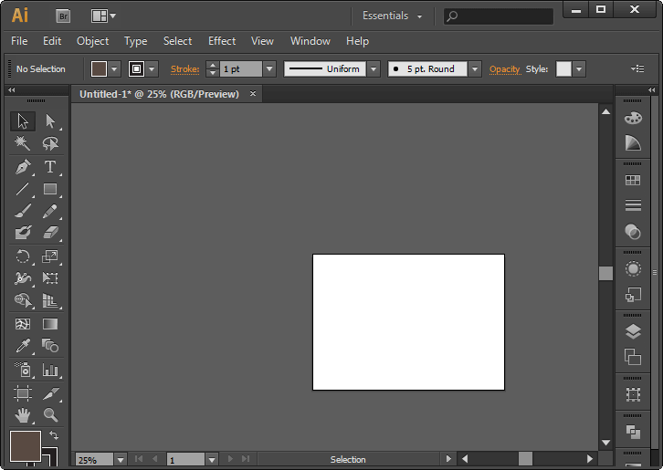
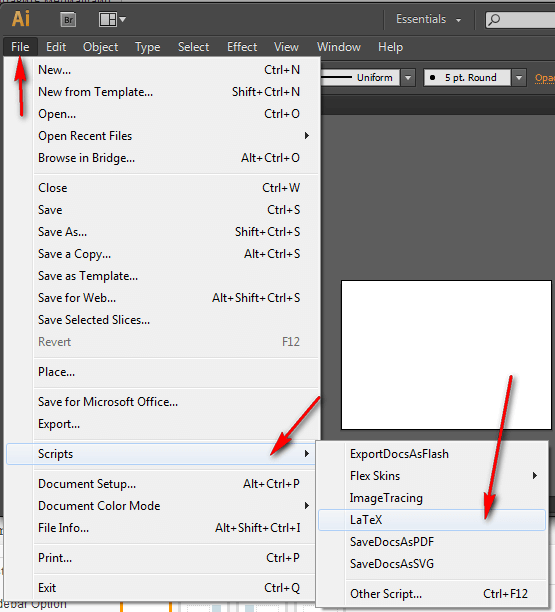
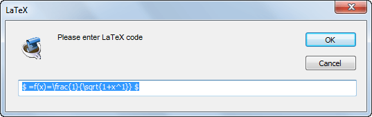
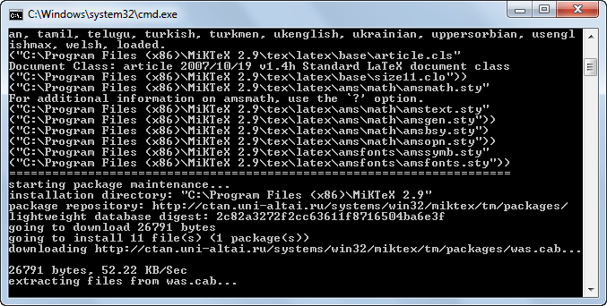
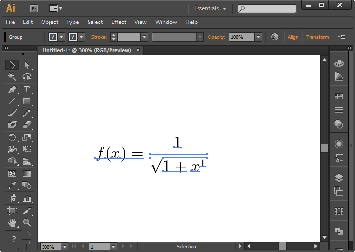
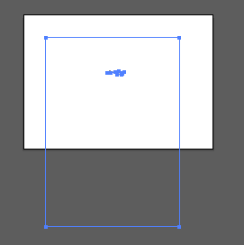
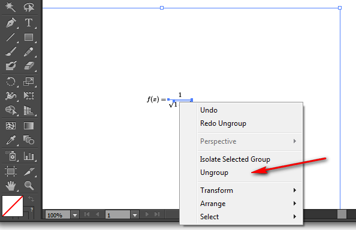

# LaTeX и Illustrator

Как добавлять LaTeX формулы в Illustrator? Об этом идет речь в статье.

## Исходные данные

Для LaTeX я использую связку MiKTex (версия 2.9) и TeXstudio (версия 2.5.2).

Для редактирования векторных изображению использую Illustrator CS6.

Все действия провожу в Windows 7 Home.

Помните, что MiKTex у вас должен быть установлен.

## Шрифты

Вначале нужно, чтобы Illustrator смог увидеть шрифты, что предназначены для отображения LaTeX. Они находятся в папке MiKTex. У меня это в папке: `C:\Program Files\MiKTeX 2.9\fonts`.

Найдите там все файлы расширения `*.pfm` через поиск.

Скопируйте все в папку `C:\Windows\Fonts`. В некоторых случаях Windows может поругаться на неправильные шрифты, но это не страшно.

**Update 2018.** Сейчас установка шрифтов в Windows не помогает. Необходимо скопировать шрифты в папку шрифтов Adobe. Для этого я копирую всё содержимое папки `C:\Program Files\MiKTeX 2.9\fonts` в папку `C:\Program Files\Common Files\Adobe\Fonts` на Windows 10 для Adobe Illustrator CC 2018. При этом папку `Fonts` в папке `C:\Program Files\Common Files\Adobe` пришлось создавать самому.

## Настройка Illustrator

Скопируйте файл себе на компьютер: [LaTeX.zip](files/LaTeX.zip).

В нем содержится файл `LaTeX.js` со следующим кодом (исправленный):

```js
var pdflatexexe = "pdflatex.exe"; // Add full path if necessary

// determining the local temporary directory
var temppath = Folder.temp.fsName; // path already in Windows syntax: c:\...
var i = temppath.indexOf("Temporary Internet Files");
if (i >= 0) temppath = temppath.substr(0, i + 4);
//temppath should now contain something like C:\Documents and Settings\<user>\Local Settings\Temp

// remember the last user input in a text file
var lastcode = "$$";
var lastcodefile = File(temppath + "\\latex2illustrator_lastcode.txt");
if (lastcodefile.exists) {
  lastcodefile.open("r");
  lastcode = lastcodefile.read();
  lastcodefile.close();
}

// prompt for user input
var latexcode = prompt("Please enter LaTeX code", lastcode, "LaTeX");
if (latexcode != null) {
  lastcodefile.open("w");
  lastcodefile.write(latexcode);
  lastcodefile.close();

  // add latex header etc. to create a complete latex document
  var latexfile = new File(temppath + "\\latex2illustrator.tex");
  latexfile.open("w");
  latexfile.writeln("\\documentclass[11pt]{article}");
  // add or remove additional latex packages here
  latexfile.writeln("\\usepackage{amsmath}");
  latexfile.writeln("\\usepackage{amssymb}");
  latexfile.writeln("\\usepackage{gensymb}"); // for \degree
  latexfile.writeln("\\usepackage{textcomp}"); // for \textdegree
  latexfile.writeln("\\usepackage{bm}"); // bold math
  latexfile.writeln("\\begin{document}");
  latexfile.writeln("\\pagestyle{empty}"); // no page number
  latexfile.writeln(latexcode);
  latexfile.writeln("\\end{document}");
  latexfile.close();

  var pdffile = File(temppath + "\\latex2illustrator.pdf");
  if (pdffile.exists) pdffile.remove();

  // create a batch file calling latex
  var batchfile = new File(temppath + "\\latex2illustrator.bat");
  batchfile.open("w");
  batchfile.writeln(
    pdflatexexe +
      " -aux-directory=" +
      temppath +
      " -include-directory=" +
      temppath +
      " -output-directory=" +
      temppath +
      " " +
      temppath +
      "\\latex2illustrator.tex"
  );
  //batchfile.writeln(''pause'');
  batchfile.writeln("del " + temppath + "\\latex2illustrator.bat");
  batchfile.close();
  batchfile.execute();

  for (; batchfile.exists; )
    // wait until the batch file has removed itself

    var pdffile = File(temppath + "\\latex2illustrator.pdf");
  if (pdffile.exists) {
    // import pdf file into the current document
    var grp = app.activeDocument.activeLayer.groupItems.createFromFile(pdffile);
    // The imported objects are grouped twice. Now move the subgroup
    // items to the main group and skip the last item which is the page frame
    for (var i = grp.pageItems[0].pageItems.length - 1; --i >= 0; )
      grp.pageItems[0].pageItems[i].move(grp, ElementPlacement.PLACEATEND);
    grp.pageItems[0].remove();
    // Move the imported objects to the center of the current view.
    grp.translate(
      app.activeDocument.activeView.centerPoint[0] - grp.left,
      app.activeDocument.activeView.centerPoint[1] - grp.top
    );
  } else alert("File " + temppath + "\\" + pdffile.name + " could not be created. LaTeX error?");
}
```

Перейдите в папку со скриптами в Illustrator. У меня это папка `C:\Program Files\Adobe\Adobe Illustrator CS6 (64 Bit)\Presets\en_US\Scripts`. У вас папка `Presets` может называться `Стили`, но это Windows так её обзывает: на самом деле это папка `Presents`.

Скопируйте в эту папку файл `LaTeX.js`.

Перезапустите Illustrator.

## Работа Illustrator

Теперь создайте в Illustrator любой документ:



Вызовите скрипт LaTeX через пункты меню `File` → `Scripts` → `LaTex`:



Появится окно, где вы вводите свою формулу, например, вида:

```tex
$ =f(x)=\frac{1}{\sqrt{1+x^1}} $
```



Нажимаете `OK`.

И ждите. Так как этот первый раз запускается скрипт, то он будет долго ничего не делать. У меня минуту на экране ничего не происходило. После этого появится черное окно, где что-то будет делаться, а потом остановится и долго ничего не будет происходить:



Жите, пока все не установится, и не закрывайте черное окно сами. Если MiKTex попросит что-то установить, то устанавливайте (пакеты всякие), так что вам может пригодиться доступ в Интернет.

После того, как все установится, то на экране появится ваша формула в векторном виде:



При последующих вызовах скрипта, создание нового векторного объекта будет происходить быстрее.

## Неприятные моменты

Скрипт написан не мной, и он не совсем красивый по исполнению. Кроме самой формулы добавляется рамка:



Это из-за того, что скрипт вначале создает PDF документ, а потом его внедряет в Illustrator.

Чтобы от нее избавиться, разгруппируйте объект:



И удалите рамку, выделив ее.

Второй недостаток связан с вводом формулы в окно ввода формулы. Как написано выше, мы добавляли код:

```tex
$ =f(x)=\frac{1}{\sqrt{1+x^1}} $
```

Хотя отобразился код:

```tex
$ f(x)=\frac{1}{\sqrt{1+x^1}} $
```

Суть в том, что скрипт почему-то не отображает первый символ формулы, поэтому костылем для исправления является написание лишнего знака «=», чтобы вся формула отобразилась, то есть ваша формула должна находится в этой конструкции:

```tex
$ = $
```

Например:

```tex
$ =2+2=4 $
```

Проверено на Adobe Illustrator CC.
