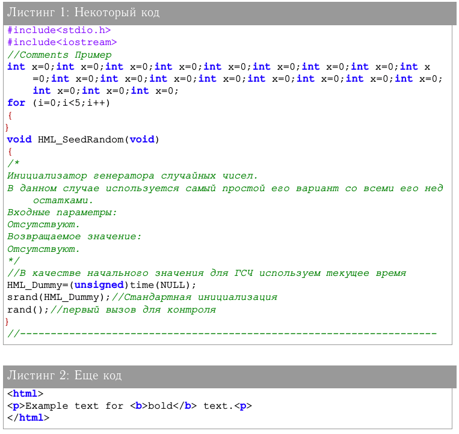

# Подсветка синтаксиса в LaTeX с кириллицей


Как посветить код, который публикуется в LaTeX? В статье рассматриваются способ решения этой проблемы. Рассматривается вариант для цветной подсветки кода с кириллицей.

Должны быть подключены следующие модули:

```tex
\usepackage[T2A]{fontenc} % Поддержка русских букв
\usepackage[utf8]{inputenc} % Кодировка utf8
\usepackage[english, russian]{babel} % Языки: русский, английский
\usepackage{pscyr} % Нормальные шрифты
```

Как подключить модуль Pscyr, читайте [тут](https://github.com/Harrix/harrix.dev-blog-2018/blob/main/pscyr/pscyr.md) <!-- https://harrix.dev/ru/blog/2018/pscyr/ -->.

После этого прописываете следующие настройки:

```tex
\usepackage{caption}
\usepackage{color}
\usepackage{xcolor}
\usepackage{listings}

% Цвета для кода
\definecolor{string}{HTML}{B40000} % цвет строк в коде
\definecolor{comment}{HTML}{008000} % цвет комментариев в коде
\definecolor{keyword}{HTML}{1A00FF} % цвет ключевых слов в коде
\definecolor{morecomment}{HTML}{8000FF} % цвет include и других элементов в коде
\definecolor{captiontext}{HTML}{FFFFFF} % цвет текста заголовка в коде
\definecolor{captionbk}{HTML}{999999} % цвет фона заголовка в коде
\definecolor{bk}{HTML}{FFFFFF} % цвет фона в коде
\definecolor{frame}{HTML}{999999} % цвет рамки в коде
\definecolor{brackets}{HTML}{B40000} % цвет скобок в коде

%%% Отображение кода %%%
% Настройки отображения кода
\lstset{
  language=C++, % Язык кода по умолчанию
  morekeywords={*,...}, % если хотите добавить ключевые слова, то добавляйте
  % Цвета
  keywordstyle=\color{keyword}\ttfamily\bfseries,
  %stringstyle=\color{string}\ttfamily,
  stringstyle=\ttfamily\color{red!50!brown},
  commentstyle=\color{comment}\ttfamily\itshape,
  morecomment=[l][\color{morecomment}]{\#},
  % Настройки отображения
  breaklines=true, % Перенос длинных строк
  basicstyle=\ttfamily\footnotesize, % Шрифт для отображения кода
  backgroundcolor=\color{bk}, % Цвет фона кода
  frame=lrb,xleftmargin=\fboxsep,xrightmargin=-\fboxsep, % Рамка, подогнанная к заголовку
  rulecolor=\color{frame}, % Цвет рамки
  tabsize=3, % Размер табуляции в пробелах
  % Настройка отображения номеров строк. Если не нужно, то удалите весь блок
  %numbers=left, % Слева отображаются номера строк
  %stepnumber=1, % Каждую строку нумеровать
  %numbersep=5pt, % Отступ от кода
  %numberstyle=\small\color{black}, % Стиль написания номеров строк
  % Для отображения русского языка
  extendedchars=true,
  literate={Ö}{ {\"O} }1
  {Ä}{ {\"A} }1
  {Ü}{ {\"U} }1
  {ß}{ {\ss} }1
  {ü}{ {\"u} }1
  {ä}{ {\"a} }1
  {ö}{ {\"o} }1
  {~}{ {\textasciitilde} }1
  {а}{ {\selectfont\char224} }1
  {б}{ {\selectfont\char225} }1
  {в}{ {\selectfont\char226} }1
  {г}{ {\selectfont\char227} }1
  {д}{ {\selectfont\char228} }1
  {е}{ {\selectfont\char229} }1
  {ё}{ {\"e} }1
  {ж}{ {\selectfont\char230} }1
  {з}{ {\selectfont\char231} }1
  {и}{ {\selectfont\char232} }1
  {й}{ {\selectfont\char233} }1
  {к}{ {\selectfont\char234} }1
  {л}{ {\selectfont\char235} }1
  {м}{ {\selectfont\char236} }1
  {н}{ {\selectfont\char237} }1
  {о}{ {\selectfont\char238} }1
  {п}{ {\selectfont\char239} }1
  {р}{ {\selectfont\char240} }1
  {с}{ {\selectfont\char241} }1
  {т}{ {\selectfont\char242} }1
  {у}{ {\selectfont\char243} }1
  {ф}{ {\selectfont\char244} }1
  {х}{ {\selectfont\char245} }1
  {ц}{ {\selectfont\char246} }1
  {ч}{ {\selectfont\char247} }1
  {ш}{ {\selectfont\char248} }1
  {щ}{ {\selectfont\char249} }1
  {ъ}{ {\selectfont\char250} }1
  {ы}{ {\selectfont\char251} }1
  {ь}{ {\selectfont\char252} }1
  {э}{ {\selectfont\char253} }1
  {ю}{ {\selectfont\char254} }1
  {я}{ {\selectfont\char255} }1
  {А}{ {\selectfont\char192} }1
  {Б}{ {\selectfont\char193} }1
  {В}{ {\selectfont\char194} }1
  {Г}{ {\selectfont\char195} }1
  {Д}{ {\selectfont\char196} }1
  {Е}{ {\selectfont\char197} }1
  {Ё}{ {\"E} }1
  {Ж}{ {\selectfont\char198} }1
  {З}{ {\selectfont\char199} }1
  {И}{ {\selectfont\char200} }1
  {Й}{ {\selectfont\char201} }1
  {К}{ {\selectfont\char202} }1
  {Л}{ {\selectfont\char203} }1
  {М}{ {\selectfont\char204} }1
  {Н}{ {\selectfont\char205} }1
  {О}{ {\selectfont\char206} }1
  {П}{ {\selectfont\char207} }1
  {Р}{ {\selectfont\char208} }1
  {С}{ {\selectfont\char209} }1
  {Т}{ {\selectfont\char210} }1
  {У}{ {\selectfont\char211} }1
  {Ф}{ {\selectfont\char212} }1
  {Х}{ {\selectfont\char213} }1
  {Ц}{ {\selectfont\char214} }1
  {Ч}{ {\selectfont\char215} }1
  {Ш}{ {\selectfont\char216} }1
  {Щ}{ {\selectfont\char217} }1
  {Ъ}{ {\selectfont\char218} }1
  {Ы}{ {\selectfont\char219} }1
  {Ь}{ {\selectfont\char220} }1
  {Э}{ {\selectfont\char221} }1
  {Ю}{ {\selectfont\char222} }1
  {Я}{ {\selectfont\char223} }1
  {і}{ {\selectfont\char105} }1
  {ї}{ {\selectfont\char168} }1
  {є}{ {\selectfont\char185} }1
  {ґ}{ {\selectfont\char160} }1
  {І}{ {\selectfont\char73} }1
  {Ї}{ {\selectfont\char136} }1
  {Є}{ {\selectfont\char153} }1
  {Ґ}{ {\selectfont\char128} }1
  {\{}{ { {\color{brackets}\{} } }1 % Цвет скобок {
  {\} }{ { {\color{brackets}\} } } }1 % Цвет скобок }
}
% Для настройки заголовка кода
\DeclareCaptionFont{white}{\color{captiontext} }
\DeclareCaptionFormat{listing}{\parbox{\linewidth}{\colorbox{captionbk}{\parbox{\linewidth}{#1#2#3} }\vskip-4pt} }
\captionsetup[lstlisting]{format=listing,labelfont=white,textfont=white}
\renewcommand{\lstlistingname}{Код} % Переименование Listings в нужное именование структуры
% Для отображения кода формата xml
\lstdefinelanguage{XML}
{
  morestring=[s]{"}{"},
  morecomment=[s]{?}{?},
  morecomment=[s]{!--}{--},
  commentstyle=\color{comment},
  moredelim=[s][\color{black}]{>}{<},
  moredelim=[s][\color{red}]{\ }{=},
  stringstyle=\color{string},
  identifierstyle=\color{keyword}
}
```

Далее уже в документе пишите свой код, например:

```tex
\begin{lstlisting}[language=html,label=some-code2,caption=Еще код]
<html>
 <p>Example text for <b>bold</b> text.<p>
</html>
\end{lstlisting}
```

Пример документа:

```tex
\documentclass{article}

\usepackage[T2A]{fontenc} % Поддержка русских букв
\usepackage[utf8]{inputenc} % Кодировка utf8
\usepackage[english, russian]{babel} % Языки: русский, английский
\usepackage{pscyr} % Нормальные шрифты

\usepackage{caption}
\usepackage{color}
\usepackage{xcolor}
\usepackage{listings}

% Цвета для кода
\definecolor{string}{HTML}{B40000} % цвет строк в коде
\definecolor{comment}{HTML}{008000} % цвет комментариев в коде
\definecolor{keyword}{HTML}{1A00FF} % цвет ключевых слов в коде
\definecolor{morecomment}{HTML}{8000FF} % цвет include и других элементов в коде
\definecolor{captiontext}{HTML}{FFFFFF} % цвет текста заголовка в коде
\definecolor{captionbk}{HTML}{999999} % цвет фона заголовка в коде
\definecolor{bk}{HTML}{FFFFFF} % цвет фона в коде
\definecolor{frame}{HTML}{999999} % цвет рамки в коде
\definecolor{brackets}{HTML}{B40000} % цвет скобок в коде

%%% Отображение кода %%%
% Настройки отображения кода
\lstset{
  language=C++, % Язык кода по умолчанию
  morekeywords={*,...}, % если хотите добавить ключевые слова, то добавляйте
  % Цвета
  keywordstyle=\color{keyword}\ttfamily\bfseries,
  %stringstyle=\color{string}\ttfamily,
  stringstyle=\ttfamily\color{red!50!brown},
  commentstyle=\color{comment}\ttfamily\itshape,
  morecomment=[l][\color{morecomment}]{\#},
  % Настройки отображения
  breaklines=true, % Перенос длинных строк
  basicstyle=\ttfamily\footnotesize, % Шрифт для отображения кода
  backgroundcolor=\color{bk}, % Цвет фона кода
  frame=lrb,xleftmargin=\fboxsep,xrightmargin=-\fboxsep, % Рамка, подогнанная к заголовку
  rulecolor=\color{frame}, % Цвет рамки
  tabsize=3, % Размер табуляции в пробелах
  % Настройка отображения номеров строк. Если не нужно, то удалите весь блок
  %numbers=left, % Слева отображаются номера строк
  %stepnumber=1, % Каждую строку нумеровать
  %numbersep=5pt, % Отступ от кода
  %numberstyle=\small\color{black}, % Стиль написания номеров строк
  % Для отображения русского языка
  extendedchars=true,
  literate={Ö}{ {\"O} }1
  {Ä}{ {\"A} }1
  {Ü}{ {\"U} }1
  {ß}{ {\ss} }1
  {ü}{ {\"u} }1
  {ä}{ {\"a} }1
  {ö}{ {\"o} }1
  {~}{ {\textasciitilde} }1
  {а}{ {\selectfont\char224} }1
  {б}{ {\selectfont\char225} }1
  {в}{ {\selectfont\char226} }1
  {г}{ {\selectfont\char227} }1
  {д}{ {\selectfont\char228} }1
  {е}{ {\selectfont\char229} }1
  {ё}{ {\"e} }1
  {ж}{ {\selectfont\char230} }1
  {з}{ {\selectfont\char231} }1
  {и}{ {\selectfont\char232} }1
  {й}{ {\selectfont\char233} }1
  {к}{ {\selectfont\char234} }1
  {л}{ {\selectfont\char235} }1
  {м}{ {\selectfont\char236} }1
  {н}{ {\selectfont\char237} }1
  {о}{ {\selectfont\char238} }1
  {п}{ {\selectfont\char239} }1
  {р}{ {\selectfont\char240} }1
  {с}{ {\selectfont\char241} }1
  {т}{ {\selectfont\char242} }1
  {у}{ {\selectfont\char243} }1
  {ф}{ {\selectfont\char244} }1
  {х}{ {\selectfont\char245} }1
  {ц}{ {\selectfont\char246} }1
  {ч}{ {\selectfont\char247} }1
  {ш}{ {\selectfont\char248} }1
  {щ}{ {\selectfont\char249} }1
  {ъ}{ {\selectfont\char250} }1
  {ы}{ {\selectfont\char251} }1
  {ь}{ {\selectfont\char252} }1
  {э}{ {\selectfont\char253} }1
  {ю}{ {\selectfont\char254} }1
  {я}{ {\selectfont\char255} }1
  {А}{ {\selectfont\char192} }1
  {Б}{ {\selectfont\char193} }1
  {В}{ {\selectfont\char194} }1
  {Г}{ {\selectfont\char195} }1
  {Д}{ {\selectfont\char196} }1
  {Е}{ {\selectfont\char197} }1
  {Ё}{ {\"E} }1
  {Ж}{ {\selectfont\char198} }1
  {З}{ {\selectfont\char199} }1
  {И}{ {\selectfont\char200} }1
  {Й}{ {\selectfont\char201} }1
  {К}{ {\selectfont\char202} }1
  {Л}{ {\selectfont\char203} }1
  {М}{ {\selectfont\char204} }1
  {Н}{ {\selectfont\char205} }1
  {О}{ {\selectfont\char206} }1
  {П}{ {\selectfont\char207} }1
  {Р}{ {\selectfont\char208} }1
  {С}{ {\selectfont\char209} }1
  {Т}{ {\selectfont\char210} }1
  {У}{ {\selectfont\char211} }1
  {Ф}{ {\selectfont\char212} }1
  {Х}{ {\selectfont\char213} }1
  {Ц}{ {\selectfont\char214} }1
  {Ч}{ {\selectfont\char215} }1
  {Ш}{ {\selectfont\char216} }1
  {Щ}{ {\selectfont\char217} }1
  {Ъ}{ {\selectfont\char218} }1
  {Ы}{ {\selectfont\char219} }1
  {Ь}{ {\selectfont\char220} }1
  {Э}{ {\selectfont\char221} }1
  {Ю}{ {\selectfont\char222} }1
  {Я}{ {\selectfont\char223} }1
  {і}{ {\selectfont\char105} }1
  {ї}{ {\selectfont\char168} }1
  {є}{ {\selectfont\char185} }1
  {ґ}{ {\selectfont\char160} }1
  {І}{ {\selectfont\char73} }1
  {Ї}{ {\selectfont\char136} }1
  {Є}{ {\selectfont\char153} }1
  {Ґ}{ {\selectfont\char128} }1
  {\{}{ { {\color{brackets}\{} } }1 % Цвет скобок {
  {\} }{ { {\color{brackets}\} } } }1 % Цвет скобок }
}
% Для настройки заголовка кода
\DeclareCaptionFont{white}{\color{captiontext} }
\DeclareCaptionFormat{listing}{\parbox{\linewidth}{\colorbox{captionbk}{\parbox{\linewidth}{#1#2#3} }\vskip-4pt} }
\captionsetup[lstlisting]{format=listing,labelfont=white,textfont=white}
\renewcommand{\lstlistingname}{Код} % Переименование Listings в нужное именование структуры
% Для отображения кода формата xml
\lstdefinelanguage{XML}
{
  morestring=[s]{"}{"},
  morecomment=[s]{?}{?},
  morecomment=[s]{!--}{--},
  commentstyle=\color{comment},
  moredelim=[s][\color{black}]{>}{<},
  moredelim=[s][\color{red}]{\ }{=},
  stringstyle=\color{string},
  identifierstyle=\color{keyword}
}

\begin{document}

\begin{lstlisting}[label=some-code,caption=Некоторый код]
#include<stdio.h>
#include<iostream>
//Comments Пример
int x=0;int x=0;int x=0;int x=0;int x=0;int x=0;int x=0;int x=0;int x=0;int x=0;int x=0;int x=0;int x=0;int x=0;int x=0;int x=0;int x=0;int x=0;int x=0;int x=0;
for (i=0;i<5;i++)
{
}
void HML_SeedRandom(void)
{
/*
Инициализатор генератора случайных чисел.
В данном случае используется самый простой его вариант со всеми его недостатками.
Входные параметры:
Отсутствуют.
Возвращаемое значение:
Отсутствуют.
*/
//В качестве начального значения для ГСЧ используем текущее время
HML_Dummy=(unsigned)time(NULL);
srand(HML_Dummy);//Стандартная инициализация
rand();//первый вызов для контроля
}
//--------------------------------------------------------------------
\end{lstlisting}

\begin{lstlisting}[language=html,label=some-code2,caption=Еще код]
<html>
<p>Example text for <b>bold</b> text.<p>
</html>
\end{lstlisting}

\end{document}
```

При этом получим вот такое отображение:



_Рисунок 1 — Результат компилирования_

Если вам нужен черно-белый текст, то данный блок нужно заменить:

```tex
 % Цвета для кода
\definecolor{string}{HTML}{B40000} % цвет строк в коде
\definecolor{comment}{HTML}{008000} % цвет комментариев в коде
\definecolor{keyword}{HTML}{1A00FF} % цвет ключевых слов в коде
\definecolor{morecomment}{HTML}{8000FF} % цвет include и других элементов в коде
definecolor{captiontext}{HTML}{FFFFFF} % цвет текста заголовка в коде
\definecolor{captionbk}{HTML}{999999} % цвет фона заголовка в коде
\definecolor{bk}{HTML}{FFFFFF} % цвет фона в коде
\definecolor{frame}{HTML}{999999} % цвет рамки в коде
\definecolor{brackets}{HTML}{B40000} % цвет скобок в коде
```

А заменить нужно на следующий блок:

```tex
% Цвета для кода
\definecolor{string}{HTML}{000000} % цвет строк в коде
\definecolor{comment}{HTML}{000000} % цвет комментариев в коде
\definecolor{keyword}{HTML}{000000} % цвет ключевых слов в коде
\definecolor{morecomment}{HTML}{000000} % цвет include и других элементов в коде
\definecolor{captiontext}{HTML}{FFFFFF} % цвет текста заголовка в коде
\definecolor{captionbk}{HTML}{000000} % цвет фона заголовка в коде
\definecolor{bk}{HTML}{FFFFFF} % цвет фона в коде
\definecolor{frame}{HTML}{000000} % цвет рамки в коде
\definecolor{brackets}{HTML}{000000} % цвет скобок в коде
```

Поддерживаются следующие языки: ABAP, IDL, PL/I, ACSL, inform, Plasm, Ada, Java, POV, Algol, JVMIS, Prolog, Ant, ksh, Promela, Assembler2, Lisp, Python, Awk, Logo, R, bash, make, Reduce, Basic2, Mathematica1, Rexx, C4, Matlab, RSL, C++, Mercury, Ruby, Caml, MetaPost, S, Clean, Miranda, SAS, Cobol, Mizar, Scilab, Comal, ML, sh, csh, Modelica3, SHELXL, Delphi, Modula-2, Simula, Eiffel, MuPAD, SQL, Elan, NASTRAN, tcl, erlang, Oberon-2, TeX, Euphoria, OCL, VBScript, Fortran, Octave, Verilog, GCL, Oz, VHDL, Gnuplot, Pascal, VRML, Haskell, Perl, XML, HTML, PHP, XSLT.

Хотел было настроить еще цвет для цифр, нашел нормальный способ, но к сожалению в том виде, что есть, он не работает с добавлением русских букв. Можно переделать, то тогда цифры будут везде выделяться. Даже в названиях переменных, строках и др., что мне совсем не надо.

P.S. Код C++ в примере, который выводится, конечно не соответствует правильному написанию кода, но в этой статье это же не важно?
