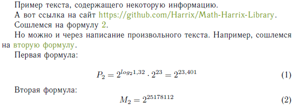

# Ссылки и гиперссылки в LaTeX


Небольшая шпаргалка для работы с ссылками и гиперссылками в LaTeX при генерировании PDF документа. Это не полный справочник, а только описание тех функций, которыми сам лично пользуюсь.

<details>
<summary>📖 Содержание</summary>

- [Установка](#установка)
- [Команды управления](#команды-управления)
- [Пример использования](#пример-использования)

</details>

## Установка

Чтобы в генерированном PDF работали гиперссылки, то надо подключить модуль `hyperref` (и если хотите их разрисовать, то модуль по работе с цветами `xcolor`):

```tex
\usepackage{xcolor}
\usepackage{hyperref}
```

После этого надо настроить параметры данного пакета. Предлагаю свои настройки:

```tex
 % Цвета для гиперссылок
\definecolor{linkcolor}{HTML}{799B03} % цвет ссылок
\definecolor{urlcolor}{HTML}{799B03} % цвет гиперссылок

\hypersetup{pdfstartview=FitH,  linkcolor=linkcolor,urlcolor=urlcolor, colorlinks=true}
```

Параметр `FitH` показывает, что итоговый PDF документ был по ширине расположен на экране.

Параметр `colorlinks=true` показывает, что ссылки будут цветом отображаться, а не рамкой, вокруг них.

Параметры `linkcolor` и `urlcolor` обозначают цвета ссылок и гиперссылок.

## Команды управления

Можно использовать следующие команды.

`\label{formula}` — установка метки с уникальным именем на формулы, таблицы, рисунки и другие объекты. Параметр внутри фигурных скобок вы сами придумываете.

`\ref{formula2}` — ссылка на номер соответствующей формулы и так далее. В виде параметра в фигурных скобках выдается значение метки label, на которую надо сослаться.

`\hyperref[formula]{первая формула}` — если в предыдущей команде выдается только номер формулы или иной структуры, то тут на ссылку по соответствующем значению label, которая задается в фигурных скобках.

`\href{https://github.com/Harrix/Math-Harrix-Library}{https://github.com/Harrix/Math-Harrix-Library}` — ссылка на произвольный сайт.

## Пример использования

Вот такой код:

```tex
\documentclass{article}

\usepackage[T2A]{fontenc} % Поддержка русских букв
\usepackage[utf8]{inputenc} % Кодировка utf8
\usepackage[english, russian]{babel} % Языки: русский, английский
\usepackage{pscyr} % Нормальные шрифты

\usepackage{xcolor}
\usepackage{hyperref}

 % Цвета для гиперссылок
\definecolor{linkcolor}{HTML}{799B03} % цвет ссылок
\definecolor{urlcolor}{HTML}{799B03} % цвет гиперссылок

\hypersetup{pdfstartview=FitH,  linkcolor=linkcolor,urlcolor=urlcolor, colorlinks=true}

\begin{document}

Пример текста, содержащего некоторую информацию.

А вот ссылка на сайт \href{https://github.com/Harrix/Math-Harrix-Library}{https://github.com/Harrix/Math-Harrix-Library}.

Сошлемся на формулу \ref{formula2}.

Но можно и через написание произвольного текста. Например, сошлемся на \hyperref[formula2]{вторую формулу}.

Первая формула:

\begin{equation}\label{formula}
P_2 = 2^{log_2 1,32}\cdot 2^{23} = 2^{23,401}
\end{equation}

Вторая формула:
\begin{equation}\label{formula2}
M_2 = 2^{25178112}
\end{equation}

\end{document}
```

В результате получим следующее:



_Рисунок 1 — Результат компилирования формулы_

Более подробно можно прочитать тут: <https://www.tug.org/applications/hyperref/manual.html> или тут <http://en.wikibooks.org/wiki/LaTeX/Hyperlinks>.
