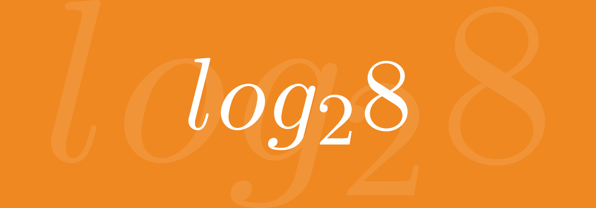
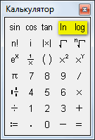
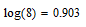
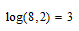

# Логарифм по основанию 2 в Mathcad

У некоторых вызывает непонимание, когда в `Mathcad` (например, версии 15) в списке операторов видят только два логарифма: натуральный и десятичный.

Панель операторов в `Mathcad 15`:

_Рисунок 1 — Панель операторов_

_Рисунок 2 — Вычисление логарифма log(8)=0.903_

Как посчитать логарифм, например, по основанию 2: $log_2 8$?

Всё просто. Когда пишите десятичный логарифм, то через запятую введите основание, которое Вам нужно. А основание 10 просто стоит по умолчанию:

_Рисунок 3 — Вычисление логарифма log(8,2)=3_
