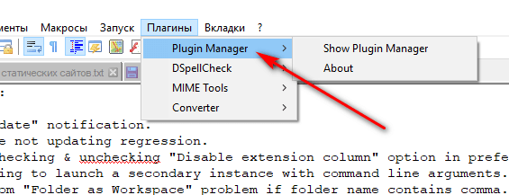

# Плагины Notepad++


Известный редактор Notepad++, возможности которого можно расширить дополнительными плагинами, о некоторых я и расскажу.

## Про Plugin Manager

Создатель Notepad++ выпилил Plugin Manager из программы несколько лет назад (пишу в 2018) из-за наличия рекламы в данном инструменте. Поэтому его нужно устанавливать отдельно с официального репозитория: <https://github.com/bruderstein/nppPluginManager/releases>:


_Рисунок 1 — Plugin Manager_

Рекомендую устанавливать x86 версию Notepad++, если хотите пользоваться плагинами, так как многие плагины не перестроены на x64 версию. Соответственно нужно выбирать версию `UNI` у nppPluginManager.

Из архива достаньте обе папки `plugins` и `updater`, скопируйте их в папку Notepad++ (у меня это `C:\Program Files (x86)\Notepad++`).

Перезапустите Notepad++ и менеджер плагинов у вас появится:



_Рисунок 2 — Меню Plugin Manager_

## TextFX

Очень полезный плагин, который шел в предыдущих средах предустановленным, а теперь его надо устанавливать дополнительно.

Идем в `Плагины` → `Plugin Manager` → `Show Plugin Manager`. Ищем там плагин `TextFX Characters` и его устанавливаем. Версии x64 на 2018 год нет и скорее всего не будет:


_Рисунок 3 — Меню плагина TextFX_

Полный обзор смотрите в статье [Обзор плагина TextFX в Notepad++](https://github.com/Harrix/harrix.dev-articles-2013/blob/main/textfx/textfx.md)<!-- https://harrix.dev/ru/articles/2013/textfx/ -->.

## Сортировка чисел

~~NppColumnSort — позволяет отсортировать строки как числа.~~

Сортируйте числа встроенной функцией `Правка` → `Операции со строками` → `Сортировка по Возрастанию целых чисел`:


_Рисунок 4 — Сортировка по возрастанию целых чисел_

Пример текста:

```text
5
1
10
```

Данный текст будет отсортирован так:

```text
1
5
10
```

## Compare

Плагин для сравнения файлов.

Идем `Плагины` → `Plugin Manager` → `Show Plugin Manager`. Ищем там плагин `Compare` и его устанавливаем:


_Рисунок 5 — Плагин Compare_

При выборе данного пункта меню происходит сравнение файлов:


_Рисунок 6 — Сравнение файлов с помощью плагина Compare_
