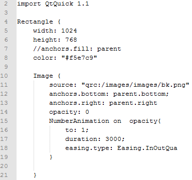
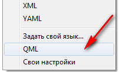
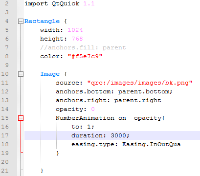

# QML в Notepad++


Как открыть QML файл в Notepad++ с подсветкой синтаксиса?

Стили подсветки синтаксиса:

```xml
<UserLang name="QML" ext="qml">
    <Settings>
        <Global caseIgnored="no" />
        <TreatAsSymbol comment="no" commentLine="no" />
        <Prefix words1="no" words2="no" words3="no" words4="no" />
    </Settings>
    <KeywordLists>
        <Keywords name="Delimiters">&quot;&apos;0&quot;&apos;0</Keywords>
        <Keywords name="Folder+">{</Keywords>
        <Keywords name="Folder-">}</Keywords>
        <Keywords name="Operators"></Keywords>
        <Keywords name="Comment">1/* 2*/ 0//</Keywords>
        <Keywords name="Words1">import property types as abstract bool break byte case catch char class const continue color date debugger default delete do double else enum export extends final finally float for function goto if implements in instanceof int interface long native new package private protected public return short static string super switch synchronized this throw throws transient try typeof var void volatile while with true false prototype url real double </Keywords>
        <Keywords name="Words2"></Keywords>
        <Keywords name="Words3">State PropertyChanges StateGroup ParentChange StateChangeScript AnchorChanges PropertyAnimation ColorAnimation PauseAnimation PropertyAction ParentAction ScriptAction Transition SpringFollow Behavior Binding Listmodel ListElement VisualItemModel XmlListModel XmlRole DateTimeFormatter Script Connection Component Timer QtObject Item Rectangle Animation ParallelAnimation SequentialAnimation Image BorderImage Text TextInput TextEdit MouseArea FocusScope Flickable WebView Loader Repeater SystemPalette GraphicsObjectContainer LayoutItem ListView GridView PathView Path PathLine PathQuad PathCubic PathAttribute PathPercent Columns Row Grid Scale Rotation Blur Colorize DropShadow Opacity Particles ParticleMotionLinear ParticleMotionGravity ParticleMotionWander Gradient GradientStop MouseRegion</Keywords>
        <Keywords name="Words4">alias variant url</Keywords>
    </KeywordLists>
    <Styles>
        <WordsStyle name="DEFAULT" styleID="11" fgColor="000000" bgColor="FFFFFF" fontName="" fontStyle="0" />
        <WordsStyle name="FOLDEROPEN" styleID="12" fgColor="000000" bgColor="FFFFFF" fontName="" fontStyle="0" />
        <WordsStyle name="FOLDERCLOSE" styleID="13" fgColor="000000" bgColor="FFFFFF" fontName="" fontStyle="0" />
        <WordsStyle name="KEYWORD1" styleID="5" fgColor="000000" bgColor="FFFFFF" fontName="" fontStyle="1" />
        <WordsStyle name="KEYWORD2" styleID="6" fgColor="000000" bgColor="FFFFFF" fontName="" fontStyle="1" />
        <WordsStyle name="KEYWORD3" styleID="7" fgColor="0080FF" bgColor="FFFFFF" fontName="" fontStyle="1" />
        <WordsStyle name="KEYWORD4" styleID="8" fgColor="0080FF" bgColor="FFFFFF" fontName="" fontStyle="0" />
        <WordsStyle name="COMMENT" styleID="1" fgColor="C0C0C0" bgColor="FFFFFF" fontName="" fontStyle="0" />
        <WordsStyle name="COMMENT LINE" styleID="2" fgColor="C0C0C0" bgColor="FFFFFF" fontName="" fontStyle="0" />
        <WordsStyle name="NUMBER" styleID="4" fgColor="FF80FF" bgColor="FFFFFF" fontName="" fontStyle="0" />
        <WordsStyle name="OPERATOR" styleID="10" fgColor="000000" bgColor="FFFFFF" fontName="" fontStyle="0" />
        <WordsStyle name="DELIMINER1" styleID="14" fgColor="FF0000" bgColor="FFFFFF" fontName="" fontStyle="0" />
        <WordsStyle name="DELIMINER2" styleID="15" fgColor="FF00FF" bgColor="FFFFFF" fontName="" fontStyle="0" />
        <WordsStyle name="DELIMINER3" styleID="16" fgColor="000000" bgColor="FFFFFF" fontName="" fontStyle="0" />
    </Styles>
</UserLang>
```

Идем сюда `%appdata%/Notepad++`.

Если там есть файл `userDefineLang.xml`, то копируем код XML из начала статьи в файл `userDefineLang.xml` перед последней строчкой:

```xml
</NotepadPlus>
```

Если там нет файла `userDefineLang.xml`, то создаем текстовой документ в этой папке и называем `userDefineLang.xml`. Открываем файл и добавляем в него строки:

```xml
<NotepadPlus>

</NotepadPlus>
```

И между тэгами `<NotepadPlus>` вставляем код XML из начала статьи.

Сохраняем, перезапускам Notepad++.

Теперь откройте какой-нибудь QML файл. Возможен вариант, когда подсветка синтаксиса не появляется:



_Рисунок 1 — Код QML без подсветки_

Тогда идем `Синтаксис` → `QML`:



_Рисунок 2 — Выбор языка подсветки синтаксиса_

Теперь все QML файлы будут с подсветкой синтаксиса:



_Рисунок 3 — Код QML с подсветкой_
