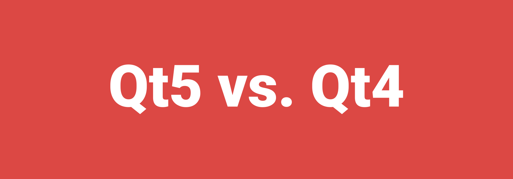

# Соответствие include в Qt5 и Qt4 в QtQuick приложениях

Создатели Qt5 привнесли множество изменений, в том числе изменили многие модули в названии. Поэтому перенос приложения с Qt4 на Qt5 вызвал у меня ряд осложнений с работой QML. Прилагается таблица соответствий модулей `#include` в приложениях QtQuick и не только.

| Qt4                                                  | Qt5                                          |
| ---------------------------------------------------- | -------------------------------------------- |
| `#include <QApplication>`                            | `#include <QGuiApplication>`                 |
| `#include <QDeclarativeContext>`                     | `#include <QQmlContext>`                     |
| `#include <QGraphicsObject>`                         | `#include <QQuickItem>`                      |
| `#include <QDeclarativeComponent>`                   | `#include <QQmlComponent>`                   |
| `#include <QDeclarativeEngine>`                      | `#include <QQmlEngine>`                      |
| `#include <QDeclarativeError>`                       | `#include <QQmlError>`                       |
| `#include <QDeclarativeExpression>`                  | `#include <QQmlExpression>`                  |
| `#include <QDeclarativeExtensionPlugin>`             | `#include <QQmlExtensionPlugin>`             |
| `#include <QDeclarativeInfo>`                        | `#include <QQmlInfo>`                        |
| `#include <QDeclarativeListReference>`               | `#include <QQmlListReference>`               |
| `#include <QDeclarativeNetworkAccessManagerFactory>` | `#include <QQmlNetworkAccessManagerFactory>` |
| `#include <QDeclarativeParserStatus>`                | `#include <QQmlParserStatus>`                |
| `#include <QDeclarativeProperty>`                    | `#include <QQmlProperty>`                    |
| `#include <QDeclarativePropertyMap>`                 | `#include <QQmlPropertyMap>`                 |
| `#include <QDeclarativePropertyValueSource>`         | `#include <QQmlPropertyValueSource>`         |
| `#include <QDeclarativeScriptString>`                | `#include <QQmlScriptString>`                |
| `#include <QDeclarativeItem>`                        | `#include <QQuickItem>`                      |
| `#include <QDeclarativeView>`                        | `#include <QQuickView>`                      |
| `#include <QDeclarativeComponent >`                  | `#include <QQmlComponent>`                   |
| `#include <QDeclarativeImageProvider>`               | `#include <QQuickImageProvide>`              |

Более подробно тут: <http://doc.qt.io/qt-5/qtquick-porting-qt5.html>.
