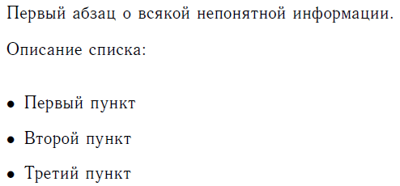
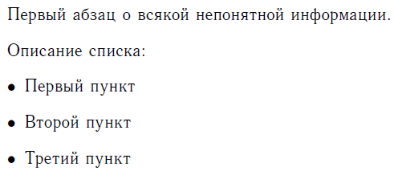
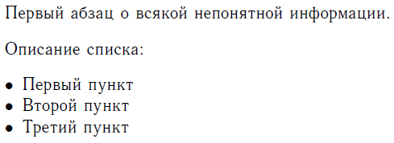
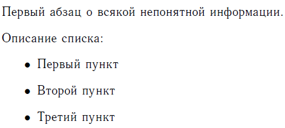

# Как убрать отступ у списка itemize перед предыдущим текстом

Ну, вопрос озвучен в названии статьи.

Допустим у нас есть такой документ, где через команду `\setlength` указан отступ между абзацами:

```tex
\documentclass[titlepage]{article}

\usepackage[T2A]{fontenc} % Поддержка русских букв
\usepackage[utf8]{inputenc} % Кодировка utf8
\usepackage[english, russian]{babel} % Языки: русский, английский
\usepackage{pscyr} % Нормальные шрифты

\setlength{\parskip}{0.3cm} % отступы между абзацами

\begin{document}

Первый абзац о всякой непонятной информации.

Описание списка:

\begin{itemize}
\item Первый пункт
\item Второй пункт
\item Третий пункт
\end{itemize}

\end{document}
```

Мы в итоге получим следующее:



Как видим, между последней строкой нормального абзаца и списком слишком большой отступ. Надо исправлять. Для этого в преамбуле напишем:

```tex
\usepackage{enumitem}
\setlist{nolistsep, itemsep=0.3cm,parsep=0pt}
```

И наш документ примет вид:

```tex
\documentclass[titlepage]{article}

\usepackage[T2A]{fontenc} % Поддержка русских букв
\usepackage[utf8]{inputenc} % Кодировка utf8
\usepackage[english, russian]{babel} % Языки: русский, английский
\usepackage{pscyr} % Нормальные шрифты

\setlength{\parskip}{0.3cm} % отступы между абзацами

\usepackage{enumitem}
\setlist{nolistsep, itemsep=0.3cm,parsep=0pt}

\begin{document}

Первый абзац о всякой непонятной информации.

Описание списка:

\begin{itemize}
\item Первый пункт
\item Второй пункт
\item Третий пункт
\end{itemize}

\end{document}
```



Что и требовалось.

Кстати, если добавить только это в преамбулу (не забывая про `\usepackage{enumitem}`), то получим:

```tex
\setlist{nolistsep}
```



Если добавить только это в преамбулу, то получим:

```tex
\setlist{nolistsep, itemsep=0.3cm,parsep=0pt,leftmargin=1.5cm}
```


