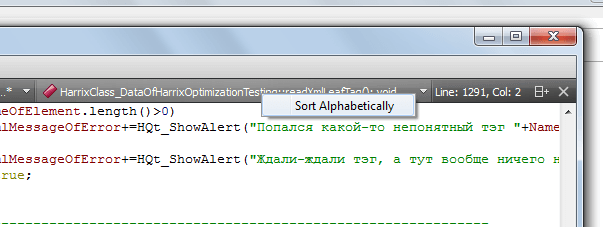

# Сортировка списка функций в Qt Creator

В Qt Creator (в примере используется версия 2.8.1) есть очень полезная функция показа списка функций. Это можно увидеть наверху справа. Но список не отсортирован, а при большом количестве функций это становится неудобным. Как быть?

Вот тут находится наш полезный список:

Правая кнопка по данному списку и выбираем единственный пункт меню:

И получаем отсортированный список функций:

