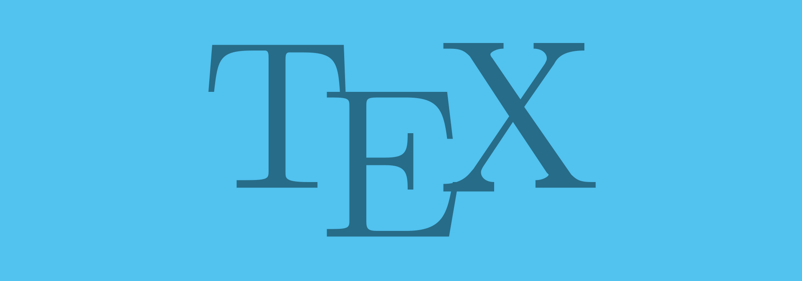

# Проверка орфографии в TeXstudio

Для редактирования LaTex документов я использую связку [TeXstudio](https://www.texstudio.org/) и [MiKTeX](https://miktex.org/). Но вот проверки орфографии русского языка в TeXstudio по умолчанию нет.

Качаем архив русско-английского словаря [russian_english.zip](files/russian_english.zip).

Переходим в папку `dictionaries` в папке TexStudio. У меня это `C:\Program Files\texstudio\dictionaries` (раньше было `C:\Program Files (x86)\texstudio\dictionaries`). Если папки нет, то создайте её.

Распаковываем все файлы из архива в эту папку:

_Рисунок 1 — Файлы словарей_

Перезапускаем программу TeXstudio.

Идем в настройки `Options` → `Configure TeXstudio…`:

_Рисунок 2 — Настройки программы_

В разделе `Language Checking` в поле `Default Language` выбираем русский язык для проверки орфографии:

_Рисунок 3 — Выбор языка_

Теперь проверка орфографии появилась:

_Рисунок 4 — Подчеркивание слов с ошибками_
