# Обзор плагина TextFX в Notepad++


Обычно люди редко изучают все многочисленные возможности плагина. Поэтому прошу посмотреть на эти функции — многие из них вам очень пригодятся.

<details>
<summary>📖 Содержание ⬇️</summary>

## Содержание

- [Установка Plugin Manager](#установка-plugin-manager)
- [Установка TextFX](#установка-textfx)
- [TextFX Characters](#textfx-characters)
  - [`Convert quotes to "`](#convert-quotes-to-)
  - [`Convert quotes to '`](#convert-quotes-to-1)
  - [`Swap quotes (" <-> ')`](#swap-quotes----)
  - [`Drop quotes " & '`](#drop-quotes---)
  - [`Escape " to \"`](#escape--to-)
  - [`Escape ' to \'`](#escape--to-1)
  - [`Escape ' to \"`](#escape--to-2)
  - [`Escape both "&' to \"&\'`](#escape-both--to-)
  - [`unEscape \" to "`](#unescape--to-)
  - [`unEscape \' to '`](#unescape--to-1)
  - [`unEscape \" to '`](#unescape--to-2)
  - [`unEscape both \"&\' to "&`](#unescape-both--to-)
  - [`Escape " to ""`](#escape--to-3)
  - [`Escape ' to ""`](#escape--to-4)
  - [`unEscape "" to "`](#unescape--to-3)
  - [`unEscape "" to '`](#unescape--to-4)
  - [`UPPER CASE`](#upper-case)
  - [`lower case`](#lower-case)
  - [`Proper Case`](#proper-case)
  - [`Sentence case`](#sentence-case)
  - [`iNVERT cASE`](#invert-case)
  - [`Zap all characters to space`](#zap-all-characters-to-space)
  - [`Zap all non printable characters to #`](#zap-all-non-printable-characters-to-)
- [TextFX Quick](#textfx-quick)
  - [`Mark Word or Find Reverse`](#mark-word-or-find-reverse)
  - [`Mark Word or Find Forward`](#mark-word-or-find-forward)
  - [`+Mark Word or Find Case Sensitive`](#mark-word-or-find-case-sensitive)
  - [`+Mark Word or Find Whole Words`](#mark-word-or-find-whole-words)
  - [`Find matching {([])}`](#find-matching-)
  - [`Mark to matching {([])}`](#mark-to-matching-)
  - [`Delete Marked {([])} Pair`](#delete-marked--pair)
  - [`Mark lines to matching {([])}`](#mark-lines-to-matching-)
  - [`Find/Replace`](#findreplace)
  - [`Duplicate Line or Block`](#duplicate-line-or-block)
- [TextFX Edit](#textfx-edit)
  - [`Fill Down Insert`](#fill-down-insert)
  - [`Fill Down Overwrite`](#fill-down-overwrite)
  - [`Insert (Clipboard) through lines`](#insert-clipboard-through-lines)
  - [`Reindent C++ code`](#reindent-c-code)
  - [`Leading space to tabs or tabs to spaces`](#leading-space-to-tabs-or-tabs-to-spaces)
  - [`Leading space to tabs or tabs to spaces width=8`](#leading-space-to-tabs-or-tabs-to-spaces-width8)
  - [`Trim Trailing Spaces`](#trim-trailing-spaces)
  - [`Indent text sticky left margin`](#indent-text-sticky-left-margin)
  - [`Indent & surround { text lines }`](#indent--surround--text-lines-)
  - [`Delete Blank Lines`](#delete-blank-lines)
  - [`Delete Surplus Blank Lines`](#delete-surplus-blank-lines)
  - [`Strip unquoted text (C) separate by (Clipboard<=20)`](#strip-unquoted-text-c-separate-by-clipboard20)
  - [`Strip unquoted text (VB) separate by (Clipboard<=20)`](#strip-unquoted-text-vb-separate-by-clipboard20)
  - [`Kill unquoted (C) whitespace`](#kill-unquoted-c-whitespace)
  - [`Kill unquoted (VB) whitespace`](#kill-unquoted-vb-whitespace)
  - [`Split lines at (clipboard character) or, (C)`](#split-lines-at-clipboard-character-or-c)
  - [`Split lines at (clipboard character) or, (VB)`](#split-lines-at-clipboard-character-or-vb)
  - [`Line up multiple lines by (,)`](#line-up-multiple-lines-by-)
  - [`Line up multiple lines by (=)`](#line-up-multiple-lines-by-1)
  - [`Line up multiple lines by (Clipboard character)`](#line-up-multiple-lines-by-clipboard-character)
  - [`Unwrap Text`](#unwrap-text)
  - [`ReWrap Text (Clipboard or 72) width`](#rewrap-text-clipboard-or-72-width)
  - [`Pad rectangular selection with spaces`](#pad-rectangular-selection-with-spaces)
- [TextFX Convert](#textfx-convert)
  - [`Encode URI Component`](#encode-uri-component)
  - [`Encode HTML (&<>")`](#encode-html-)
  - [`Strip HTML tags table tabs`](#strip-html-tags-table-tabs)
  - [`Strip HTML tags table nontabs`](#strip-html-tags-table-nontabs)
  - [`Submit to W3C HTML Validator`](#submit-to-w3c-html-validator)
  - [`Submit to W3C CSS Validator`](#submit-to-w3c-css-validator)
  - [`Convert text to code command ("text=\"value\"");`](#convert-text-to-code-command-textvalue)
  - [`Convert Decimal Number to Binary`](#convert-decimal-number-to-binary)
  - [`Convert Decimal Number to Octal`](#convert-decimal-number-to-octal)
  - [`Convert Decimal Number to Hex`](#convert-decimal-number-to-hex)
  - [`Convert Hex Number to Decimal`](#convert-hex-number-to-decimal)
  - [`Convert Octal Number to Decimal`](#convert-octal-number-to-decimal)
  - [`Convert Binary Number to Decimal`](#convert-binary-number-to-decimal)
  - [`Convert C-style Number to Decimal`](#convert-c-style-number-to-decimal)
  - [`Convert text to Hex-16`](#convert-text-to-hex-16)
  - [`Convert text to Hex-32`](#convert-text-to-hex-32)
  - [`Convert text to Hex-64`](#convert-text-to-hex-64)
  - [`Convert text to Hex-128`](#convert-text-to-hex-128)
  - [`Convert hex byte runs into LE-WORDS`](#convert-hex-byte-runs-into-le-words)
  - [`Convert hex byte runs into LE-DWORDS`](#convert-hex-byte-runs-into-le-dwords)
  - [`Convert LE-words to hex byte runs`](#convert-le-words-to-hex-byte-runs)
  - [`Convert Hex to text`](#convert-hex-to-text)
  - [`ROT13 Text`](#rot13-text)
  - [`Convert EBCDIC to ASCII`](#convert-ebcdic-to-ascii)
  - [`Convert ASCII to EBCDIC`](#convert-ascii-to-ebcdic)
  - [`Convert KOI8_R to CP1251`](#convert-koi8_r-to-cp1251)
  - [`Convert CP1251 to KOI8_R`](#convert-cp1251-to-koi8_r)
- [TextFX Insert](#textfx-insert)
  - [`Current Full Path`](#current-full-path)
  - [`Current File Name`](#current-file-name)
  - [`Current Directory`](#current-directory)
  - [`Date & Time - short format`](#date--time---short-format)
  - [`Date & Time - long format`](#date--time---long-format)
- [TextFX HTML Tidy](#textfx-html-tidy)
- [TextFX Tools](#textfx-tools)
  - [`Sort lines case sensitive (at column)`](#sort-lines-case-sensitive-at-column)
  - [`Sort lines case insensitive (at column)`](#sort-lines-case-insensitive-at-column)
  - [`+Sort ascending`](#sort-ascending)
  - [`+Sort outputs only UNIQUE (at column) lines`](#sort-outputs-only-unique-at-column-lines)
  - [`Insert Ascii Chart or Character`](#insert-ascii-chart-or-character)
  - [`Insert Ruler`](#insert-ruler)
  - [`Insert Line Numbers`](#insert-line-numbers)
  - [`Delete Line Numbers or First Word`](#delete-line-numbers-or-first-word)
  - [`Clean eMail > Quoting`](#clean-email--quoting)
  - [`Uuencode`](#uuencode)
  - [`Base64 Decode`](#base64-decode)
  - [`Word Count`](#word-count)
  - [`Add up numbers`](#add-up-numbers)
  - [`Empty Undo Buffer (be sure to save)`](#empty-undo-buffer-be-sure-to-save)
- [TextFX Viz](#textfx-viz)
  - [`Show Between-Selected or All-Reset Lines`](#show-between-selected-or-all-reset-lines)
  - [`Hide Between-Selected or All-Reset Lines`](#hide-between-selected-or-all-reset-lines)
  - [`Invert Visibility Between-Selected or All-Reset Lines`](#invert-visibility-between-selected-or-all-reset-lines)
  - [`Hide Lines with (Clipboard) text`](#hide-lines-with-clipboard-text)
  - [`Hide Lines without (Clipboard) text`](#hide-lines-without-clipboard-text)
  - [`Show Lines with (Clipboard) text`](#show-lines-with-clipboard-text)
  - [`Show Lines without (Clipboard) text`](#show-lines-without-clipboard-text)
  - [`Show More Lines around my position`](#show-more-lines-around-my-position)
  - [`Hide/Show sequence all steps`](#hideshow-sequence-all-steps)
  - [`Hide/Show sequence singlestep start`](#hideshow-sequence-singlestep-start)
  - [`Hide/Show sequence singlestep next`](#hideshow-sequence-singlestep-next)
  - [`Hide/Show sequence singlestep rest`](#hideshow-sequence-singlestep-rest)
  - [`Select at Hide/Show sequence`](#select-at-hideshow-sequence)
  - [`Insert Show/Hide Sequence`](#insert-showhide-sequence)
  - [`Copy Visible Selection`](#copy-visible-selection)
  - [`Cut Visible Selection`](#cut-visible-selection)
  - [`Delete Visible Selection`](#delete-visible-selection)
  - [`Copy Invisible Selection`](#copy-invisible-selection)
  - [`Cut Invisible Selection`](#cut-invisible-selection)
  - [`Delete Invisible Selection`](#delete-invisible-selection)
  - [`Copy Entire Selection (no append)`](#copy-entire-selection-no-append)
  - [`Cut Entire Selection (no append)`](#cut-entire-selection-no-append)
  - [`Copy & Append Entire Selection`](#copy--append-entire-selection)
  - [`Cut & Append Entire Selection`](#cut--append-entire-selection)
  - [`Paste as UTF-8/ANSI`](#paste-as-utf-8ansi)
  - [`Paste`](#paste)
- [TextFX Viz Settings](#textfx-viz-settings)
  - [`+Viz Text Search Case Sensitive`](#viz-text-search-case-sensitive)
  - [`+Viz Text Search Whole Words`](#viz-text-search-whole-words)
  - [`+Viz Text Search Regex`](#viz-text-search-regex)
  - [`+Viz Copy-Cut Appends to clipboard`](#viz-copy-cut-appends-to-clipboard)
  - [`+Viz Copy-Cut always converts to CRLF`](#viz-copy-cut-always-converts-to-crlf)
  - [`+Viz Copy-Cut replace [NUL] with space`](#viz-copy-cut-replace-nul-with-space)
  - [`+Viz Copy-Cut also in UTF-8`](#viz-copy-cut-also-in-utf-8)
  - [`+Viz Paste retains position`](#viz-paste-retains-position)
  - [`+Viz Paste/Append binary`](#viz-pasteappend-binary)
  - [`+Viz Paste converts EOL to editor`](#viz-paste-converts-eol-to-editor)
  - [`+Viz Capture Keyboard Ctrl-C,X,V`](#viz-capture-keyboard-ctrl-cxv)
- [TextFX Settings](#textfx-settings)
  - [`+Cancel Overwrite Mode moving from current line`](#cancel-overwrite-mode-moving-from-current-line)
  - [`+Autoclose XHTML/XML <tag>`](#autoclose-xhtmlxml-tag)
  - [`+Autoclose {([Brace<tag>`](#autoclose-bracetag)
  - [`+Autoconvert typed leading spaces to tabs`](#autoconvert-typed-leading-spaces-to-tabs)
  - [`+Autoconvert typed HTML/XML to &entities;`](#autoconvert-typed-htmlxml-to-entities)
  - [`+Disable Subclassing & advanced features`](#disable-subclassing--advanced-features)
  - [`+Move quick menus out of 'Plugins' menu`](#move-quick-menus-out-of-plugins-menu)
  - [`+Ctrl-D also dups marked text`](#ctrl-d-also-dups-marked-text)
  - [`Visit Notepad++ & TextFX website`](#visit-notepad--textfx-website)
  - [`Help`](#help)
  - [`About TextFX`](#about-textfx)

</details>

Раньше этот плагин был предустановлен, но с переходом на версию Unicode плагин ушел в состав устанавливаемых пользователем. Помните, что сам плагин довольно древний, так что не все функции работают. Возможно поэтому плагин и исключили из программы по умолчанию.

Исследования проводились в Windows 7 x64 в Notepad++ v.6.2.3 (UNICODE). И да x64 версии у него нет.

## Установка Plugin Manager

Создатель Notepad++ выпилил Plugin Manager из программы несколько лет назад (пишу в 2018) из-за наличия рекламы в данном инструменте. Поэтому его нужно устанавливать отдельно с официального репозитория: <https://github.com/bruderstein/nppPluginManager/releases>:

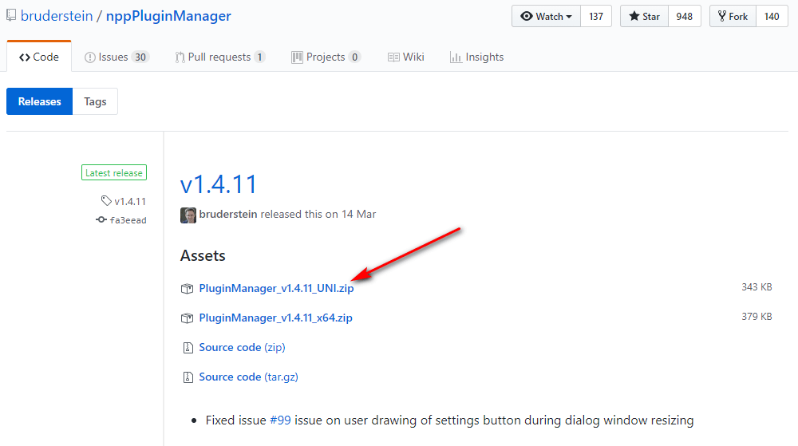

_Рисунок 1 — Инструмент Plugin Manager_

Рекомендую устанавливать x86 версию Notepad++, если хотите пользоваться плагинами, так как многие плагины не перестроены на x64 версию. Соответственно нужно выбирать версию `UNI` у nppPluginManager.

Из архива достаньте обе папки `plugins` и `updater`, скопируйте их в папку Notepad++ (у меня это `C:\Program Files (x86)\Notepad+`).

Перезапустите Notepad++ и менеджер плагинов у вас появится:

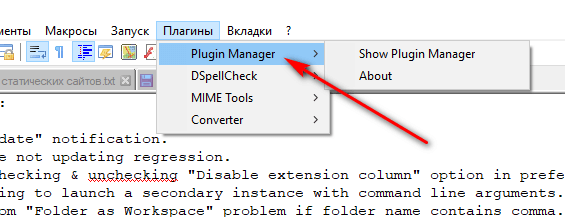

_Рисунок 2 — Меню Plugin Manager_

## Установка TextFX

Идем `Плагины` → `Plugin Manager` → `Show Plugin Manager`. Ищем там плагин `TextFX Characters` и его устанавливаем:


_Рисунок 3 — Меню TextFX_

Обязательно выделяйте текст, перед тем как производить действия этим плагином, если иное не оговорено.

## TextFX Characters

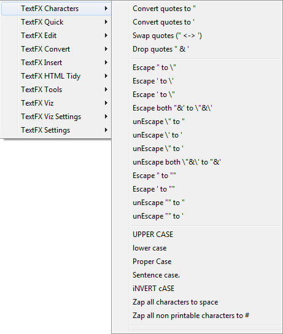

_Рисунок 4 — Подменю TextFX Characters_

### `Convert quotes to "`

Заменяет кавычки в тексте на двойные. Типографские кавычки не трогает.

Первоначальный текст:

```text
«Пример текста» int "include" double " float 'const'
```

Измененный текст:

```text
«Пример текста» int "include" double " float "const"
```

### `Convert quotes to '`

Заменяет кавычки в тексте на одинарные. Типографские кавычки не трогает.

Первоначальный текст:

```text
«Пример текста» int "include" double " float 'const'
```

Измененный текст:

```text
«Пример текста» int 'include' double ' float 'const'
```

### `Swap quotes (" <-> ')`

Заменяет двойные кавычки в тексте на одинарные, а двойные на одинарные. Типографские кавычки не трогает.

Первоначальный текст:

```text
«Пример текста» int "include" double " float 'const'
```

Измененный текст:

```text
«Пример текста» int 'include' double ' float "const"
```

### `Drop quotes " & '`

Удаляет двойные и одинарные кавычки. Типографские кавычки не трогает.

Первоначальный текст:

```text
«Пример текста» int "include" double " float 'const'
```

Измененный текст:

```text
«Пример текста» int include double float const
```

### `Escape " to \"`

Экранирует двойные кавычки. Пункт полезный.

Первоначальный текст:

```text
«Пример текста» int "include" double " float 'const'
```

Измененный текст:

```text
«Пример текста» int \"include\" double \" float 'const'
```

### `Escape ' to \'`

Экранирует одинарные кавычки. Пункт полезный.

Первоначальный текст:

```text
«Пример текста» int "include" double " float 'const'
```

Измененный текст:

```text
«Пример текста» int "include" double " float \'const\'
```

### `Escape ' to \"`

Экранирует одинарные кавычки в двойные.

Первоначальный текст:

```text
«Пример текста» int "include" double " float 'const'
```

Измененный текст:

```text
«Пример текста» int "include" double " float \"const\"
```

### `Escape both "&' to \"&\'`

Экранирует одинарные и двойные кавычки.

Первоначальный текст:

```text
«Пример текста» int "include" double " float 'const'
```

Измененный текст:

```text
«Пример текста» int \"include\" double \" float \'const\'
```

### `unEscape \" to "`

Разэкранирует двойные кавычки. Пункт полезный.

Первоначальный текст:

```text
«Пример текста» int \"include\" double \" float 'const'
```

Измененный текст:

```text
«Пример текста» int "include" double " float 'const'
```

### `unEscape \' to '`

Разэкранирует одинарные кавычки.

Первоначальный текст:

```text
«Пример текста» int "include" double " float \'const\'
```

Измененный текст:

```text
«Пример текста» int "include" double " float 'const'
```

### `unEscape \" to '`

Разэкранирует двойные кавычки в одинарные.

Первоначальный текст:

```text
«Пример текста» int \"include\" double \" float 'const'
```

Измененный текст:

```text
«Пример текста» int 'include' double ' float 'const'
```

### `unEscape both \"&\' to "&`

Разэкранирует двойные и одинарные кавычки.

Первоначальный текст:

```text
«Пример текста» int \"include\" double \" float \'const\'
```

Измененный текст:

```text
«Пример текста» int "include" double " float 'const'
```

### `Escape " to ""`

Двойные кавычки превращает в двойные двойные кавычки.&

Первоначальный текст:

```text
«Пример текста» int "include" double " float 'const'
```

Измененный текст:

```text
«Пример текста» int ""include"" double "" float 'const'
```

### `Escape ' to ""`

Одинарные кавычки превращает в двойные двойные кавычки.

Первоначальный текст:

```text
«Пример текста» int "include" double " float 'const'
```

Измененный текст:

```text
«Пример текста» int "include" double " float ""const""
```

### `unEscape "" to "`

Двойные двойные кавычки превращает в обычные двойные.

Первоначальный текст:

```text
«Пример текста» int "include" double " float ""const""
```

Измененный текст:

```text
«Пример текста» int "include" double " float "const"
```

### `unEscape "" to '`

Двойные двойные кавычки превращает в обычные одинарные.

Первоначальный текст:

```text
«Пример текста» int "include" double " float ""const""
```

Измененный текст:

```text
«Пример текста» int "include" double " float 'const'
```

### `UPPER CASE`

Переводит всё в верхний регистр.

Первоначальный текст:

```text
Пример текст. текст второй
```

Измененный текст:

```text
ПРИМЕР ТЕКСТ. ТЕКСТ ВТОРОЙ
```

### `lower case`

Переводит всё в нижний регистр.

Первоначальный текст:

```text
Пример текст. текст второй
```

Измененный текст:

```text
пример текст. текст второй
```

### `Proper Case`

Делает каждое слово с большой буквы.

Первоначальный текст:

```text
Пример текст. текст второй
```

Измененный текст:

```text
Пример Текст. Текст Второй
```

### `Sentence case`

Каждое предложение должно начинаться с большой буквы, что данная функция и делает. Пункт полезный.

Первоначальный текст:

```text
Пример текст. текст второй
```

Измененный текст:

```text
Пример текст. Текст второй
```

### `iNVERT cASE`

Инвертирует регистр букв.

Первоначальный текст:

```text
Пример текст. текст второй
```

Измененный текст:

```text
пРИМЕР ТЕКСТ. ТЕКСТ ВТОРОЙ
```

### `Zap all characters to space`

Заменяет все выделенные символы на пробелы

Первоначальный текст:

```text
Пример текст. текст второй
```

Измененный текст (48 пробелов):


_Рисунок 5 — Здесь 48 пробелов_

### `Zap all non printable characters to #`

Инвертирует символы непечатаемые на знак #. Практика показала, что такими символами являются почему то русские буквы. В общем странная и непонятная функция.

Первоначальный текст:

```text
Пример текст. This is Sparta *-()+= k hh/?-
```

Измененный текст:

```text
############ ##########. This is Sparta *-()+= k hh/?-
```

## TextFX Quick

Это поисковые функции:

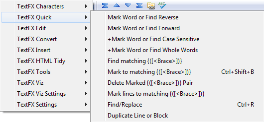

_Рисунок 6 — Раздел TextFX Quick_

### `Mark Word or Find Reverse`

Если щелкнуть просто без выделения, то функция выделит текущее слово. Если выделить какой-то текст, то, если есть такой же текст до данного, то выделится этот такой же текст до данного. Если такого текста нет, то ничего не произойдет. То есть эта функция быстрого поиска предыдущего такого же текста.

Допустим, что в тексте выделим слово `пример`:

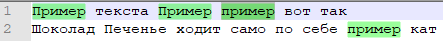

_Рисунок 7 — Выделение текста_

В результате выделится предыдущее слово `Пример`:

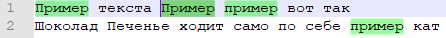

_Рисунок 8 — Результат выполнения команды «Mark Word or Find Revers»_

### `Mark Word or Find Forward`

Если щелкнуть просто без выделения, то функция выделит текущее слово. Если выделить какой-то текст, то, если есть такой же текст после данного, то выделится этот такой же текст после данного. Если такого текста нет, то ничего не произойдет. То есть эта функция быстрого поиска последующего такого же текста.

Допустим, что в тексте выделим часть слова `приме`:

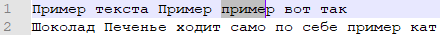

_Рисунок 9 — Выделение текста_

В результате выделится следующее слово (точнее часть слова) `приме`:

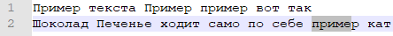

_Рисунок 10 — Результат выполнения команды «Mark Word or Find Forward»_

### `+Mark Word or Find Case Sensitive`

При включенной данной функции поиск в предыдущих двух функциях будет зависеть от регистра.

Допустим, что в тексте выделим часть слова `Приме`:

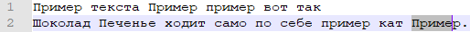

_Рисунок 11 — Выделение текста_

В результате выделится предыдущее слово `Приме` при вызове `Mark Word or Find Reverse`:

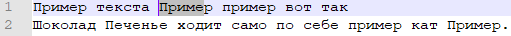

_Рисунок 12 — Результат выполнения команды «+Mark Word or Find Case Sensitive»_

### `+Mark Word or Find Whole Words`

При включенной данной функции поиск в предыдущих двух функциях будет вестись по полному соответствию слову. То есть нужно выделить всё слово, чтобы поиск заработал.

Допустим, что в тексте выделим слово `Пример`:

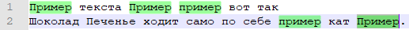

_Рисунок 13 — Выделение текста_

В результате выделится предыдущее слово `пример`:

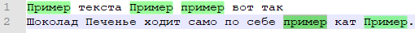

_Рисунок 14 — Результат выполнения команды «+Mark Word or Find Whole Words»_

### `Find matching {([])}`

Поставьте курсор к какой-нибудь скобке (или выделите её) из набора: `{([])}`. Функция найдет соответствующую скобку и перейдет к ней. Аналог действия клавиш `Ctrl` + `B`.

Допустим, что в тексте выделим первую фигурную скобку и вызовем команду:

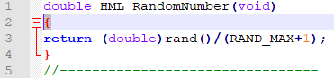

_Рисунок 15 — Выделение правой фигурной скобки_

В результате выделится вторая скобка:

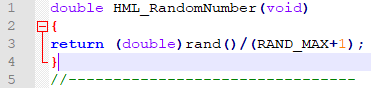

_Рисунок 16 — Результат выполнения команды «Find matching»_

### `Mark to matching {([])}`

Поставьте курсор к какой-нибудь скобке (или выделите её) из набора: `{([])}`. Функция выделит текст между скобками.

Допустим, что в тексте выделим первую фигурную скобку (или вторую) и вызовем команду:

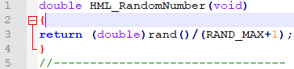

_Рисунок 17 — Выделение правой фигурной скобки_

В результате выделится весь текст внутри них, включая скобки:

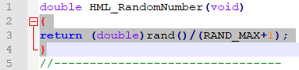

_Рисунок 18 — Результат выполнения команды «Mark to matching»_

### `Delete Marked {([])} Pair`

Поставьте курсор к какой-нибудь скобке (или выделите её) из набора: `{([])}`. Функция удалит пару соответствующих скобок.

Допустим, что в тексте выделим первую фигурную скобку (или вторую) и вызовем команду:

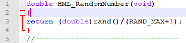

_Рисунок 19 — Выделение правой фигурной скобки_

В результате обе скобки удалятся:

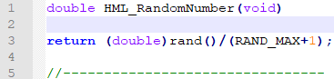

_Рисунок 20 — Результат выполнения команды «Delete Marked …»} Pair_

### `Mark lines to matching {([])}`

Поставьте курсор к какой-нибудь скобке (или выделите её) из набора: `{([])}`. Функция выделит строки в которых заключается текст, что между скобками, включая их. ~~Функция `Mark to matching {([])}` выделяет текст между скобками, а эта функция именно строки.~~ **Update 2018.** Нет, выделит также скобки.

Допустим, что в тексте выделим первую фигурную скобку (или вторую) и вызовем команду:

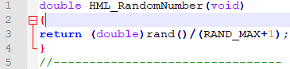

_Рисунок 21 — Выделение правой фигурной скобки_

В результате выделится весь текст внутри них (и скобки тоже):

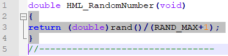

_Рисунок 22 — Результат выполнения команды «Mark lines to matching»_

### `Find/Replace`

Это функция поиска и замены. Честно, лучше использовать встроенные функции, чем этот инструмент:

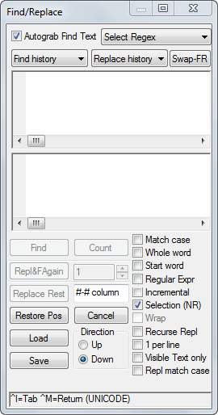

_Рисунок 23 — Раздел Find/Replace_

Выделите слово, которое вы хотите искать и вызовите функцию поиска. Вводить русский текст не получится в поле поиска, так как вместо русского текста возникают крякозябры. С остальным вы сможете разобраться. Хотя не вижу причин использовать этот глючный вариант.

### `Duplicate Line or Block`

Поставьте курсор в нужной строке или выделите нужный текст. Если вы поставили просто курсор, то продублируется строка и вставится после текущей. Если выделите текст, то продублируется данный текст.

Допустим, что щелкнем в тексте на третей строке и вызовем функцию:

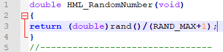

_Рисунок 24 — Каретка находится на одной из строк_

В результате строка продублируется:

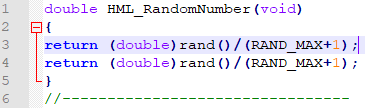

_Рисунок 25 — Результат выполнения команды «Duplicate Line or Block»_

## TextFX Edit

### `Fill Down Insert`

Данная функция вставляет содержимое выделения первой строки при вертикальном выделении и вставляет в каждую строку, сдвигая элементы.

С помощью клавиши `Alt` выделите вертикально текст:

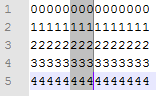

_Рисунок 26 — Выделение текста с помощью Alt_

При вызове функции получим:

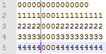

_Рисунок 27 — Результат выполнения команды «Fill Down Insert»_

### `Fill Down Overwrite`

Данная функция вставляет содержимое выделения первой строки при вертикальном выделении и вставляет в каждую строку, замещая элементы.

С помощью клавиши `Alt` выделите вертикально текст:


_Рисунок 28 — Выделение текста с помощью Alt_

При вызове функции получим:


_Рисунок 29 — Результат выполнения команды «Fill Down Overwrite»_

### `Insert (Clipboard) through lines`

Данная функция вставляет содержимое выделения буфера обмена при выделении нескольких строк в месте в каждой строки, равное началу выделения в первой строки.

Выделите текст, а в буфере обмена пусть находится строчка `double max`:

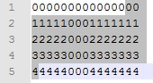

_Рисунок 30 — Выделенный текст_

При вызове функции получим:

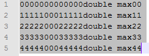

_Рисунок 31 — Результат выполнения команды «Insert (Clipboard) through lines»_

### `Reindent C++ code`

Функция форматирует отступы в коде C++. То есть расставляет знаки табуляции в блоках, находящихся в фигурных скобках. Возможно и иные места обрабатывает.

Выделите текст, содержащий код C++:

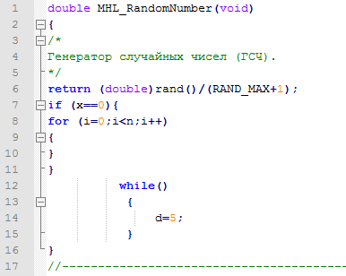

_Рисунок 32 — Пример кода C++_

При вызове функции получим:

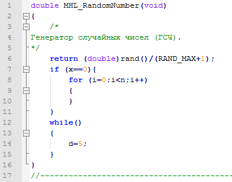

_Рисунок 33 — Результат выполнения команды «Reindent C++ code»_

### `Leading space to tabs or tabs to spaces`

Насколько я понял, функция превращает пробелы в табуляцию нужных размеров. Превратить табуляцию в пробелы не получилось. Пример текста:

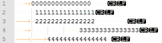

_Рисунок 34 — Текст с табуляцией и пробелами_

При вызове функции получим:

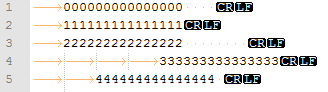

_Рисунок 35 — Результат выполнения команды «»Leading space to tabs or tabs to spaces»_

### `Leading space to tabs or tabs to spaces width=8`

Чем отличается эта функция от предыдущей, я на практике не смог понять. Вроде делает всё то же самое.

### `Trim Trailing Spaces`

Удаляет в конце строки пробелы. Пример текста:

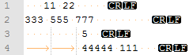

_Рисунок 36 — Текст с пробелами в тексте_

При вызове функции получим:

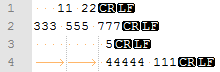

_Рисунок 37 — Результат выполнения команды «Trim Trailing Spaces»_

### `Indent text sticky left margin`

Добавляет слева табуляцию ко всем выделенным строкам. Но как показала практика, некоторые строки остаются без изменения. Причины не понял. Пример текста:

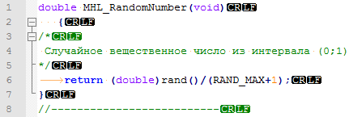

_Рисунок 38 — Текст для примера_

При вызове функции получим:

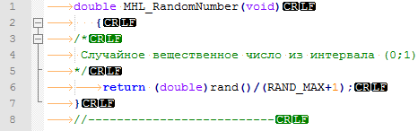

_Рисунок 39 — Результат выполнения команды Indent text sticky left margin_

### `Indent & surround { text lines }`

Обрамляет текст в фигурные скобки, а текст сдвигает табуляцией.

Попробуем выделить текст вот так (только две строки):

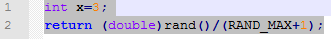

_Рисунок 40 — Выделение двух строчек_

При вызове функции получим:

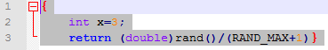

_Рисунок 41 — Результат выполнения команды «Indent & surround { text lines }»_

Попробуем выделить текст вот так (с третьей пустой строкой):


_Рисунок 42 — Выделение с третьей пустой строкой_

При вызове функции получим:

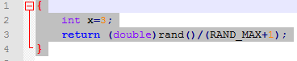

_Рисунок 43 — Результат выполнения команды «Indent & surround { text lines }»_

### `Delete Blank Lines`

Удаляет пустые строки. Если в строке есть табуляция или пробелы, то пустой строкой не является.

Выделим текст:

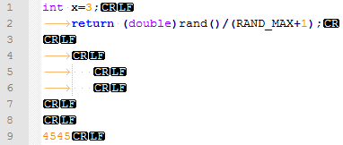

_Рисунок 44 — Текст для примера_

При вызове функции получим:

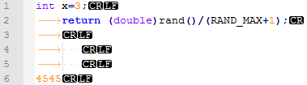

_Рисунок 45 — Результат выполнения команды «Delete Blank Lines»_

### `Delete Surplus Blank Lines`

Функция должна удалять повторяющиеся пустые строки. Но если есть пустые строки с табуляциями, то может удалить знак абзаца. Так что будьте осторожнее. Лучше воспользоваться функцией заменой Notepad++.

Выделим текст:

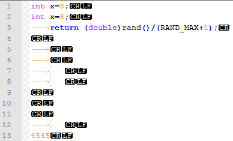

_Рисунок 46 — Текст для примера_

При вызове функции получим:

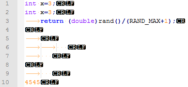

_Рисунок 47 — Результат выполнения команды «Delete Surplus Blank Lines»_

### `Strip unquoted text (C) separate by (Clipboard<=20)`

У вас есть некий код на языке C++. В нем встречаются строки обрамленные в двойные кавычки. Нужно их достать из данного кода. В качестве разделителя строк будет использоваться то, что в буфере обмена, если в буфере обмена меньше или равно 20 символов. Иначе будет использоваться запятая.

Выделим текст, а в буфер обмена занесем знак `+`:

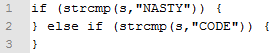

_Рисунок 48 — Текст для примера_

При вызове функции получим:


_Рисунок 49 — Результат выполнения команды «Strip unquoted text (C) separate by (Clipboard<=20)»_

### `Strip unquoted text (VB) separate by (Clipboard<=20)`

По сути должна быть такой же функцией, что и предыдущая, но со спецификой построения строк в Visual Basic. Что там за особенности я не знаю. И надеюсь, что никогда не узнаю)

### `Kill unquoted (C) whitespace`

Удаляет лишние пробелы, оставляя только по одному. Пробелы вначале строки не трогает.

Выделим текст:

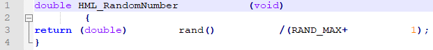

_Рисунок 50 — Текст для примера_

При вызове функции получим:

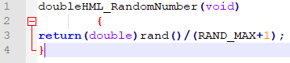

_Рисунок 51 — Результат выполнения команды «Kill unquoted (C) whitespace»_

### `Kill unquoted (VB) whitespace`

По сути должна быть такой же функцией, что и предыдущая, но со спецификой построения строк в Visual Basic. Что там за особенности я не знаю.

### `Split lines at (clipboard character) or, (C)`

Разделяет строку (или строки) на множество строк. В качестве символа, который служит распознаванием конца места разрыва строки, используется символ в буфере обмена или запятая.

Выделим текст, а в буфер обмена или ничего не запишем, или запятую:


_Рисунок 52 — Пример текста_

При вызове функции получим:

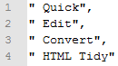

_Рисунок 53 — Результат выполнения команды «Split lines at (clipboard character) or, (C)»_

### `Split lines at (clipboard character) or, (VB)`

По сути должна быть такой же функцией, что и предыдущая, но со спецификой построения строк в Visual Basic. Что там за особенности я не знаю.

### `Line up multiple lines by (,)`

При выделении нескольких строк, в которых есть знаки `,`, функция подстраивает строки так, чтобы знаки `,` были на одном уровне. Делает это с помощью пробелов. Недостаток. Если перед `,` вам нужен пробел, то его у вас не будет.

Выделим текст:

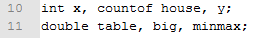

_Рисунок 54 — Текст для примера_

При вызове функции получим:

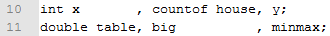

_Рисунок 55 — Результат выполнения команды «Line up multiple lines by (,)»_

### `Line up multiple lines by (=)`

Аналогично предыдущей функции. Только в качестве разделителя используется знак `=`.

Выделим текст:

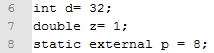

_Рисунок 56 — Текст для примера_

При вызове функции получим:

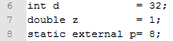

_Рисунок 57 — Результат выполнения команды «Line up multiple lines by (=)»_

### `Line up multiple lines by (Clipboard character)`

Аналогично предыдущей функции. Только в качестве разделителя используется знак знак из буфера обмена.

### `Unwrap Text`

Удаляет знак перевода строки. То есть объединяет строки в одну. В качестве разделителя используется пробел. Пустые строки не объединяются.

Выделим текст:

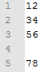

_Рисунок 58 — Пример текста_

При вызове функции получим:

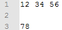

_Рисунок 59 — Результат выполнения команды «Unwrap Text»_

### `ReWrap Text (Clipboard or 72) width`

По сути функция должна переразбивать текст на строки согласно длине в буфере обмена или по 72 символа. Но управлять я этой функцией так и не смог. Разбивает по своему усмотрению и всегда одинаково.

Выделим текст:

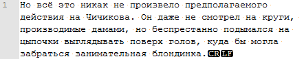

_Рисунок 60 — Пример текста_

При вызове функции получим:

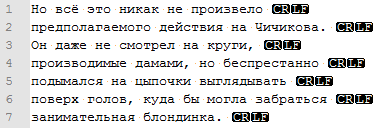

_Рисунок 61 — Результат выполнения команды «ReWrap Text (Clipboard or 72) width»_

Пользователь **DmFedorov** так прокомментировал этот пункт:

> ReWrap Text to (Clipboard or 72) width — тут не 72 символа.
>
> Я как раз перевожу этот плагин с жестких строк и у меня задача очень кратко (не шире чем исходный текст) сформулировать.
>
> Получилось так: НЕ пустые строки преобразовать в ширину 72 пословно. Т. е. ширина 72 — это максимум.
>
> А вот причем здесь буфер — для меня загадка тоже.

### `Pad rectangular selection with spaces`

Пользователь **DmFedorov** так прокомментировал этот пункт:

> Смысл тут простой: Подбить прямоугольник выделения до максимальной длины (в выделении).
>
> Причем длина — это вовсе не число символов. Это то что ты видишь в строке состояния Npp как length или в окне Summary.
>
> Т. е. это типа длина виртуальная символов но не совсем так. Короче это толком нигде не объяснено. Но если хочешь проверить после того как будет подбито для каждого подбитого куска Summary покажет тебе одинаковую длину (если ты этот кусок выделишь). Хотя на глаз длина этого куска после заполнения пробелами будет наоборот не одинаковая.

## TextFX Convert

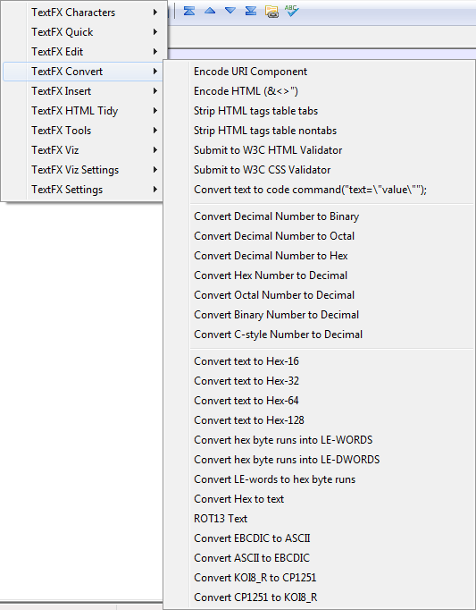

_Рисунок 62 — Раздел TextFX Convert_

### `Encode URI Component`

Функция переводит строку в формат URI. Но где и как это использовать? Тот же адрес сайта становится непонятным для браузеров, так как переделывает все нелатинские символы, в том числе и слэши.

Выделим текст:


_Рисунок 63 — Пример текста_

При вызове функции получим:

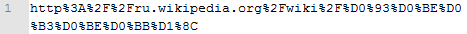

_Рисунок 64 — Результат выполнения команды «Encode URI Component»_

### `Encode HTML (&<>")`

Функция переводит символы `&<>"` в их HTML аналоги. Хорошая функция, когда вам нужно в HTML тексте написать код HTML так, чтобы он отображался как текст, а не преобразовывался как код. Сложно как-то описал.

Выделим текст:

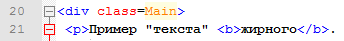

_Рисунок 65 — Пример текста_

При вызове функции получим:

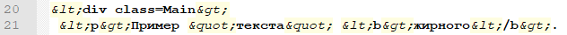

_Рисунок 66 — Результат выполнения команды «Encode HTML …»_

### `Strip HTML tags table tabs`

Очень полезная функция. Удаляет из HTML кода все тэги, оставляю только текст. При этом таблицы делает таблицами с разделителем в виде табуляции.

Выделим текст:

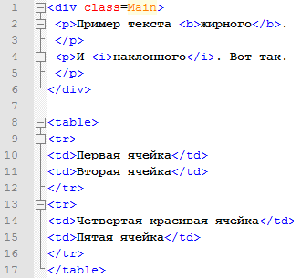

_Рисунок 67 — Пример текста_

При вызове функции получим:

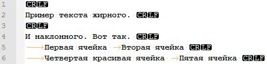

_Рисунок 68 — Результат выполнения команды «Strip HTML tags table tabs»_

### `Strip HTML tags table nontabs`

Аналогично предыдущей функции, только при этом таблицы делает таблицами с разделителем в виде пробелов.

Выделим текст:


_Рисунок 69 — Пример текста_

При вызове функции получим:

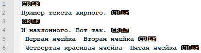

_Рисунок 70 — Результат выполнения команды «Strip HTML tags table nontabs»_

### `Submit to W3C HTML Validator`

Функция не работает. Должна отправлять файл или выделенный фрагмент на сайт W3C и проверять HTML код на валидность.

### `Submit to W3C CSS Validator`

Функция не работает. Должна отправлять файл или выделенный фрагмент на сайт W3C и проверять CSS код на валидность.

### `Convert text to code command ("text=\"value\"");`

Превращает какой-нибудь текст в строку под тот или иной язык. Данная функция требует выбора синтаксиса языка в документе:

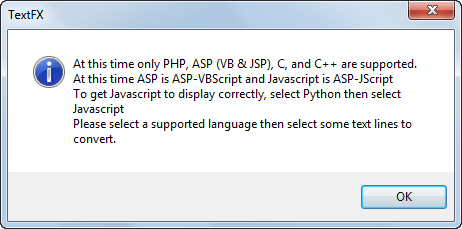

_Рисунок 71 — Предупреждение от плагина_

Выделим текст в документе C++:

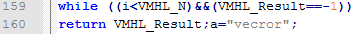

_Рисунок 72 — Пример кода_

При вызове функции получим:

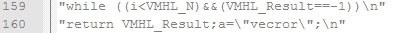

_Рисунок 73 — Результат выполнения команды «Convert text to code command»_

Выделим текст в документе PHP:

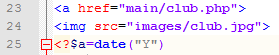

_Рисунок 74 — Пример кода_

При вызове функции получим:

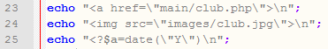

_Рисунок 75 — Результат выполнения команды «Convert text to code command»_

### `Convert Decimal Number to Binary`

Конвертирует десятичное число в двоичное.

Выделим текст:


_Рисунок 76 — Пример текста_

При вызове функции получим:


_Рисунок 77 — Результат выполнения команды «Convert Decimal Number to Binary»_

### `Convert Decimal Number to Octal`

Конвертирует десятичное число в восьмеричное.

Выделим текст:


_Рисунок 78 — Пример текста_

При вызове функции получим:

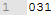

_Рисунок 79 — Результат выполнения команды «Convert Decimal Number to Octal»_

### `Convert Decimal Number to Hex`

Конвертирует десятичное число в шестнадцатеричное.

Выделим текст:


_Рисунок 80 — Пример текста_

При вызове функции получим:


_Рисунок 81 — Результат выполнения команды «Convert Decimal Number to Hex»_

### `Convert Hex Number to Decimal`

Конвертирует шестнадцатеричное число в десятичное.

Выделим текст:


_Рисунок 82 — Пример текста_

При вызове функции получим:


_Рисунок 83 — Результат выполнения команды «Convert Hex Number to Decimal»_

### `Convert Octal Number to Decimal`

Конвертирует восьмеричное число в десятичное.

Выделим текст:


_Рисунок 84 — Пример текста_

При вызове функции получим:


_Рисунок 85 — Результат выполнения команды «Convert Octal Number to Decimal»_

### `Convert Binary Number to Decimal`

Конвертирует двоичное число в десятичное.

Выделим текст:


_Рисунок 86 — Пример текста_

При вызове функции получим:


_Рисунок 87 — Результат выполнения команды «Convert Binary Number to Decimal»_

### `Convert C-style Number to Decimal`

Конвертирует число в форме C стиля в десятичное. Что за стиль C? Язык C++ или просто C? Вроде числа формата `-10f` переводит (удаляет идентификатор типа `float`), но с другими числами не справляется, например, с `1.5e-10`. В общем оно вам надо связываться с сомнительной функцией?

### `Convert text to Hex-16`

Переводит текст в Hex формат по 16 символов в строке. По идеи лучше пользоваться соответствующими редакторами. Но вдруг потребуется?

Выделим текст:

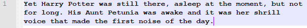

_Рисунок 88 — Пример текста_

При вызове функции получим:

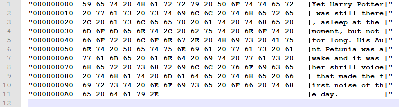

_Рисунок 89 — Результат выполнения команды «Convert text to Hex-16»_

### `Convert text to Hex-32`

Аналогично предыдущей функции переводит текст в Hex формат, но уже по 32 символов в строке.

### `Convert text to Hex-64`

Аналогично предыдущей функции переводит текст в Hex формат, но уже по 64 символов в строке.

### `Convert text to Hex-128`

Аналогично предыдущей функции переводит текст в Hex формат, но уже по 128 символов в строке.

### `Convert hex byte runs into LE-WORDS`

Переводит текст из Hex формата в Little Endian WORD (порядок байтов от младшего к старшему). Честно, не понимаю, что конкретно это и где это может использоваться.

Комментарий от <https://habr.com/users/Fedcomp/>:

> Это больше полезно для сетевого кода, там бывает используют разные порядки байт. Мне лично попадалось такое при исследовании сетевого кода двух разных игр.

Выделим текст:

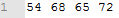

_Рисунок 90 — Пример текста_

При вызове функции получим:


_Рисунок 91 — Результат выполнения команды «Convert hex byte runs into LE-WORDS»_

### `Convert hex byte runs into LE-DWORDS`

Переводит текст из Hex формата в Little Endian DWORDS (порядок байтов от младшего к старшему). Честно, не понимаю, что конкретно это и где это может использоваться. Тем более не понимаю, чем отличается от предыдущей функции.

### `Convert LE-words to hex byte runs`

Еще одна мне непонятная функция. Переводит текст из Little Endian DWORDS формата в Hex. Честно, не понимаю, что конкретно это и где это может использоваться.

### `Convert Hex to text`

Переводит текст из Hex формата в обычный текст.

Выделим текст:


_Рисунок 92 — Пример текста_

При вызове функции получим:

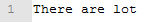

_Рисунок 93 — Результат выполнения команды Convert Hex to text»_

### `ROT13 Text`

Отличная функция! Кодирует и раскодирует латинский текст по «шифру» ROT13, который довольно популярен на форумах и так далее. Подробнее читать в статье <https://ru.wikipedia.org/wiki/ROT13>.

Выделим текст:


_Рисунок 94 — Пример текста_

При вызове функции получим:


_Рисунок 95 — Результат выполнения команды «ROT13 Text»_

### `Convert EBCDIC to ASCII`

Функция конвертирует EBCDIC текст в текст в кодировке ASCII. Заставить работать не получилось.

### `Convert ASCII to EBCDIC`

Функция конвертирует ASCII текст в текст EBCDIC. Заставить работать не получилось.

### `Convert KOI8_R to CP1251`

Не ожидал увидеть функцию в зарубежной библиотеке для русских пользователей. Конвертирует текст из кодировки KOI8_R в CP1251. Но опять таки я не смог применить эту функцию. Лучше пользоваться стандартными средствами Notepad++ для перекодирования текстов.

### `Convert CP1251 to KOI8_R`

Конвертирует текст из кодировки CP1251 в KOI8_R. Но опять таки я не смог применить эту функцию. Лучше пользоваться стандартными средствами Notepad++ для перекодирования текстов.

## TextFX Insert

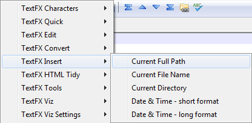

_Рисунок 96 — Раздел TextFX Insert_

### `Current Full Path`

Должна копировать полный путь к файлу и вставлять в документ. Но почему то копирует только первую букву из всего полного пути, то есть букву диска, на котором файле располагается. Например, `C`. В общем, используйте стандартную функцию в Notepad++ (правый клик по вкладке с файлом).

### `Current File Name`

Должна копировать имя файла и вставлять в документ. Но почему то копирует только первую букву из всего имени. Например, `n`. В общем, используйте стандартную функцию в Notepad++ (правый клик по вкладке с файлом).

### `Current Directory`

Должна копировать имя полного пути, в котором находится файл, и вставлять в документ. Но почему то копирует только первую букву из всего имени. Например, `C`. В общем, используйте стандартную функцию в Notepad++ (правый клик по вкладке с файлом).

### `Date & Time - short format`

Вставляет в текст дату в коротком формате:


_Рисунок 97 — Результат выполнения команды «Date & Time — short format»_

### `Date & Time - long format`

Вставляет в текст дату в полном формате:


_Рисунок 98 — Результат выполнения команды «`Date & Time — long format»_

Но документ должен быть в кодировке ASCII, а не в UTF-8, что есть плохо. В UTF-8 вставляет крякозябры:

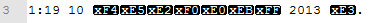

_Рисунок 99 — Результат выполнения команды в UTF-8 документе_

## TextFX HTML Tidy

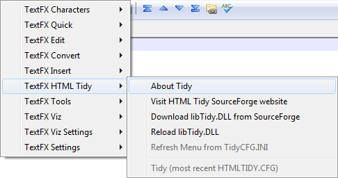

_Рисунок 100 — Раздел TextFX HTML Tidy_

В общем, я не смог завести эти функции все. Они требуют установки HTML Tidy. Его можно найти на сайте <http://www.paehl.com/open_source/?HTML_Tidy_for_Windows>. Но я не смог установить и воспроизвести нужные действия шаманского типа.

- About Tidy
- Visit HTML Tidy SourceForge website
- Download libTidy.DLL from SourceForge
- Reload libTidy.DLL
- Refresh Menu from TidyCFG.INI
- Tidy (most recent HTMLTIDY.CFG)

## TextFX Tools


_Рисунок 101 — Раздел TextFX Tools_

### `Sort lines case sensitive (at column)`

Это самая любимая моя функция. Благодаря ей и пользуюсь этим плагином. Сортировка строк с учетом регистра.

Выделим текст:

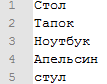

_Рисунок 102 — Пример текста_

При вызове функции получим:

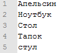

_Рисунок 103 — Результат выполнения команды «Sort lines case sensitive (at column)»_

### `Sort lines case insensitive (at column)`

Сортировка строк без учета регистра. Но к сожалению, только для английского языка. Для русского языка сортировка будет производиться, но с учетом регистра.

Выделим текст:

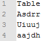

_Рисунок 104 — Пример текста_

При вызове функции получим:

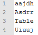

_Рисунок 105 — Результат выполнения команды «Sort lines case insensitive (at column)»_

### `+Sort ascending`

При включенной галочке сортировка в предыдущий двух функциях будет вестись по возрастанию. Без ее включения сортировка будет вестись по убыванию.

Выделим текст:


_Рисунок 106 — Пример текста_

При вызове функции Sort lines case sensitive (at column) при выключенной галочке получим:

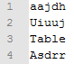

_Рисунок 107 — Результат выполнения команды «+Sort ascending»_

### `+Sort outputs only UNIQUE (at column) lines`

При включенной галочке при сортировке будут удалены копии строк. То есть останутся только уникальные строки.

Выделим текст:

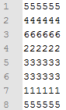

_Рисунок 108 — Пример текста_

При вызове функции Sort lines case sensitive (at column) при включенной галочке получим:

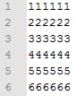

_Рисунок 109 — Результат выполнения команды «+Sort outputs only UNIQUE (at column) lines»_

### `Insert Ascii Chart or Character`

Для символа показывает его ASCII код и другие характеристики.

Выделим текст:


_Рисунок 110 — Пример текста_

При вызове функции получим:


_Рисунок 111 — Результат выполнения команды «Insert Ascii Chart or Character»_

Если же не выделять символы, то функция выдаст весь список кодов:

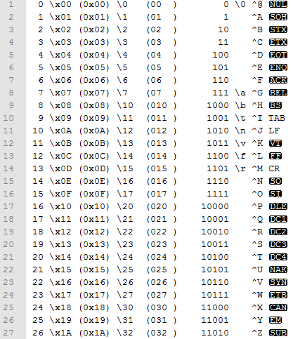

_Рисунок 112 — Результат выполнения команды «Insert Ascii Chart or Character» без выделения символов_

### `Insert Ruler`

Вставляет интересную и красивую линейку. Просто прикольная штука.

При вызове функции получим:

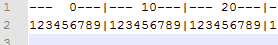

_Рисунок 113 — Результат выполнения команды «Insert Ruler»_

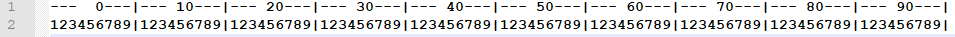

_Рисунок 114 — Результат выполнения команды «Insert Ruler»_

### `Insert Line Numbers`

Вставляет номера строк.

Выделим текст:

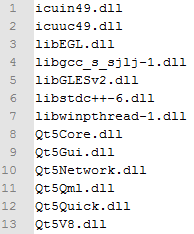

_Рисунок 115 — Пример текста_

При вызове функции получим:

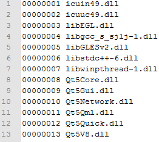

_Рисунок 116 — Результат выполнения команды «Insert Line Numbers»_

### `Delete Line Numbers or First Word`

Удаляет первое слово в выделенных строках. Ну очень полезная функция. Например, когда с сайта код копируется с номерами строк.

Выделим текст:

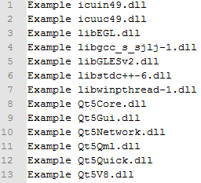

_Рисунок 117 — Пример текста_

При вызове функции получим:

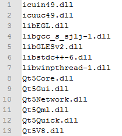

_Рисунок 118 — Результат выполнения команды «Delete Line Numbers or First Word»_

### `Clean eMail > Quoting`

Очищает текст email письма от знаков цитирования `>`.

Выделим текст:

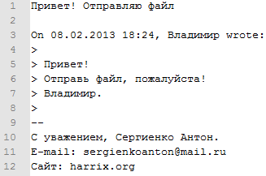

_Рисунок 119 — Пример текста_

При вызове функции получим:

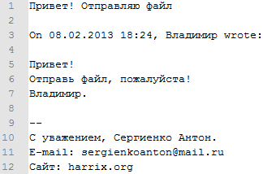

_Рисунок 120 — Результат выполнения команды «Clean eMail > Quoting»_

### `Uuencode`

Декодирует текст в виде [UUE](https://ru.wikipedia.org/wiki/UUE).

Выделим текст:

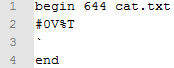

_Рисунок 121 — Пример текста_

При вызове функции получим:


_Рисунок 122 — Результат выполнения команды «Uuencode»_

### `Base64 Decode`

Декодирует текст в виде [Base64](https://ru.wikipedia.org/wiki/Base64).

Выделим текст:


_Рисунок 123 — Пример текста_

При вызове функции получим:


_Рисунок 124 — Результат выполнения команды «Base64 Decode»_

### `Word Count`

Показывает число слов в тексте и другие характеристики.

Выделим текст:

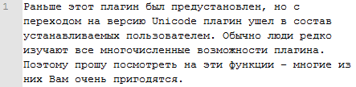

_Рисунок 125 — Пример текста_

При вызове функции получим:

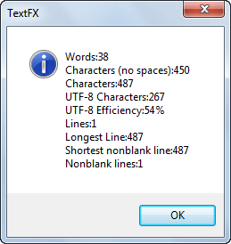

_Рисунок 126 — Результат выполнения команды «Word Count»_

### `Add up numbers`

Должна суммировать числа, но делает это часто неправильно.

Выделим текст:


_Рисунок 127 — Пример текста_

При вызове функции получим:

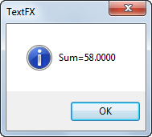

_Рисунок 128 — Результат выполнения команды «Add up numbers»_

### `Empty Undo Buffer (be sure to save)`

Очищает буфер изменений. То есть после применения этой функции вы не сможете отменить изменения в файле, что вы сделали во время редактирования. Полезна тем, кто хочет стереть какие-то свои провинности)

## TextFX Viz

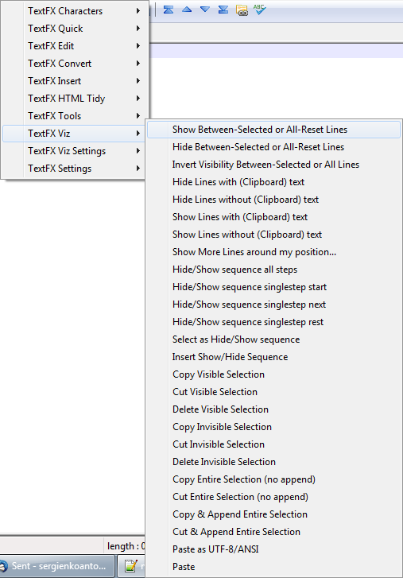

_Рисунок 129 — Раздел TextFX Viz_

Данные инструменты используются для работы со спрятанными строками (`Вид` → `Спрятать выбранные строки` или `Alt` + `H`). Например, у нас есть текст:

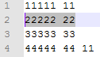

_Рисунок 130 — Пример текста_

Выделяем вторую строку и нажимаем `Alt` + `H`. Строка свернется:

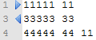

_Рисунок 131 — Свернутая строка_

Без наличия свернутых строк функции могут вызвать некорректные результаты.

И вообще, не рекомендую использовать функции данного раздела.

### `Show Between-Selected or All-Reset Lines`

Разворачивает в выделенном фрагменте все свернутые строки. Если ничего не выделено, то развернет все строки.

Пусть есть текст:


_Рисунок 132 — Пример текста_

Свернем в двух местах текст, а потом выделим текст с первым свернутым местом:

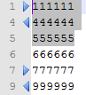

_Рисунок 133 — Текст со свернутыми строками_

При вызове функции первое свернутое место развернется:

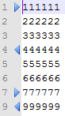

_Рисунок 134 — Результат выполнения команды «Show Between-Selected or All-Reset Lines»_

### `Hide Between-Selected or All-Reset Lines`

По аналогии с предыдущей функцией должен сворачивать выделенные строки. Но сворачивает не то, что выделяется, а то, что идет после.

Пусть есть текст:

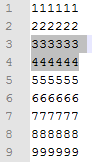

_Рисунок 135 — Пример текста_

При вызове функции строки неправильно скрываются. При этом не появляется отметок, что строки скрылись. Создается ощущение, что строки просто удалились. При переходе в другой файл и возвращении обратно все строки автоматически появляются. Оно вам надо? Как это выглядит:

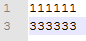

_Рисунок 136 — Результат выполнения команды «Hide Between-Selected or All-Reset Lines»_

### `Invert Visibility Between-Selected or All-Reset Lines`

Должна инвертировать свертывание строк. Те, что были скрыты, должны стать видимыми, а те, что были видимы, должны быть скрыты.

Пусть есть текст:

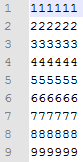

_Рисунок 137 — Пример текста_

Скроем текст:

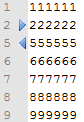

_Рисунок 138 — Текст со скрытыми строками_

Выделим текст:

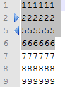

_Рисунок 139 — Выделение строки_

Применим функцию:

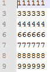

_Рисунок 140 — Результат выполнения команды «Invert Visibility Between-Selected or All-Reset Lines»_

И получаем фигню, которая при смене вкладок исчезает. Возможно так и должно быть, но без видимых отметок функция бесполезна.

### `Hide Lines with (Clipboard) text`

Функция сворачивает те строки, в которых есть текст, что есть в буфере обмена. Функция работает, но опять таки без опознавательных знаков, и, кажется, что строки удаляются. А при смене вкладок всё возвращается.

Пусть есть текст:

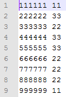

_Рисунок 141 — Пример текста_

Скопируем в буфер обмена текст `33`. Выделим текст весь текст и применим функцию:

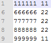

_Рисунок 142 — Результат выполнения команды «Hide Lines with (Clipboard) text»_

### `Hide Lines without (Clipboard) text`

Функция сворачивает те строки, в которых нет текста, что есть в буфере обмена. Функция работает, но опять таки без опознавательных знаков, и, кажется, что строки удаляются. А при смене вкладок всё возвращается. При этом первые строки текста, что должен скрываться остается.

Пусть есть текст:


_Рисунок 143 — Пример текста_

Скопируем в буфер обмена текст `33`. Выделим текст весь текст и применим функцию:


_Рисунок 144 — Результат выполнения команды «Hide Lines without (Clipboard) text»_

### `Show Lines with (Clipboard) text`

Функция показывает те строки в которых есть текст в буфере обмена.

Пусть есть текст:

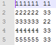

_Рисунок 145 — Пример текста_

Скопируем в буфер обмена текст `33`. Скроем строки:

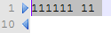

_Рисунок 146 — Текст со скрытыми строками_

Выделим текст весь текст и применим функцию:

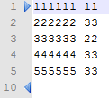

_Рисунок 147 — Результат выполнения команды «Show Lines with (Clipboard) text»_

### `Show Lines without (Clipboard) text`

Функция показывает те строки в которых нет текста из буфера обмена.

Пусть есть текст:


_Рисунок 148 — Пример текста_

Скопируем в буфер обмена текст `33`. Скроем строки:


_Рисунок 149 — Текст со скрытыми строками_

Выделим текст весь текст и применим функцию:

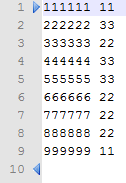

_Рисунок 150 — Результат выполнения команды «Show Lines without (Clipboard) text»_

### `Show More Lines around my position`

Функция постепенно раскрывает строки из свернутого варианта.

Пусть есть текст:

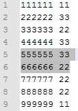

_Рисунок 151 — Пример текста_

Скроем строки:

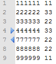

_Рисунок 152 — Текст со скрытыми строками_

Применим функцию и увидим текст:

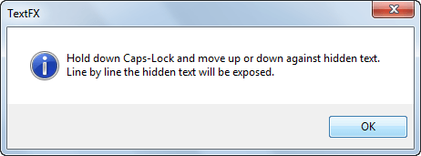

_Рисунок 153 — Результат выполнения команды «Show More Lines around my position»_

По данному тексту с зажатой клавишей `Caps Lock` щелкаем по скрытому тексту и поочередно строки начнут появляться. Вроде и без этой функции действие по клавише `Caps Lock` работает.

### `Hide/Show sequence all steps`

Не разобрался, что делает эта функция. Но так как она что-то скрывает, а скрытие строк функциями этого раздела каталогов ужасна: нет указателей, что строки свернуты, сворачивание не сохраняется при переходе к другим вкладкам, развернуть проблематично, то нет желания и разбираться.

### `Hide/Show sequence singlestep start`

Не разобрался, что делает эта функция. Но так как она что-то скрывает, а скрытие строк функциями этого раздела каталогов ужасна: нет указателей, что строки свернуты, сворачивание не сохраняется при переходе к другим вкладкам, развернуть проблематично, то нет желания и разбираться.

### `Hide/Show sequence singlestep next`

Не разобрался, что делает эта функция. Но так как она что-то скрывает, а скрытие строк функциями этого раздела каталогов ужасна: нет указателей, что строки свернуты, сворачивание не сохраняется при переходе к другим вкладкам, развернуть проблематично, то нет желания и разбираться.

### `Hide/Show sequence singlestep rest`

Не разобрался, что делает эта функция. Но так как она что-то скрывает, а скрытие строк функциями этого раздела каталогов ужасна: нет указателей, что строки свернуты, сворачивание не сохраняется при переходе к другим вкладкам, развернуть проблематично, то нет желания и разбираться.

### `Select at Hide/Show sequence`

Не разобрался, что делает эта функция. Но так как она что-то скрывает, а скрытие строк функциями этого раздела каталогов ужасна: нет указателей, что строки свернуты, сворачивание не сохраняется при переходе к другим вкладкам, развернуть проблематично, то нет желания и разбираться.

### `Insert Show/Hide Sequence`

Не разобрался, что делает эта функция. Но так как она что-то скрывает, а скрытие строк функциями этого раздела каталогов ужасна: нет указателей, что строки свернуты, сворачивание не сохраняется при переходе к другим вкладкам, развернуть проблематично, то нет желания и разбираться.

### `Copy Visible Selection`

Копирует только видимый текст. Но копирует без переносов строк. Ну, кому это надо?

Если у вас есть скрытый текст, и вы скопируете часть текста, что содержит этот текст:

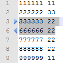

_Рисунок 154 — Текст со скрытыми строками_

И потом вставите скопированный текст, то увидите, что скопировался и скрытый текст:

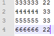

_Рисунок 155 — Результат вставки скопированного текста_

Если же скопируете через эту функцию плагина и вставите текст, то увидите, что скопировался только видимый текст, но без перевода строк:


_Рисунок 156 — Результат выполнения команды «Copy Visible Selection»_

### `Cut Visible Selection`

Вырезает только видимый текст. Но копирует без переносов строк. Ну, кому это надо?

Допустим, что у вас есть скрытый текст:


_Рисунок 157 — Текст со скрытыми строками_

После применения функции вы получите:

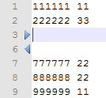

_Рисунок 158 — Результат выполнения команды «Cut Visible Selection»_

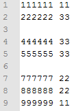

_Рисунок 159 — Результат выполнения команды «Cut Visible Selection», если развернуть строки_

Если вставите текст, то увидите, что скопировался только видимый текст, но без перевода строк:


_Рисунок 160 — Результат вставки текста_

### `Delete Visible Selection`

Удаляет только видимый текст. Вторая работающая функция в разделе.

Допустим, что у вас есть скрытый текст:


_Рисунок 161 — Текст со скрытыми строками_

В результате после применения функции вы получите:


_Рисунок 162 — Результат выполнения команды «Delete Visible Selection»_


_Рисунок 163 — Результат выполнения команды «Delete Visible Selection», если развернуть строки_

### `Copy Invisible Selection`

Копирует только невидимый текст. Но копирует без переносов строк. Ну, кому это надо?

Если у вас есть скрытый текст, и вы скопируете часть текста, что содержит этот текст:


_Рисунок 164 — Текст со скрытыми строками_

И потом вставите скопированный текст, то увидите, что скопировался и видимый текст:


_Рисунок 165 — Результат обычной вставки текста_

Если же скопируете через эту функцию плагина и вставите текст, то увидите, что скопировался только невидимый текст, но без перевода строк:


_Рисунок 166 — Результат выполнения команды «Copy Invisible Selection»_

### `Cut Invisible Selection`

Вырезает только невидимый текст. Но копирует без переносов строк. Ну, кому это надо?

Допустим, что у вас есть скрытый текст:


_Рисунок 167 — Текст со скрытыми строками_

В результате после применения функции вы получите:

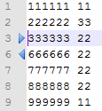

_Рисунок 168 — Результат выполнения команды «Cut Invisible Selection»_

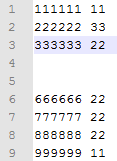

_Рисунок 169 — Результат выполнения команды «Cut Invisible Selection», если развернуть строки_

Если вставите текст, то увидите, что скопировался только невидимый текст, но без перевода строк:


_Рисунок 170 — Результат вставки текста_

### `Delete Invisible Selection`

Удаляет только невидимый текст. Третья работающая функция в разделе.

Допустим, что у вас есть скрытый текст:


_Рисунок 171 — Текст со скрытыми строками_

В результате после применения функции вы получите:


_Рисунок 172 — Результат выполнения команды «Delete Invisible Selection»_


_Рисунок 173 — Результат выполнения команды «Delete Invisible Selection», если развернуть строки_

### `Copy Entire Selection (no append)`

Копирует невидимый и видимый текст. Но копирует без переносов строк. Ну, кому это надо, если можно и так скопировать?

У вас есть текст:


_Рисунок 174 — Текст со скрытыми строками_

Скопируете через эту функцию плагина и вставите текст, то увидите, что скопировался видимый и невидимый текст, но без перевода строк:

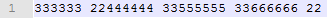

_Рисунок 175 — Результат выполнения команды «Copy Entire Selection (no append)»_

### `Cut Entire Selection (no append)`

Вырезает невидимый и видимый текст. Но копирует без переносов строк. Ну, кому это надо, если можно и так вырезать?

У вас есть текст:


_Рисунок 176 — Текст со скрытыми строками_

После функции получите:

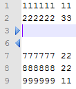

_Рисунок 177 — Результат выполнения команды «Cut Entire Selection (no append)»_

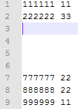

_Рисунок 178 — Результат выполнения команды «Cut Entire Selection (no append)», если развернуть строки_

Скопируете через эту функцию плагина и вставите текст, то увидите, что скопировался видимый и невидимый текст, но без перевода строк:


_Рисунок 179 — Результат вставки текста_

### `Copy & Append Entire Selection`

Копирует невидимый и видимый текст. При этом не замещает то, что есть в буфере обмена, а добавляет к нему. Но копирует без переносов строк. Ну, кому это надо, если можно и так скопировать?

У вас есть текст, а в буфере обмена текст `Example text`:


_Рисунок 180 — Текст со скрытыми строками_

Скопируете через эту функцию плагина и вставите текст, то увидите, что скопировался видимый и невидимый текст, но без перевода строк:

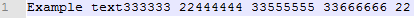

_Рисунок 181 — Результат выполнения команды «Copy & Append Entire Selection»_

### `Cut & Append Entire Selection`

Вырезает невидимый и видимый текст. При этом не замещает то, что есть в буфере обмена, а добавляет к нему. Но копирует без переносов строк. Ну, кому это надо, если можно и так скопировать?

У вас есть текст, а в буфере обмена текст `Example text`:


_Рисунок 182 — Текст со скрытыми строками_

После функции получите:


_Рисунок 183 — Результат выполнения команды «Cut & Append Entire Selection»_


_Рисунок 184 — Результат выполнения команды «Cut & Append Entire Selection», если развернуть строки_

Скопируете через эту функцию плагина и вставите текст, то увидите, что скопировался видимый и невидимый текст, но без перевода строк:


_Рисунок 185 — Результат вставки текста_

### `Paste as UTF-8/ANSI`

Вставляет текст. Наверно в формате UTF-8 или ANSI в зависимости от ситуации. Особо не разбирался. Главное, что переносы строк не вставляет.

### `Paste`

Вставляет текст. Чем отличается от предыдущей функции не знаю.

## TextFX Viz Settings

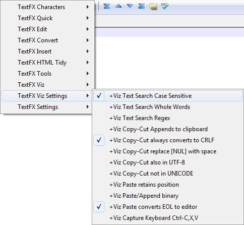

_Рисунок 186 — Раздел TextFX Viz Settings_

Здесь будут настройки для работы функций предыдущего раздела. Так как там только три работающих, но не мега важных функций, то особо сильно останавливаться не буду.

### `+Viz Text Search Case Sensitive`

Судя по всему это галочка позволяет делать поиск текста (в предыдущем разделе вроде две функции были на этом основаны) с учетом регистра.

### `+Viz Text Search Whole Words`

Судя по всему это галочка позволяет делать поиск текста (в предыдущем разделе вроде две функции были на этом основаны) с учетом поиска только целых слов.

### `+Viz Text Search Regex`

Судя по всему это галочка позволяет делать поиск текста (в предыдущем разделе вроде две функции были на этом основаны) с учетом регулярных выражений??? Но как??

### `+Viz Copy-Cut Appends to clipboard`

При включенной этой галочке все функции раздела TexFX Viz при копировании, вырезании элемента в буфер обмена будут копировать текст, не удаляя его, а добавляя его к тому, что уже было в буфере. Как в функции `Cut & Append Entire Selection`

### `+Viz Copy-Cut always converts to CRLF`

Не понял, что делает эта галочка. Типа должна происходит конвертация символа перевода строки. Надеялся, что после нее копирование будет с переводом строки, но облом.

### `+Viz Copy-Cut replace [NUL] with space`

При включенной настройке должна при использовании функций раздела TextFX Viz происходить замена символов [NUL] на пробелы. Не проверял.

### `+Viz Copy-Cut also in UTF-8`

При включенной настройке должно при использовании функций раздела TextFX Viz происходить копирование только в формате UTF-8. Не проверял.

### `+Viz Paste retains position`

Вообще не понял, что должна делать эта функция.

### `+Viz Paste/Append binary`

Вообще не понял, что должна делать эта функция.

### `+Viz Paste converts EOL to editor`

При включенной галочке должна конвертировать символ EOL. Не проверял.

### `+Viz Capture Keyboard Ctrl-C,X,V`

При включенной галочке должна перехватывать клавиши Ctrl-C,X,V и навязывать свои функции. Не проверял. Надеюсь, что никто не будет это делать.

## TextFX Settings

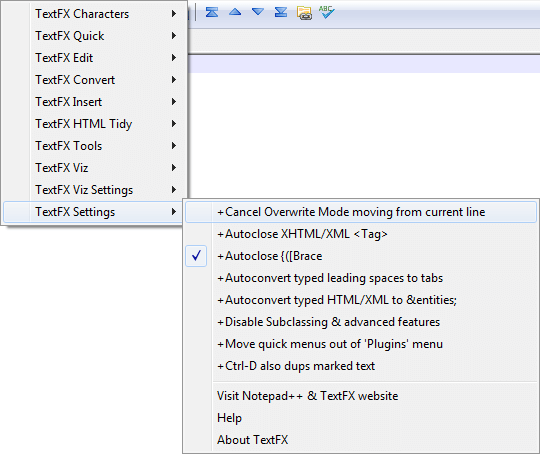

_Рисунок 187 — Раздел TextFX Settings_

Последний раздел. И несколько очень «вкусных» и полезных функций. Вам понравится.

### `+Cancel Overwrite Mode moving from current line`

У многих на клавиатурах есть `Insert`. При нажатии на нее включается режим Overwrite, то сеть когда пишешь в тексте, то символы замещают те, что уже были. Режим бесит, а кнопка расположена так, что частенько на нее нажимаешь. При включенной данной опции вам не нужно будет беспокоиться: так как режим Overwrite в Notepad++ не включится, даже если вы нажмете `Insert`. Рекомендую, хотя проверить не могу, так как такой клавиши на ноутбуке нет.

### `+Autoclose XHTML/XML <tag>`

Включает автозавершение тэгов. Очень удобная вещь. Например, вы пишите:

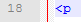

_Рисунок 188 — Пример текста_

После этого закрываете тэг символом `>`, и автоматически появляется закрывающий тэг:

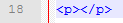

_Рисунок 189 — Результат выполнения команды «+Autoclose XHTML/XML tag»_

### `+Autoclose {([Brace<tag>`

Включает автозавершение скобок в соответствующих языках. Очень удобная вещь. Например, в C++ вы пишите открывающуюся скобку `{`, и автоматически появляется закрывающаяся скобка:

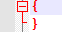

_Рисунок 190 — Результат выполнения команды «+Autoclose»_

### `+Autoconvert typed leading spaces to tabs`

Включает автоматическое превращение пробелов в знаки табуляции в начале строк, когда их число равно 4. Очень удобная вещь. Например, вы пишите:

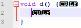

_Рисунок 191 — Пример текста_

После этого пишите еще один пробел, и он автоматически превращает четыре пробела в знак табуляции:

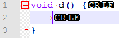

_Рисунок 192 — Результат выполнения команды «+Autoconvert typed leading spaces to tabs»_

### `+Autoconvert typed HTML/XML to &entities;`

В HTML тексте при нажатии клавиши `Enter` внутри тэгов происходит автоматическое добавление тега `&lt;br/&gt;`:


_Рисунок 193 — Пример кода с тэгами_

Нажимаете `Enter` и получаете:

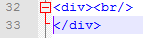

_Рисунок 194 — Результат выполнения команды «+Autoconvert typed HTML/XML…»_

И так далее:

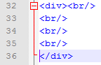

_Рисунок 195 — Результат многократного выполнения команды_

### `+Disable Subclassing & advanced features`

В оригинале написано, что:

> At this time the extended Tidy menu and Ctrl-B require subclassing to capture. A future version of Notepad++ may cause Subclassing to fail to operate correctly. The features are still available in a more limited form if Subclassing is turned off.

Как я понимаю, это нужно, когда вы используете плагин Tidy, который я подключить не смог. Так что функция бесполезна.

### `+Move quick menus out of 'Plugins' menu`

Выносит в главное меню два подменю этого плагина. При включении этой галочки возникнет надпись:

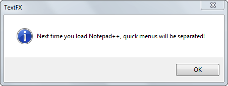

_Рисунок 196 — Окно при включении пункта «+Move quick menus out of Plugins menu»_

После перезапустите Notepad++ и в главном меню будут изменения:

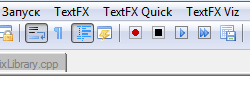

_Рисунок 197 — Результат выполнения команды «+Move quick menus out of Plugins menu»_

И вынеслось два подменю, где самые неинтересные и неработающие функции. Tidy только не хватает.

Пользователь **DmFedorov** так прокомментировал этот пункт:

> выносит подменю quick в отдельное главное меню Np++.

### `+Ctrl-D also dups marked text`

При включении этой галочки возникнет надпись:

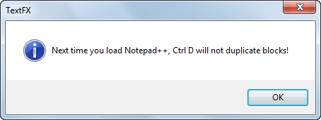

_Рисунок 198 — Окно при включении пункта «+Ctrl-D also dups marked text»_

~~После перезапуска Notepad++ не обнаружил никаких изменений.~~

**Update 2018.** По идеи должно включать/выключать дублирование строчек по `Ctrl` + `D`, но это сейчас по умолчанию работает в Notepad++, так что эффекта данный пункт никакого не оказывает.

### `Visit Notepad++ & TextFX website`

Происходит посещение сайта <https://notepad-plus-plus.org/>:

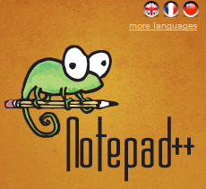

_Рисунок 199 — Результат выполнения команды «Visit Notepad++ & TextFX website»_

### `Help`

При нажатии появляется надпись:

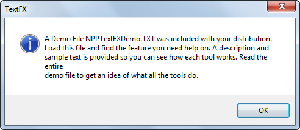

_Рисунок 200 — Результат выполнения команды «Help_

Данный файл `nppTextFXDemo.txt` на диске я так и не нашел. Но в интернете он есть. Если нужно, пользуйтесь: [nppTextFXDemo.txt](files/nppTextFXDemo.txt).

Может некоторые функции объяснены тут лучше, чем у меня. Но есть описание не всех функций, и я почти все функции проверил на работоспособность.

### `About TextFX`

При нажатии появляется надпись:

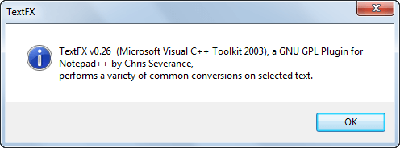

_Рисунок 201 — Результат выполнения команды «About TextFX»_

В общем, вот и всё! Надеюсь, что что-то новое для себя нашли.
