# Инструменты, использованные в блоге на Wordpress. Часть 1

Список использованных механизмов в блоге на Wordpress.

Статья написана была в то время, когда данный блог базировался на CMS Wordpress. Поэтому «живые» примеры заменены на скриншоты.

## Тема, использованная для дизайна

Под конец использования Wordpress использовал тему [Drone](https://demo.zigzagpress.com/?theme=drone).

До этого использовал тему [Flat](https://themeisle.com/themes/flat/).

До этого использовал тему [Basic Themify](https://themify.me/themes/basic).

## Шрифты

В качестве основного шрифта используется `Open Sans`, а для отображения кода `PT Mono`:

```css
@import url(
  https://fonts.googleapis.com/css?family=Open+Sans:400,
  300,
  300italic,
  400italic,
  600,
  600italic,
  700,
  700italic,
  800italic,
  800&subset=latin,
  cyrillic-ext,
  cyrillic,
  latin-ext
);
@import url(https://fonts.googleapis.com/css?family=PT+Mono&subset=latin, cyrillic, cyrillic-ext, latin-ext);
```

## Плагин для подсветки синтаксиса кода

[Crayon Syntax Highlighter](https://wordpress.org/plugins/crayon-syntax-highlighter/) — на мой взгляд на порядок лучше более популярного [SyntaxHighlighter Evolved](https://wordpress.org/plugins/syntaxhighlighter/). Crayon умеет подсвечивать несколько языков в одном фрагменте, может переносить строки, имеет удобную панель работы с кодом. И не копирует номера строк при выделении кода. Пример подсветки кода:

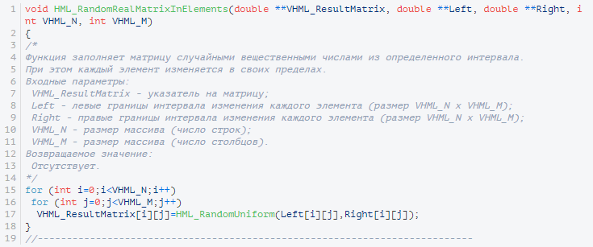

Для оформления использую свой стиль кода, который похож на тему Coy из библиотеки Prism.js.

Файл оформления можно скачать: [coy.zip](files/coy.zip).

Чтобы у вас в плагине появился стиль, файл из архива `coy.css` добавьте в папку `[ваш сайт]/wp-content/uploads/crayon-syntax-highlighter/themes/coy/`.

Плюс еще добавил часть настроек, например, чтобы поменять шрифт, так как в панели выбора `Crayon Syntax Highlighter` шрифта `PT Mono` нет:

```css
pre,
code {
  font-family: "PT Mono", monospace;
  font-size: 12px;
  margin: 0px;
}
pre {
  padding-top: 5px !important;
  padding-bottom: 15px !important;
}
code {
  border-width: 1px;
  border-color: #dedede;
  border-style: solid;
}
pre {
  background: none !important;
}
```

## Плагин для отображения LaTeX текста

[WP QuickLaTeX](https://wordpress.org/plugins/wp-quicklatex/) — умеет отображать корректно LaTeX код. При этом может даже графику отображать корректно. Так что очень удобная вещь.

Шпаргалка — <http://www.holoborodko.com/pavel/quicklatex/>.

Пример отображения формулы:

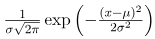

## Плагин для отображения числа просмотров страницы

[WP-PostViews](https://wordpress.org/plugins/wp-postviews/) — отображает число просмотров постов. Необходимо в нужном месте соответствующего PHP файла (у меня в функции `zp_custom_post_info`) вставить код, указанный в документации.

Не забывайте на странице настроек плагина перевести слово `views`.

## Плагин для показа иконок у прикрепленных файлов

[MimeTypes Link Icons](https://wordpress.org/plugins/mimetypes-link-icons) — показывает иконку файла (по его расширению) и его размер в ссылках, что я вставляю в статьях.

На странице параметров плагина отметьте галочками форматы файлов, которые вы хотите снабжать иконками.

К сожалению, иконки в плагине используются довольно старые и классические. Поэтому для тех форматов, которые я использую, я прописал в CSS файле темы измененные иконки под стиль сайта. Также использование SVG иконок позволяет качественно отображать для retina дисплеев.

Иконки можно скачать здесь: [icons.zip](files/icons.zip).

CSS код:

```css
.mtli_doc {
  background: url("doc-blue.svg");
  background-size: 16px 16px;
  background-position: left center;
}
.btn.mtli_doc {
  background: url("doc-white.svg");
  background-size: 16px 16px;
  background-color: #de2b26;
  border-color: #de2b26;
}
.btn.mtli_doc:hover,
.btn.mtli_doc:focus,
.btn.mtli_doc:active {
  background: url("doc-white.svg");
  background-size: 16px 16px;
  background-color: #f54d4c;
  border-color: #f54d4c;
}

.mtli_docx {
  background: url("docx-blue.svg");
  background-size: 16px 16px;
  background-position: left center;
}
.btn.mtli_docx {
  background: url("docx-white.svg");
  background-size: 16px 16px;
  background-color: #de2b26;
  border-color: #de2b26;
}
.btn.mtli_docx:hover,
.btn.mtli_docx:focus,
.btn.mtli_docx:active {
  background: url("docx-white.svg");
  background-size: 16px 16px;
  background-color: #f54d4c;
  border-color: #f54d4c;
}

.mtli_xls {
  background: url("xls-blue.svg");
  background-size: 16px 16px;
  background-position: left center;
}
.btn.mtli_xls {
  background: url("xls-white.svg");
  background-size: 16px 16px;
  background-color: #de2b26;
  border-color: #de2b26;
}
.btn.mtli_xls:hover,
.btn.mtli_xls:focus,
.btn.mtli_xls:active {
  background: url("xls-white.svg");
  background-size: 16px 16px;
  background-color: #f54d4c;
  border-color: #f54d4c;
}

.mtli_xlsx {
  background: url("xlsx-blue.svg");
  background-size: 16px 16px;
  background-position: left center;
}
.btn.mtli_xlsx {
  background: url("xlsx-white.svg");
  background-size: 16px 16px;
  background-color: #de2b26;
  border-color: #de2b26;
}
.btn.mtli_xlsx:hover,
.btn.mtli_xlsx:focus,
.btn.mtli_xlsx:active {
  background: url("xlsx-white.svg");
  background-size: 16px 16px;
  background-color: #f54d4c;
  border-color: #f54d4c;
}

.mtli_pdf {
  background: url("pdf-blue.svg");
  background-size: 16px 16px;
  background-position: left center;
}
.btn.mtli_pdf {
  background: url("pdf-white.svg");
  background-size: 16px 16px;
  background-color: #de2b26;
  border-color: #de2b26;
}
.btn.mtli_pdf:hover,
.btn.mtli_pdf:focus,
.btn.mtli_pdf:active {
  background: url("pdf-white.svg");
  background-size: 16px 16px;
  background-color: #f54d4c;
  border-color: #f54d4c;
}

.mtli_txt {
  background: url("txt-blue.svg");
  background-size: 16px 16px;
  background-position: left center;
}
.btn.mtli_txt {
  background: url("txt-white.svg");
  background-size: 16px 16px;
  background-color: #de2b26;
  border-color: #de2b26;
}
.btn.mtli_txt:hover,
.btn.mtli_txt:focus,
.btn.mtli_txt:active {
  background: url("txt-white.svg");
  background-size: 16px 16px;
  background-color: #f54d4c;
  border-color: #f54d4c;
}

.mtli_zip {
  background: url("zip-blue.svg");
  background-size: 16px 16px;
  background-position: left center;
}
.btn.mtli_zip {
  background: url("zip-white.svg");
  background-size: 16px 16px;
  background-color: #de2b26;
  border-color: #de2b26;
}
.btn.mtli_zip:hover,
.btn.mtli_zip:focus,
.btn.mtli_zip:active {
  background: url("zip-white.svg");
  background-size: 16px 16px;
  background-color: #f54d4c;
  border-color: #f54d4c;
}

.mtli_rar {
  background: url("rar-blue.svg");
  background-size: 16px 16px;
  background-position: left center;
}
.btn.mtli_rar {
  background: url("rar-white.svg");
  background-size: 16px 16px;
  background-color: #de2b26;
  border-color: #de2b26;
}
.btn.mtli_rar:hover,
.btn.mtli_rar:focus,
.btn.mtli_rar:active {
  background: url("rar-white.svg");
  background-size: 16px 16px;
  background-color: #f54d4c;
  border-color: #f54d4c;
}

.mtli_mp4 {
  background: url("mp4-blue.svg");
  background-size: 16px 16px;
  background-position: left center;
}
.btn.mtli_mp4 {
  background: url("mp4-white.svg");
  background-size: 16px 16px;
  background-color: #de2b26;
  border-color: #de2b26;
}
.btn.mtli_mp4:hover,
.btn.mtli_mp4:focus,
.btn.mtli_mp4:active {
  background: url("mp4-white.svg");
  background-size: 16px 16px;
  background-color: #f54d4c;
  border-color: #f54d4c;
}

.mtli_mpeg {
  background: url("mpeg-blue.svg");
  background-size: 16px 16px;
  background-position: left center;
}
.btn.mtli_mpeg {
  background: url("mpeg-white.svg");
  background-size: 16px 16px;
  background-color: #de2b26;
  border-color: #de2b26;
}
.btn.mtli_mpeg:hover,
.btn.mtli_mpeg:focus,
.btn.mtli_mpeg:active {
  background: url("mpeg-white.svg");
  background-size: 16px 16px;
  background-color: #f54d4c;
  border-color: #f54d4c;
}
```

Примеры иконок:

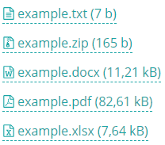

## Отображение клавиш клавиатуры в тексте

Использую следующий код:

```css
kbd {
  padding: 2px 4px;
  font-size: 90%;
  color: #fff;
  background-color: #de2b26;
  border-radius: 3px;
  box-shadow: none;
  font-family: "PT Mono", monospace;
}
```

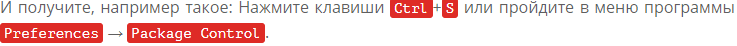

## Содержание статей

В соответствующем файле добавляем код (у меня `custom_functions.php`):

```php
/* --------------------- Содержание --------------------- */
add_filter('the_content', 'make_contents');
function make_contents($content){
  if (strpos($content, '[содержание') === false)
    return $content;

  $pattern = '\[содержание\s*([^\]]*)\]';

  preg_match("@{$pattern}(.*)@s", $content, $m);

  $hds = $m[1] ? trim($m[1]) : 'h2';
  $hds = explode(' ', $hds);
  $hds = array_map('trim', $hds);
  $h = implode('|', $hds);

  @preg_match_all('@<(?:'.$h.')[^>]*>(.*?)</('.$h.')>@is', $m[2], $match);
  if (!$match)
    return $content;

  // заменяем заголовки и строим содержание
  $g = 0;
  foreach ($match[0] as $ch){
    $t = &$match[2];
    $anchor = $t[$g].'_'.$g;
  $new_ch = preg_replace("@>(.+?)<@", " id='$anchor' class='h2'><a href='#a_menu' title='Вернуться к содержанию'> \\1</a><", $ch, 1);
    $content = str_replace($ch, $new_ch, $content);

    $out .= '<li><a href="#'. $anchor .'">'. strip_tags($match[1][$g]) ."</a></li>\n";

    if ($hds[1] && $t[$g]!=$t[$g+1] && isset($t[$g+1])){
      if (!$on){
        $on=true;
        $out .= "<ul>\n";
      } else {
        $on=false;
        $out .= "</ul>\n";
      }
    }
    $g++;
  }

  $out = '<'.$hds[0].' id="a_menu" class="h2">Содержание</'.$hds[0].'><ul>'. $out .'</ul>';
  $content = preg_replace("@{$pattern}@", $out, $content, 1);
  return $content;
}
```

После этого в статье напишите тег `[содержание]` и появится содержание вашей статьи, как на скриншоте ниже:

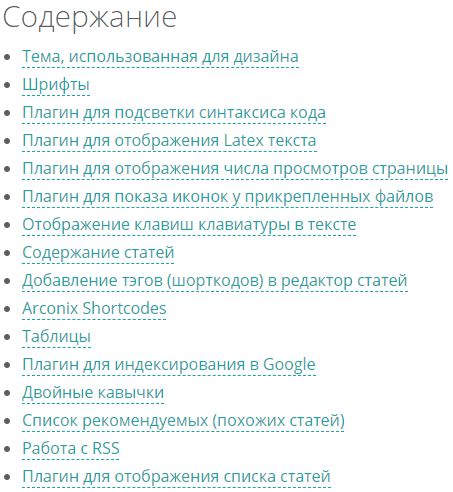

## Добавление тэгов (шорткодов) в редактор статей

[AddQuicktag](https://wordpress.org/plugins/addquicktag/) — плагин, чтобы добавлять некоторые постоянно использующиеся куски кода или шорткоды других плагинов, символы.

Вот пример моих кнопок:

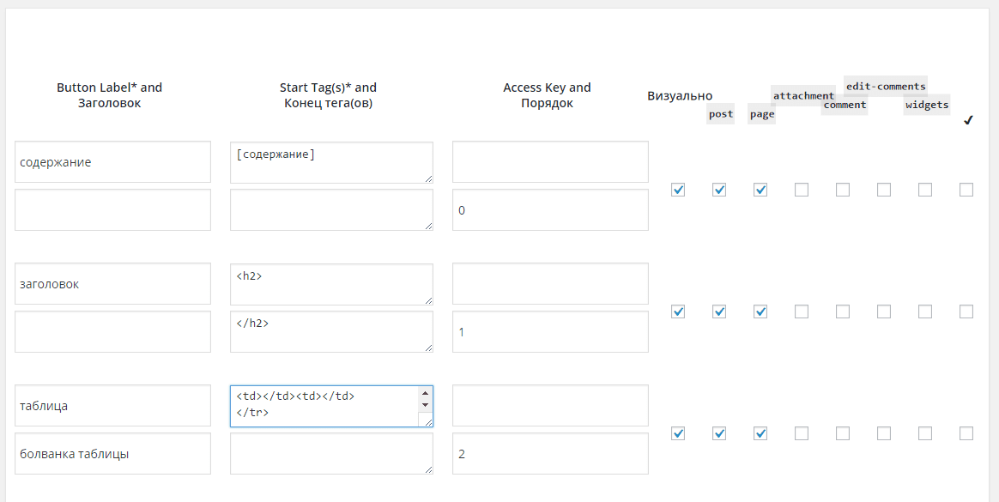

В итоге получаем такое:

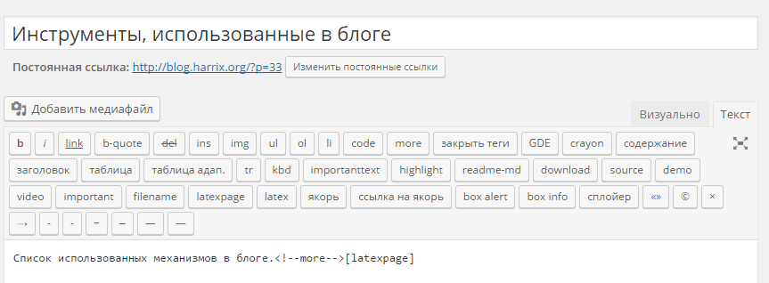

Файл с настройками кнопок в архиве: [add-quicktag.zip](files/add-quicktag.zip).

## Arconix Shortcodes

Использую интересный плагин [Arconix Shortcodes](https://wordpress.org/plugins/arconix-shortcodes/). Полный обзор я сделал тут: [Обзор плагина Arconix Shortcodes для WordPress](https://github.com/Harrix/harrix.dev-blog-2013/blob/main/2013-02-20-arconix-shortcodes/2013-02-20-arconix-shortcodes.md)

Позволяет делать текстовые блоки:

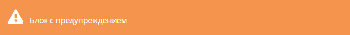


Спойлеры:

[Спойлер](img/toggle.mp4)

Кнопки:

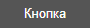

Вкладки:

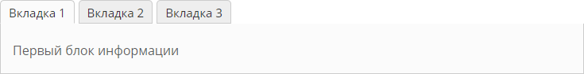

И многое другое. В общем полезный плагин.

## Таблицы

<https://codepen.io/Harrix/pen/GBwrwy>

<https://codepen.io/Harrix/pen/KBraLY>

<https://codepen.io/Harrix/pen/zLMZOr>

## Плагин для индексирования в Google

Плагин [Better WordPress Google XML Sitemaps](https://wordpress.org/plugins/bwp-google-xml-sitemaps/) создает карту сайта, которая при изменении или добавлении поста редактируется автоматически. Это позволяет быстро индексировать страницы в поисковике.

## Двойные кавычки

Wordpress исправляет двойные кавычки на более приятные на взгляд лапки. Ну, это он так думает. Но этим портится весь код, который вставляется у меня не через плагин Crayon Syntax Highlighter.

В общем, в файле вашей темы, где прописываете PHP функции (у меня это `custom_functions.php`), и там добавляете код:

```php
if ( function_exists('remove_filter') ) {
# Отключим замену кавычек в тексте записей и страниц
remove_filter('the_content', 'wptexturize');
# Отключим замену кавычек в заголовках записей и страниц
remove_filter('the_title', 'wptexturize');
# Отключим замену кавычек в тексте комментариев
remove_filter('comment_text', 'wptexturize');
}
```

И после кавычки станут обычными, что не может не радовать.

## Список рекомендуемых (похожих статей)

Сейчас использую плагин [Yet Another Related Posts Plugin](https://wordpress.org/plugins/yet-another-related-posts-plugin/).

Раньше использовал такой код:

```php
<?php
$tags = wp_get_post_tags($post->ID);
if ($tags) {
    $tag_ids = array();
    foreach($tags as $individual_tag) $tag_ids[] = $individual_tag->term_id;
    $args=array(
        'tag__in' => $tag_ids,
        'post__not_in' => array($post->ID),
        'showposts'=>10 // Количество записей для показа.
    );
    $my_query = new wp_query($args);
  wp_reset_query();
    if( $my_query->have_posts() ) {
        echo '<h3>Рекомендую статьи:</h3><ul>';
        while ($my_query->have_posts()) {
            $my_query->the_post();

        ?>
            <li><a href="<?php the_permalink() ?>" rel="bookmark" title="<?php the_title_attribute(); ?>"><?php the_title(); ?></a></li>
        <?php
        }
    wp_reset_query();
        echo '</ul>';
    }
}
?>
```

## Работа с RSS

Адрес стандартного RSS потока лежит по адресу `[Ваш блог]/feed` (раньше было `[Ваш блог]/?feed=rss2`).

RSS зарегистрировал в <http://feedburner.google.com>.

В настройках Wordpress `Настройки` → `Написание` в `Сервисах обновления` добавил строчку:

```text
http://ping.feedburner.com
```

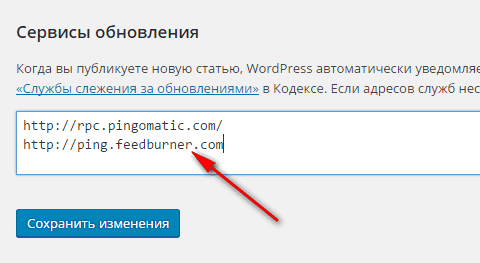

Это чтобы Feedburner сразу получал сигнал об изменениях в статьях и публикациях новых.

В настройках Wordpress `Настройки` → `Чтение` в `Для каждой статьи в RSS-ленте отображать` выбрал `Полный текст`.

В файле функций вашей темы ( у меня `custom_functions.php`) добавил код:

```php
function dear_abby_rss_teaser( $content ){
$teaser = preg_split( '/<span id/', $content );
$content = $teaser[0];
if ( has_post_thumbnail( $post->ID ) )
{
   $image_src = wp_get_attachment_image_src( get_post_thumbnail_id($post->ID), 'full');
   $content = '<div></div>' . $content;
}
return $content;
}
add_filter( 'the_content_feed' ,'dear_abby_rss_teaser' );
```

Это чтобы в RSS не отдавалась вся статья, а только текст до тэга `more`. В переменную `$readmore` можете добавить приписку, какую хотите. Например, «Читать далее» или свой копирайт или иное.

Чтобы принудительно обновить RSS в Feedburner, нужно зайти на страницу `Решай проблемы` (Troubleshootize) и нажать на кнопку `Resync Now`.

Вставить куда-нибудь ссылку на RSS на сайте. Например, я вставил в меню. Например, ссылка может выглядеть так:

```html
<a href="http://feeds.feedburner.com/harrix">RSS</a>
```

## Плагин для отображения списка статей

Использую плагин [Display Posts Shortcode](https://wordpress.org/plugins/display-posts-shortcode/).

В тексте статей при вставке шорткода `[display-posts]` публикуется список статей. Например:

### Список с нумерацией

```html
[display-posts posts_per_page="10" wrapper="ol"]
```

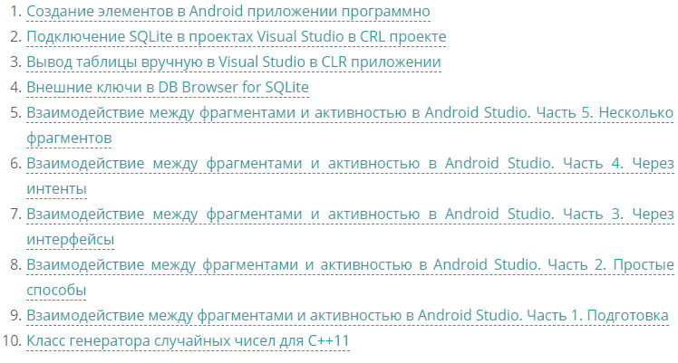

### Список статей с метками Qt или QtQuick с нумерацией

```html
[display-posts tag="Qt, QtQuick" posts_per_page="10" wrapper="ol"]
```

### Список статей с метками Qt и QtQuick с нумерацией. То есть это пересечение двух множеств

```html
[display-posts tag="Qt & QtQuick" posts_per_page="10" wrapper="ol"]
```

### Список статей с нумерацией и отсортированный в алфавитном порядке

```html
[display-posts posts_per_page="10" orderby="title" wrapper="ol" order="ASC"]
```

За количество статей, которые будут выводиться отвечает параметр `posts_per_page`. Если я хочу, чтобы выводились все статьи, то использую большое значение, например, `posts_per_page="100000"`.
