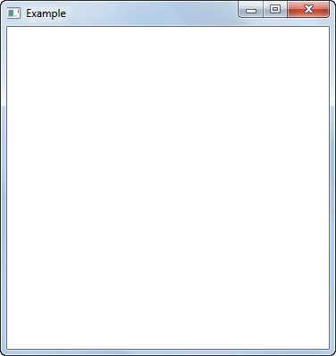
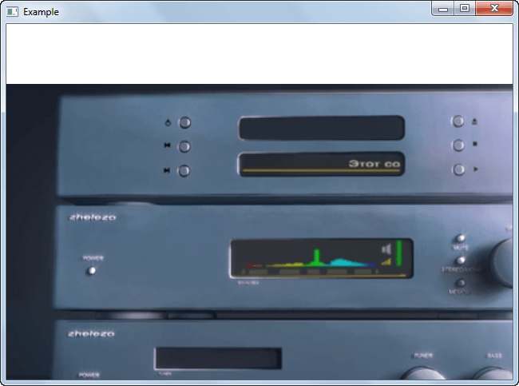

# Видео в QtQuick 2.0


Как проиграть видео в приложении QtQuick 2.0? В статье описывается пример для Qt 5.0.1 for Windows 32-bit (MinGW 4.7).

<details>
<summary>📖 Содержание</summary>

## Содержание

- [Подготовка](#подготовка)
- [Редактирование QML файла](#редактирование-qml-файла)

</details>

## Подготовка

Постройте нужное вам приложение с QtQuick.

Откомпилируйте ваше приложение.

Найдите папку, в котором находится откомпилированное приложение. Обычна эта папка находится в той же папке, что и папка проекта. Например, у меня это папка `Example-build-Desktop_Qt_5_0_1_MinGW_32bit-Release`. В ней находится папка `release` или `debug`, в которой и находится `exe` файл.

Скопируйте видеофайл, например, `video.mp4` в эту папку с `exe` файлом. И еще копию видеофайла в папку уровнем выше. То есть, например, файл должен находиться и в `Example-build-Desktop_Qt_5_0_1_MinGW_32bit-Release` и в `Example-build-Desktop_Qt_5_0_1_MinGW_32bit-Release\release`. Зачем? Дело в том, что когда вы запускаете программу из QtCreator, то `exe` файл будет искать видеофайл из папки `Example-build-Desktop_Qt_5_0_1_MinGW_32bit-Release`. А если запускать файл как сам EXE файл, то видеофайл будет искаться в папке `Example-build-Desktop_Qt_5_0_1_MinGW_32bit-Release\release`.

## Редактирование QML файла

Подключите модуль мультимедиа (у вас может быть другой номер версии пакета):

```qml
import QtMultimedia 5.0
```

Вставьте в программу код видеофайла. Например, так:

```qml
Video {
  id: video
  width : 800
  height : 600
  source: "file://video.mp4"
  MouseArea {
    anchors.fill: parent
    onClicked: {
      video.play()
    }
  }
  focus: true
}
```

И в итоге у вас может такой QML файл получиться:

```qml
import QtQuick 2.0
import QtMultimedia 5.0

Rectangle {
  width: 360
  height: 360
  Video {
    id: video
    width : 800
    height : 600
    source: "file://video.mp4"
    MouseArea {
      anchors.fill: parent
      onClicked: {
        video.play()
      }
    }
    focus: true
  }
}
```

Запускайте программу. И вы увидите следующую картину:



_Рисунок 1 — Запущенное приложение_

Нажмите по белому полю мышкой, и видео пойдет:



_Рисунок 2 — Видео в запущенном приложении_

Со всеми остальными моментами: подгонка высоты и ширину, управление видео и так далее уже сами разберетесь. Здесь всё обычно.
